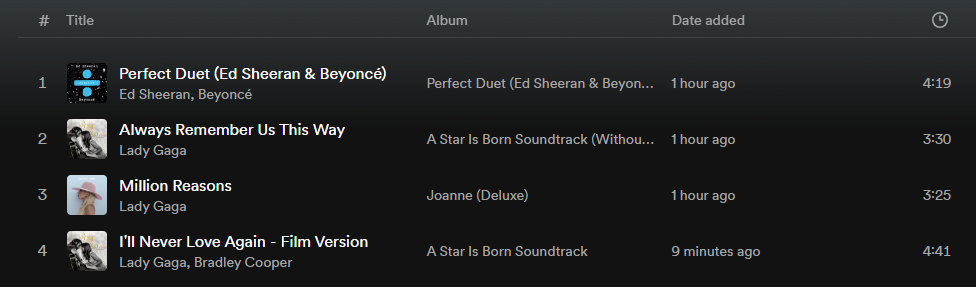
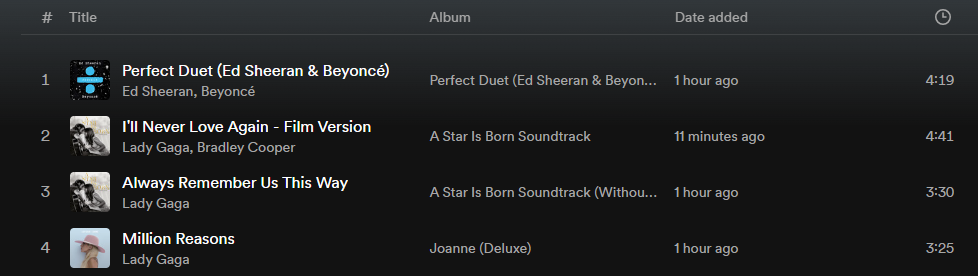

# Homework 1 — Spotify Playlists

Before starting this homework, make sure you have read and understood the Academic Integrity Policy.

In this assignment you will develop a program to manage music playlists like Spotify does, let's call this program New York Playlists. Please read the entire handout before starting to code the assignment. 

## Learning Objectives

- Practice handling command line arguments.
- Practice handling file input and output.
- Practice the C++ Standard Template Library string and vector classes. 

## Background

On Spotify, users can create and manage playlists. On the Spotify app or website, users can navigate to the "Your Library" section and click on the "+" sign to create a playlist. When creating a playlist, users can add music tracks to the playlist.

After a playlist is created, users can add new tracks to this playlist, or remove tracks from this playlist. Users can also move tracks to new positions within a playlist. The following two images show the moving process:

At first, track 1 is "Perfect Duet", track 2 is "Always Remember Us This Way", track 3 is "Million Reasons", and track 4 is "I'll Never Love Again".



Next, we drag track 4 up to right above track 2.

After this dragging action, now, track 1 is still "Perfect Duet", track 2 is "I'll Never Love Again", track 3 is "Always Remember Us This Way", and track 4 is "Million Reasons".



## Command Line Arguments

Your program will support 3 commands.

### Command 1: add a music track to a playlist
The first argument is the name of an input file which contains a playlist. The second argument is the name of another input file which contains all available music tracks. The third argument is the output file. The fourth argument is the action, which in this case is "add". The fifth argument is the title of the music track.

```console
./nyplaylists.exe playlist.txt library.txt output.txt add title
```

This command will add a music track (specified by the title) to the end of a playlist.

For example, the following command will add the song "Umbrella" to the end of the playlist.
```console
./nyplaylists.exe playlist_tiny1.txt library.txt output.txt add "Umbrella"
```

### Command 2: remove a music track from a playlist
The first argument is the name of an input file which contains a playlist. The second argument is the name of another input file which contains all available music tracks. The third argument is the output file. The fourth argument is the action, which in this case is "remove". The fifth argument is the title of the music track.

```console
./nyplaylists.exe playlist.txt library.txt output.txt remove title
```

For example, the following command will remove the song "Always Remember Us This Way" from the playlist.
```console
./nyplaylists.exe playlist_tiny1.txt library.txt output.txt remove "Always Remember Us This Way"
```

### Command 3: move a music track to a new position on the playlist
The first argument is the name of an input file which contains a playlist. The second argument is the name of another input file which contains all available music tracks. The third argument is the output file. The fourth argument is the action, which in this case is "move". The fifth argument is the title of the music track. The sixth argument is the new position - where this user wants the music track to be located on the playlist. Note that, unliked array indexing in C/C++, positioning in Spotify starts at 1, as opposed to 0. This can be seen in the above Spotify screenshot: the first position is position 1.

```console
./nyplaylists.exe playlist.txt library.txt output.txt move title [new_position]
```

For example, the following command will move the song "I Will Never Love Again - Film Version" to position 1.
```console
./nyplaylists.exe playlist_tiny1.txt library.txt output.txt move "I Will Never Love Again - Film Version" 1
```

For all 3 commands, the output.txt contains the updated playlist. We have provided sample input & output files. Examples of using command line arguments can be found on the course webpage: [Programming Information](https://www.cs.rpi.edu/academics/courses/spring24/csci1200/programming_information.php).

## Input and Output File Format

All the input files and output files have the same format. Take the playlist_tiny1.txt as an example, this file has the following 4 lines:

```console
"Perfect Duet" Ed Sheeran, Beyonce
"Always Remember Us This Way" Lady Gaga
"Million Reasons" Lady Gaga
"I Will Never Love Again - Film Version" Lady Gaga, Bradley Cooper
```

Each line has two fields, the music title, and the artist(s). There is one single space separating these two fields.

## Handling Music Tracks with the Same Title

In cases where multiple tracks may have the same title, choose the first track from the input file. This is NOT the natural behavior of Spotify, but this decision is just to simplify your implementation.

## Known Issue on Submitty

The Autograder on Submitty doesn't handle command line arguments correctly when the arguments are enclosed in double quotes. In fact, the autograder would add a backslash as an escape character in front of each double quote.

e.g., For this command:
```console
./nyplaylists.exe playlist_tiny1.txt library.txt output.txt add "Umbrella"
```

The autograder would actually run:
```console
./nyplaylists.exe playlist_tiny1.txt library.txt output.txt add \"Umbrella\"
```

And as a result, the autograder would pass the last argument as "Umbrella" (with the double quotes) to your program. Thus you need to remove the open double quote and the closing double quote in your program.

Another example, for this command,
```console
./nyplaylists.exe playlist_tiny1.txt library.txt output.txt move "I Will Never Love Again - Film Version" 1
```

The autograder would actually run:
```console
./nyplaylists.exe playlist_tiny1.txt library.txt output.txt move \"I Will Never Love Again - Film Version\" 1
```

This means the autograder would pass 14 arguments to your program. And these 14 arguments are:

0. ./nyplaylists.exe
1. playlist_tiny1.txt
2. library.txt
3. output.txt
4. move
5. "I
6. Will
7. Never
8. Love
9. Again
10. \-
11. Film
12. Version"
13. 1

To deal with this problem, you need to remove double quotes from the arguments. And the std::string erase function can help you remove a double quote. And you can use the following code to do so, here we assume you have a std::string variable called tmpString, and if this tmpString contains a double quote, the following lines will remove that double quote.

```cpp
        size_t quotePos;
        if( (quotePos = tmpString.find('"')) != std::string::npos ){
                tmpString.erase(quotePos, 1); // remove the double quote character at the found position; here number 1 as the second argument means erasing 1 character.
        }
```

You may need to include this double-quote-removal logic twice in your program so as to remove the openning double quote and then the closing double quote.

Note that the above double-quote-removal logic wouldn't do anything if the argument doesn't contain a double quote. This means including the double-quote-removal logic in your code should not affect how you run your program locally on your own computer.

## Instructor's Code

You can test (but not view) the instructor's code here: [instructor code](http://ds.cs.rpi.edu/hws/playlists/). Note that this site is hosted on RPI's network and you can visit this site only if you are on RPI's network: either on campus or using a VPN service.

## Program Requirements & Submission Details

In this assignment, you are required to use both std::string and std::vector. You are NOT allowed to use any data structures we have not learned so far.

Use good coding style when you design and implement your program. Organize your program into functions: don’t put all the code in main! Be sure to read the [Homework Policies](https://www.cs.rpi.edu/academics/courses/spring24/csci1200/homework_policies.php) as you put the finishing touches on your solution. Be sure to make up new test cases to fully debug your program and don’t forget to comment your code! Complete the provided template [README.txt](./README.txt). You must do this assignment on your own, as described in the [Collaboration Policy & Academic Integrity](https://www.cs.rpi.edu/academics/courses/spring24/csci1200/academic_integrity.php) page. If you did discuss the problem or error messages, etc. with anyone, please list their names in your README.txt file. Prepare and submit your assignment as instructed on the course webpage. Please ask a TA if you need help preparing your assignment for submission.

**Due Date**: 01/18/2024, 10pm.

## Rubric

13 pts
 - README.txt Completed (3 pts)
   - One of name, collaborators, or hours not filled in. (-1)
   - Two or more of name, collaborators, or hours not filled in. (-2)
   - No reflection. (-1)
 - STL Vector & String (3 pts)
   - Uses data structures which have not been covered in this class. (-3)
   - Did not use STL vector (-2)
   - Did not use STL string (-2)
 - Program Structure (7 pts)
   - No credit (significantly incomplete implementation) (-7)
   - Putting almost everything in the main function. It's better to create separate functions for different tasks. (-2)
   - Improper uses or omissions of const and reference. (-1)
   - Almost total lack of helpful comments. (-4)
   - Too few comments. (-2)
   - Contains useless comments like commented-out code, terminal commands, or silly notes. (-1)
   - Overly cramped, excessive whitespace, or poor indentation. (-1)
   - Lacks error checking (num of args, invalid file names, invalid command, etc.) (-1)
   - Poor choice of variable names: non-descriptive names (e.g. 'vec', 'str', 'var'), single-letter variable names (except single loop counter), etc. (-2)
   - Uses global variables. (-1)
   - Overly long lines, in excess of 100 or so characters. It's recommended to keep all lines short and put comments on their own lines. (-1)
