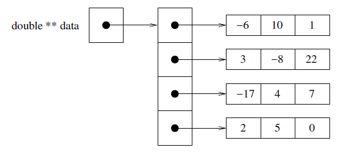
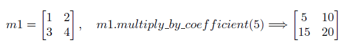
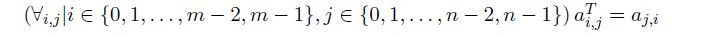
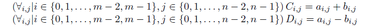
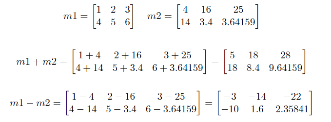

# Homework 3 — Dynamic Matrices

In this assignment you will build a custom class named Matrix, which will mimic traditional matrices (the plural of matrix). You will not be expected to have intimate knowledge of matrices, but if you are curious you can read more about them online: https://en.wikipedia.org/wiki/Matrix_(mathematics).

Matrices are used in many different applications, and over the years many optimizations, tricks, and numerical methods have been developed to quickly handle matrix operations and solve more complicated problems.

Building this data structure will give you practice with pointers, dynamic array allocation and deallocation, 2D pointers, and class design. The implementation of this data structure will involve writing one new class. You are not allowed to use any of the STL container classes in your implementation or use any additional classes or structs besides Matrix. You will need to make use of the new and delete keywords. You can use array indexing ([]). Please read the entire handout before beginning your implementation.

## The Data Structure

A matrix is a two-dimensional arrangement of numbers. In this assignment we will assume every matrix
contains doubles. We refer to the size of a matrix with m rows and n columns as an m×n matrix. For
example, shown below is a 4×3 matrix:


We will represent the data inside our Matrix class by using a two-dimensional array. Because a matrix may
be any size, you will need to use dynamic memory for this task. The same matrix shown above can be
represented like so:



We will denote a<sub>i</sub>,<sub>j</sub> as the value in matrix A that is in row i and column j. So a general matrix can be
described as:


## Basic Functionality

The private section of your class will be fairly small, and the main challenge will be working with the
dynamic memory as you implement features to make the class functional. You can implement these methods
in any order; we start by mentioning a few that will make debugging easier.

The first thing we suggest is writing a constructor that takes two unsigned ints: a rows count and a columns
count, and a double fill value. The constructor should create a data representation of a rows×columns matrix
with every value initialized to fill. If either dimension is 0, the resulting matrix should be of size 0×0.

Your class must support the equality operator == and the inequality operator !=. Two matrices are considered
to be equal if they have the same value in every position. In other words, matrices A and B are equal if and
only if


∀ is a common shorthand for “for all,” so ∀i,j means “for every value of i and j.” ∈ is a common shorthand for “in”.

Since a matrix has two dimensions, you will need to implement num rows() and num cols() which return the
number of rows and the number of columns in the matrix respectively.
We may want to change a previously filled matrix to an empty one, so you must write a clear() method as
well. This method should reset the number of rows and columns to 0, and deallocate any memory currently
held by the Matrix.

Naturally we want to be able to access data stored in the Matrix class. To do so we will implement a “safe”
accessor called get(), which takes in a row, a column, and a double. If the row and column are within the
bounds of the matrix, then the value at arow,col should be stored in the double, and the function should
return true. Otherwise the function should return false.

A complementary, but similar task to accessing data is to be able to set a value at a particular position in
the matrix. This is done through a safe modifier called set(). This function also takes in a row, column, and
a double value. set() returns false if the position is out of bounds, and true if the position is valid. If the
position is valid, the function should also set arow,col to the value of the double that was passed in.

## Overloaded Output Operator

At some point, it is probably a good idea to write a method to do output for us. Unlike previous classes where
we wrote a method to do the printing, we will instead rely on a non-member overload of the operator<<. We
have practiced overloading other operators for calls to std::sort() before, and this will be similar. Outside
of the Matrix class definition, but still in your .cpp and .h files, you should write the following operator:

```cpp
std::ostream& operator<< (std::ostream& out, const Matrix& m)
```

This will allow us to print one or more outputs sequentially. All of the following code should work if your
operator<< is implemented correctly:

```cpp
Matrix m1;
Matrix m2;
std::ofstream outfile(output_filename); //Assuming we already had the filename
std::cout << m1 << m2 << std::endl;
outfile << m1;
outfile << m2 << std::endl;
std::cout << "Done printing." << std::endl;
```

Let us assume in the above example that:


Then the output should look something like this:
```console
0 x 0 matrix:
[ ]
3 x 2 matrix:
[ 3 5.21
-2 4
-18 1 ]
Done printing.
```

We will ignore whitespace, but we do expect that your operator outputs the elements of the matrix in the
right order, that the size output comes before the matrix and follows the format shown below - one row per
line, and spacing between elements. Note that even in these examples, the alignment is not ideal. We would
rather you focus on the task of implementing the Matrix class correctly and handling memory properly
instead of focusing on making the output pretty.

### Simple Matrix Operations

To start with, we introduce some basic matrix operations. The first is the method multiply by coefficient(),
which takes a double called a coefficient. The method should multiply every element in the matrix by the
coefficient. For example:



Another common operation is to swap two rows of a matrix. This will be accomplished by the method
swap row(), which takes two arguments of type unsigned int: a source row number and a target row
number. If both rows are inside the bounds of the matrix, then the function should switch the values in the
two rows and return true. Otherwise the function should return false.
For example:


NOTE: With the basic functions and swap row() done, the tests related to the provided rref() function in
matrix main.cpp can be called. We do not explain the function in detail here, and you don’t need to know
how it works, but computing the Reduced Row Echelon Form (RREF) can be used to find an inverse matrix,
which is important in many fields. We use a simple to implement method called Gauss-Jordan Elimination,
which you can read about here: https://en.wikipedia.org/wiki/Gaussian_elimination . There are
other techniques for finding the RREF that are better, but we chose this one for its simplicity.

It is common to need to “flip” a matrix, a process called transposition. You will need to write the transpose()
method, which has a return type of void. Formally, transposition of m×n matrix A into n×m matrix AT
is
defined as:




## Binary Matrix Operations

Binary matrix operations are ones that involve two matrices. To keep things simple, we will write them as
methods (not operators) that are inside the class definition, so the current Matrix object will always be the
“left-hand” matrix, A. You will be required to implement both add() and subtract(). Both functions take in
just one argument, a second Matrix which we will refer to as B, and modify A if the dimensions of A and B
match. If the dimensions match, the functions should return true, otherwise they should return false.
Addition of two matrices, C = A + B, and subtraction of two matrices, D = A − B are formally defined as:



Consider these two matrices:



## Harder Matrix Operations

If we want to get the contents of an entire row or column, it’s annoying to have to extract the values one by
one using get(), especially since our implementation is a “safe” accessor so we can’t use some of the coding
shortcuts we normally use. To fix this, you will implement two more accessors, get row() and get col().
Both functions take one unsigned int and return a double*. For get row() the argument is the number of
row to retrieve, while for get col() the argument is the number of the column to retrieve. If the requested
row/column is outside of the matrix bounds, the method should return a pointer set to NULL.
The final method we expect you to implement, quarter(), is not a traditional matrix operation. The method
takes no arguments and returns a Matrix* containing four new Matrix elements in order: an Upper Left
(UL) quadrant, an Upper Right (UR) quadrant, a Lower Left (LL) quadrant, and finally a Lower Right
(LR) quadrant. All four quadrants should be the same size. Remember that when a function ends all
local variables go out of scope and are destroyed, so you will need to be particularly careful about how you
construct and return the quadrants. On the next page are two examples of the quarter operation:


## Testing and Debugging

We provide a [matrix_main.cpp](matrix_main.cpp) file with a wide variety of tests of the Matrix class. Some of these tests
are initially commented out. We recommend that you get your class working on the basic tests, and then
uncomment the additional tests as you implement and debug the remaining functionality. Study the provided
test cases to understand the arguments and return values.

Note: Do not edit the provided [matrix_main.cpp](matrix_main.cpp) file, except to uncomment the provided test cases as you work through your implementation and to add your own test cases where specified.

The assert() function is used throughout the test code. This is a function available in both C and C++
that will do nothing if the condition is true, and will cause an immediate crash if the condition is false. If
the condition is false, your command line should show the assertion that failed immediate prior to the crash.

We recommend using a memory debugging tool to find memory errors and memory leaks. Information on
installation and use of the memory debuggers “Dr. Memory” (available for Linux/MacOSX/Windows) and
“Valgrind” (available for Linux/OSX) is presented on the course webpage:
http://www.cs.rpi.edu/academics/courses/fall23/csci1200/memory_debugging.php

The homework submission server will also run your code with Dr. Memory to search for memory problems.
Your program must be memory error free and memory leak free to receive full credit.

## Your Task & Provided Code

You must implement the Matrix class as described in this handout. Your class should be split between a .cpp
and a .h file. You should also include some extra tests in the StudentTest() function in [matrix_main.cpp](matrix_main.cpp).
When implementing the class, pay particular attention to correctly implementing the copy constructor,
assignment operator, and destructor. 

<!--The Vec<T> class we looked at in lecture is templated, while the
Matrix class is not. You may still find the lecture notes to be a useful starting point, but remember that in
the Matrix class we should not be writing template class<T> anywhere. -->

As you implement your classes, be careful with return types, the const keyword, and passing by reference.
If you have correctly implemented the Matrix class, then running the provided [matrix_main.cpp](matrix_main.cpp) file with
your class, should produce the output provided in [sample_output.txt](sample_output.txt). We are not going to be particularly
picky about differences in whitespace, but you should be making an effort to try and match both spacing
and newlines between our output and your output.

## Submission

You will need to submit your [matrix_main.cpp](matrix_main.cpp), Matrix.cpp, Matrix.h, and README.txt file. Be aware that Submitty will be using an instructor copy of [matrix_main.cpp](matrix_main.cpp) for most of the tests, so you must make sure your Matrix implementation can compile given the provided file. Also make sure to name your class implementation files with a capital letter since Linux is case sensitive.

Be sure to write your own new test cases and don’t forget to comment your code! Use the provided template [README.txt](README.txt) file for notes you want the grader to read. Fill out the order notation section as well in the [README.txt](README.txt) file. You must do this assignment on your own, as described in the “Collaboration Policy & Academic Integrity” handout. If you did discuss this assignment, problem solving techniques, or error messages, etc. with anyone, please list their names in your README.txt file.

**Due Date**: 09/28/2023, Thursday, 23:59pm. 
