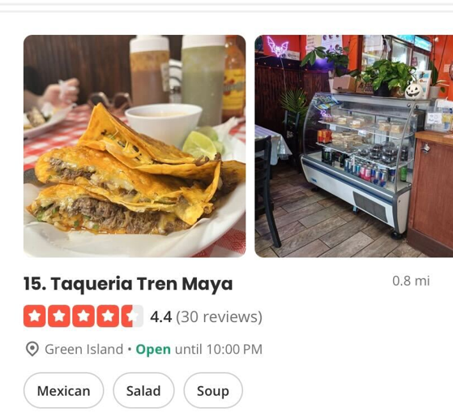

# Homework 4 — Implementing a Simple Yelp

In this assignment you will implement a simple business review and recommendation system called New York Businesses. Your program will mimic some behaviors of Yelp. Please read the entire handout before starting to code the assignment.

## Learning Objectives

- Get familiar with a commonly used data structure - linked lists.
- Practice using std::list.
- Practice using iterators.

## Background

Yelp is a popular online platform and mobile application that allows users to discover and review local businesses, particularly restaurants. It provides a platform for users to share their experiences and opinions about various businesses, including restaurants, bars, cafes, and other services. 

Yelp ratings are an essential component of the platform's review system, as they help users assess the quality and reputation of businesses based on the experiences of other customers. Yelp ratings typically use a scale of 1 to 5 stars, with 1 being the lowest rating and 5 being the highest. Users can assign a rating to a business based on their personal experience and satisfaction level.

## Specification

Similar to Yelp, in this assignment, you will be implementing a program which allows users to discover local businesses. More specifically, you will write a program which takes a json file as its input, and produce an output.txt file as its output. The output.txt should display businesses which match with the user's search query, as specified from the command line.

## Input Files

Multiple json files are provided for testing. Each time you run your program, it would just take one json file as its input file. Each line of the json file represents one business. All lines have similar format, however, some fields may exist in some lines, but may not exist in other lines. Following is an example, which describes the business Shake Shack located in Nashville, Tennessee.

```console
{"business_id":"1QBbJ27hYLxAwo9zP8436Q","name":"Shake Shack","address":"4031 Hillsboro Pike, Ste 904","city":"Nashville","state":"TN","postal_code":"37215","latitude":36.1029949,"longitude":-86.8169347,"stars":3.0,"review_count":223,"is_open":1,"attributes":{"OutdoorSeating":"True","RestaurantsPriceRange2":"2","WiFi":"u'no'","BikeParking":"False","DogsAllowed":"False","RestaurantsTakeOut":"True","Ambience":"{'touristy': False, 'hipster': False, 'romantic': False, 'divey': False, 'intimate': False, 'trendy': True, 'upscale': False, 'classy': False, 'casual': True}","BusinessAcceptsCreditCards":"True","BusinessAcceptsBitcoin":"False","RestaurantsReservations":"False","RestaurantsDelivery":"True","DriveThru":"False","Alcohol":"u'beer_and_wine'","Caters":"False","GoodForKids":"True","WheelchairAccessible":"True","GoodForMeal":"{'dessert': False, 'latenight': False, 'lunch': False, 'dinner': False, 'brunch': False, 'breakfast': False}","BusinessParking":"{u'valet': False, u'garage': True, u'street': True, u'lot': None, u'validated': False}","RestaurantsTableService":"False","RestaurantsGoodForGroups":"True","HasTV":"True"},"categories":"Fast Food, Restaurants, Burgers, American (Traditional)","hours":{"Monday":"0:0-0:0","Tuesday":"11:0-21:0","Wednesday":"11:0-21:0","Thursday":"11:0-20:0","Friday":"11:0-22:0","Saturday":"11:0-22:0","Sunday":"11:0-21:0"}}
```

The meaning of each field is self-explanatory.

## Commands to Support & Program Output

Your program only needs to support the following command:

```console
nybusninesses.exe input.json output.txt zipcode categories
```

Here

- input.json is the input file. In this assignment, we have several input files, but for each run of your program, it takes one input file.
- output.txt is where to print your output.
- zipcode indicates the zipcode of the area where the user is trying to search.
- categories indicate the categories of the businesses. This argument can be one or multiple of the following:


Keep in mind that users can select multiple categories, in the above two screenshots, six categories were chosen, and they are:

- Pizza
- Sushi Bars
- Japanese
- Barbeque
- Indian
- Chinese

If multiple categories are supplied from the command line, these categories will be separated by a single space. To simplify your command line processing logic, you can assume that our test cases would only use a category if it contains one single word, and that means, we might test the category of "Pizza", "Japanese", "Barbeque", "Indian", "Chinese", but we would not test "Sushi Bars" - because it contains more than one word.

When your program is executed, it produces the businesses which fall into any of the chosen categories, and are located in this zipcode area. For each business, your program will print to the output file something similar to what Yelp does. The following is an example from Yelp:


All expected output files are provided, refer to these expected output files for the exact format.

The businesses showed in your output file should be sorted based on the rating of the business, with higher rated businesses being showed before lower rated businesses. For any two businesses which have the same rating, for example, both are 4.5, then in your output file, keep the order of these two as they appear in the input file.

In the case where no matching businesses can be found, your program should print a message similar to what Yelp does:

```console
Sorry, we couldn't find any results
```

This message should be printed into the output file. For your reference, this is what Yelp shows:


### The Price Range

In Yelp, the "$" sign is commonly used to indicate the price range for businesses. It helps users quickly gauge the approximate cost of dining or using services at a particular establishment. There are four levels, represented by "$", "$$", "$$$", and "$$$$" respectively. A single "$" indicates that the business is relatively inexpensive, with prices typically ranging from low to moderate. A "$$$$" sign represents the highest price range level, indicating that the business is quite expensive.

In the input json file, the *RestaurantsPriceRange2* field is used for this purpose. The value of this field ranges from 1 to 4. With 1 being the least expensive and 4 being the most expensive. Therefore, for a business whose *RestaurantsPriceRange2* is 1, your program should print a "$" sign; for a business whose *RestaurantsPriceRange2* is 2, your program should print a "$$" sign; etc.

In the case where the *RestaurantsPriceRange2* field does not exist, your program should not print any "$" sign; for your reference, the following is an example from Yelp in which no "$" sign is displayed.



## Provided Code

Several helper functions are provided for you to parse the json file. All of them expect the caller to provide the one line from the json file as the sole argument, in the format of an std::string.

1. Get Business Name:

```cpp
std::string getName(std::string& line){
        int start = 0;
        // starting from the position start, and search the string variable line,
        // to find the first name string.
        int key_start = line.find("name", start);
        int value_start = key_start + 7;
        // remember to use escape.
        int value_end = line.find("\"", value_start);
        int len = value_end - value_start;
        // go from start to end, but exclude the character at end.
        // when we use the substr(start, length) function on a std::string,
        // the substring includes the character at the start position,
        // and the length of the substring is length.
        // It does not include the character at the position start + length.
        std::string name = line.substr(value_start, len);
        return name;
}
```

2. Get Categories:

```cpp
std::string getCategories(std::string& line){
        int start = 0;
        // starting from the position start, and search the string variable line,
        // to find the first categories string.
        int key_start = line.find("categories", start);
        int value_start = key_start + 13;
        // remember to use escape.
        int value_end = line.find("\"", value_start);
        int len = value_end - value_start;
        // go from start to end, but exclude the character at end.
        // when we use the substr(start, length) function on a std::string,
        // the substring includes the character at the start position,
        // and the length of the substring is length.
        // It does not include the character at the position start + length.
        std::string categories = line.substr(value_start, len);
        return categories;
}
```

3. Get Rating:

```cpp
double getRating(std::string& line){
        int start = 0;
        // starting from the position start, and search the string variable line,
        // to find the first stars string.
        int key_start = line.find("stars", start);
        int value_start = key_start + 7;
        // remember to use escape.
        int value_end = line.find("\"", value_start);
        // -1 here because this is not a string.
        int len = value_end - value_start - 1;
        // go from start to end, but exclude the character at end.
        // when we use the substr(start, length) function on a std::string,
        // the substring includes the character at the start position,
        // and the length of the substring is length.
        // It does not include the character at the position start + length.
        // convert this string to a double
        double stars = stod(line.substr(value_start, len));
        return stars;
}
```

4. Get Price Level:

```cpp
int getPrice(std::string& line){
        int start = 0;
        // starting from the position start, and search the string variable line,
        // to find the first RestaurantsPriceRange2 string.
        int key_start = line.find("RestaurantsPriceRange2", start);
        // if not found, return now
        if(key_start == std::string::npos){
                return -1;
        }
        int value_start = key_start + 25;
        // remember to use escape.
        int value_end = line.find("\"", value_start);
        // -1 here because this is not a string.
        int len = value_end - value_start;
        // go from start to end, but exclude the character at end.
        // when we use the substr(start, length) function on a std::string,
        // the substring includes the character at the start position,
        // and the length of the substring is length.
        // It does not include the character at the position start + length.
        // convert this string to an integer
        int price = stoi(line.substr(value_start, len));
        return price;
}
```

For example, if the *line* is:

```console
{"business_id":"3uvFklejzRPwEPEZQ5vHYQ","name":"Wawa","address":"100 E Old Baltimore Pike","city":"Media","state":"PA","postal_code":"19063","latitude":39.916175541,"longitude":-75.3876546369,"stars":3.5,"review_count":14,"is_open":1,"attributes":{"Alcohol":"u'none'","RestaurantsReservations":"False","RestaurantsTakeOut":"True","OutdoorSeating":"False","GoodForKids":"True","RestaurantsGoodForGroups":"False","RestaurantsPriceRange2":"2","BusinessAcceptsCreditCards":"True","NoiseLevel":"u'average'","RestaurantsAttire":"u'casual'","Ambience":"{'romantic': False, 'intimate': False, 'touristy': False, 'hipster': False, 'divey': False, 'classy': False, 'trendy': False, 'upscale': False, 'casual': False}","WiFi":"u'free'","HasTV":"True","BusinessParking":"{'garage': False, 'street': True, 'validated': False, 'lot': True, 'valet': False}","BikeParking":"True","RestaurantsDelivery":"True"},"categories":"Delis, Convenience Stores, Restaurants, Food, Coffee & Tea, Sandwiches","hours":{"Monday":"0:0-0:0","Tuesday":"0:0-0:0","Wednesday":"0:0-0:0","Thursday":"0:0-0:0","Friday":"0:0-0:0","Saturday":"0:0-0:0","Sunday":"0:0-0:0"}}
```

- The getName() function will return an std::string "Wawa".
- The getCategories() function will return an std::string "Delis, Convenience Stores, Restaurants, Food, Coffee & Tea, Sandwiches".
- The getRating() function will return a double number: 3.5.
- The getPrice() function will return an integer number: 2.

Keep in mind that some of the fields may not exist. Revise these helper functions as needed to handle such cases. For example, the getPrice() function already has such a logic, if the RestaurantsPriceRange2 field does not exist, the getPrice() function would return -1.

**Note**: These provided functions are not necessarily fast, if you aim to climb high on the leaderboard, you may want to revise these functions so as to improve the performance of your program.

## Other Useful Code

### print rating stars

This line will print the star symbol (i.e., :star:).

```
std::cout << "\u2605" << std::endl;
```

Unfortunately, it is more challenging to print a half star, so for half star, we will print ½ instead, and you can print ½ using this:

```
std::cout << "\u00BD" << std::endl;
```

Of course you can change std::cout to a file stream so as to print the these symbols into the output file.

## Program Requirements & Submission Details

In this assignment, **you must use std::list to store the businesses which match with what the user is searching for, and you must implement at least one class**.

Use good coding style when you design and implement your program. Organize your program into functions: don’t put all the code in main! Be sure to read the [Homework Policies](https://www.cs.rpi.edu/academics/courses/spring24/csci1200/homework_policies.php) as you put the finishing touches on your solution. Be sure to make up new test cases to fully debug your program and don’t forget
to comment your code! Use the provided template [README.txt](./README.txt) file for notes you want the grader to read.
You must do this assignment on your own, as described in the [Collaboration Policy & Academic Integrity](https://www.cs.rpi.edu/academics/courses/spring24/csci1200/academic_integrity.php) page. If you did discuss the problem or error messages, etc. with anyone, please list their names in your README.txt file. 

**Due Date**: 02/15/2024, Thursday, 10pm.

## Rubric

18 pts

- README.txt Completed (3 pts)
  - One of name, collaborators, or hours not filled in. (-1)
  - Two or more of name, collaborators, or hours not filled in. (-2)
  - No reflection. (-1)
- OVERALL CLASS DECLARATION & IMPLEMENTATION AND CODING STYLE (8 pts)
  - No credit (significantly incomplete implementation) (-8)
  - Does not implement at least one class. (-8)
  - Putting almost everything in the main function. It's better to create separate functions for different tasks. (-2)
  - Improper uses or omissions of const and reference. (-1)
  - Function bodies containing more than one statement are placed in the .h file. (okay for templated classes) (-2)
  - Functions are not well documented or are poorly commented, in either the .h or the .cpp file. (-1)
  - At least one function is excessively long (i.e., more than 200 lines). (-1)
  - Overly cramped. (-1)
  - Poor file organization: Puts more than one class in a file (okay for very small helper classes) (-1)
  - Poor choice of variable names: non-descriptive names (e.g. 'vec', 'str', 'var'), single-letter variable names (except single loop counter), etc. (-2)
- DATA REPRESENTATION (7 pts)
  - No credit (significantly incomplete implementation). (-7)
  - Does not use std::list to store the matchng businesses. (-7)
  - Uses data structures which have not been covered in this class. (-7)
  - Member variables are public. (-2)
<!-- - OUTPUT OPERATOR OVERLOADING (2 pts)
   - Does not overload the output (&lt;&lt;) operator. (-2)
   - Incorrect syntax (wrong return type, wrong arguments). (-1)
-->
