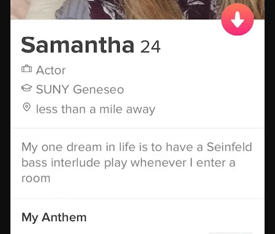

# Homework 5 — Design and Implementation of a Simple Tinder

In this assignment you will develop a simple online dating application called New York Date. Your program will mimic some of the features provided by Tinder. Please read the entire handout before starting to code the assignment.

## Learning Objectives

- Get familiar with a commonly used data structure - linked lists.
- Practice creating and manipulating linked lists without using the std::list library or creating a list class.
<!--- Practice overloading the output operator (&lt;&lt;).-->

## Background

Tinder allows users to view other users' profiles, and users can filter whom they want to view, based on age, gender, and distance.

As users browse another user's profile, users can swipe right or swipe left. Swiping right means like or accept someone, whereas swiping left means reject someone. When two users both express interest by swiping right, the app establishes a match between them, allowing them to initiate conversations and interact further. After the match is established, users have the option to unmatch their match if they are no longer interested or for other reasons.

## Input Files

The input files [users_medium1.txt](users_medium1.txt) and [users_medium2.txt](users_medium2.txt) have a format like this:

```console
Lisa 25 Female 318-125-5013 Undisclosed Undisclosed 41.5833 -83.9274 false 37 45 135 Both 663-979-6253_953-451-3708_410-750-5502_750-260-3152_688-574-6330_915-954-4073
Daniel 27 Male 210-612-4370 Athlete University_of_Pennsylvania 39.0742 -75.9063 true 25 37 85 Both 599-599-3894_841-884-8891_787-782-2239
Brandon 29 Male 580-492-5098 Anesthesiologist University_of_Georgia 42.7252 -72.7156 true 24 43 110 Both 708-384-3942_880-576-5917_973-349-7421_285-513-6312_458-254-2452_414-579-4416_214-444-5696_449-154-3706_524-919-2860_845-641-3730_321-571-9270_673-789-1929
Edward 32 Male 778-799-8211 Firefighter University_of_California_Western_Islands 38.9078 -70.4912 false 52 52 135 Both null
Pedro 27 Male 639-312-6466 Undisclosed University_of_California_Desert 40.306 -84.6312 true 51 54 160 Female 542-656-3532_431-468-1840
Rebecca 30 Female 878-162-8033 Electrician University_of_Kansas 39.6714 -80.2924 false 55 57 115 Female 551-750-9367
Isla 33 Female 884-822-9387 Dental_Hygienist Undisclosed 41.2521 -74.7712 false 46 50 125 Male 432-972-8593
Brandon 56 Male 357-422-7135 Undisclosed University_of_Chicago 43.5828 -75.3686 false 43 55 110 Male 432-972-8593_986-939-5870_732-887-1203_487-545-4465_488-106-7341
Isaac 36 Male 446-205-6456 Chemist University_of_Colorado_Boulder 42.8806 -81.55 true 42 56 60 Both 558-674-9564_517-754-5977
Timothy 46 Male 600-635-3948 Biomedical_Engineer Undisclosed 38.154 -71.3301 true 32 50 50 Male null
```

The above is the first 10 lines of the [users_medium1.txt](users_medium1.txt) file. It has 14 fields, separated by a space. And these 14 fields are:

- User's name
- User's age
- User's gender
- User's phone number
- User's profession: A user can choose not to disclose their profession, and if so, this field will be *Undisclosed*.
- User's school: A user can choose not to disclose his/her school, and if so, this field will be *Undisclosed*.
- User's current latitude
- User's current longitude
- Is Premium User or not: this field will be either *true* or *false*.
- User's preference on age: minimum age
- User's preference on age: maximum age
- User's preference on max distance (in miles). **Note**: this is an integer number.
- User's preference on interested gender: this field can be one of these three: *Male*, *Female*, *Both*.
- Users whom this user liked (i.e., users whom this user has swiped right on): here users are represented by phone numbers. If this user does not like anyone, then this field will be displayed as *null*. If this user liked multiple users, the phone numbers of these users will be displayed in this field, and these phone numbers are separated by an underscore.

In case you are not familiar with these dating apps or have not used Tinder, two randomly selected Tinder pictures (downloaded from the Internet, sorry Samantha! Hope you have found your true love!) are given below.




These two images will give you a better understanding on some of the above fields.

## Specification

Your program will support these commands:

1. show profiles match with a user's preference.
2. show all matches to a user.
3. show all users who swiped right on this user - this feature is only available to premium users.
4. unmatch someone.
5. block someone.
<!--6. delete account.-->

More details about each of these four commands are given below. For all four commands, *users.txt* represents the input file, and *output.txt* represents the output file, please do not hardcode the file names into your program, as the actual input/output file may have a different name. You should just use the *argv[]* array to retrieve the name of the input and the output file. Also note that all the expected output files contain an empty line at the end of file, to match with that, you just need to make sure to use *std::endl;* (or just *endl;* if you don't use *std::*) when printing the last line of a file.

**Note**: for all the commands, you can assume the phone numbers (used in the commands) are valid and are corresponding to an existing account.

### Show Profiles

When the user (here, *phoneNumber* is this user's phone number) runs this command:

```console
nydate.exe users.txt output.txt phoneNumber profile
```

your program should show all profiles which match with this user's preference on age, gender, and distance. All these profiles should be printed into the output file. See [user_704-736-7388_show_profiles.txt](user_704-736-7388_show_profiles.txt) for the format of this file. In the case where there are no users match with this user's preference, your program should just print this one message to the output file:

```console
There are no users matching with your preference at this moment.
```

**Note**: when printing a user's profile information, you should print the user's name, age, profession, school; however, if the user's profession is *Undisclosed*, then you should just skip printing the profession. Do not print the word "Undisclosed". Similarly, if the user's school information is *Undisclosed*, then you should just skip printing the school information. Do not print the word "Undisclosed". 

### Show Matches

When the user (here, *phoneNumber* is this user's phone number) runs this command:

```console
nydate.exe users.txt output.txt phoneNumber match
```

your program should show profiles of all users who match with this user. All these profiles should be printed into the output file. The definition of match is when two users both express interest by swiping right on each other.

See [user_722-686-8362_show_matches.txt](user_722-686-8362_show_matches.txt) for the format of the output file. In the case where this user has no matches at all, you should just print this one message to the output file:

```console
You do not have any matches at this moment.
```

### Show All Users Who Swiped Right on This User

When the user (here, *phoneNumber* is this user's phone number) runs this command:

```console
nydate.exe users.txt output.txt phoneNumber like
```

your program should show profiles of all users who liked this user. All these profiles should be printed into the output file. The definition of like is when a user swipes right on another user. Just like on Tinder, this feature is only available to premium users who pays a monthly subscription fee. Thus, if this user is not a premium user, your program should just print this message to the output file:

```console
Only premium users can view who liked you.
```

When the user is indeed a premium user, see [user_704-736-7388_show_likes.txt](user_704-736-7388_show_likes.txt) for the format of the output file. In the case where this user has not received any likes at all, which is really sad, your program should just print this one message to the output file:

```console
You have not received any likes so far.
```

### Unmatch Someone

According to [Tinder's guide](https://www.help.tinder.com/hc/en-us/articles/115003360106-Unmatching-and-reporting):"When you unmatch someone, they'll disappear from your match list and you'll disappear from theirs."

When the user (here, *phoneNumber* is this user's phone number and *phoneNumberOther* represents the other user whom this user wants to unmatch with) runs this command:

```console
nydate.exe users.txt output.txt phoneNumber unmatch phoneNumberOther
```

your program should first show profiles of all users who match with this user; and then show profiles of all users who match with this other user. All these profiles should be printed into the output file. Clearly, these two users should not be considered as a match anymore.

See [user_405-855-9725_unmatch_595-383-2432.txt](user_405-855-9725_unmatch_595-383-2432.txt) for the format of the output file. In the case where either the user or the other user only has one match, or both the user and the other user have just one match, your output should follow the format of one of these 3 sample output files.

- [user_410-750-5502_unmatch_318-125-5013.txt](user_410-750-5502_unmatch_318-125-5013.txt): when both users only have this one match.
- [user_777-921-9436_unmatch_429-204-4054.txt](user_777-921-9436_unmatch_429-204-4054.txt): when user has only one match.
- [user_429-204-4054_unmatch_777-921-9436.txt](user_429-204-4054_unmatch_777-921-9436.txt): when the other user has only one match.

### Block Someone

Tinder allows users to block other users. Blocking someone on Tinder means that you are preventing that person from seeing your profile and contacting you on the platform. It's a more severe action compared to unmatching. 

When the user (here, *phoneNumber* is this user's phone number and *phoneNumberOther* represents the other user whom this user wants to block) runs this command:

```console
nydate.exe users.txt output.txt phoneNumber block phoneNumberOther
```

your program should 

- First, print all profiles shown to this user - clearly this other user's profile should not be included; Here the term "all profiles" means all profiles which match with this user's preference on age, gender, and distance.
- Second, print all profiles shown to this other user - similarly, the current user's profile should not be included. Here the term "all profiles" means all profiles which match with this other user's preference on age, gender, and distance.

All these profiles should be printed into the output file. See [user_642-798-6219_block_405-855-9725.txt](user_642-798-6219_block_405-855-9725.txt) or [user_686-633-3806_block_704-736-7388.txt](user_686-633-3806_block_704-736-7388.txt) for the format of the output file.

<!--### Delete Account

Users can delete their accounts.

When the user (here, *phoneNumber* is this user's phone number) runs this command:

```console
nydate.exe input.txt output.txt phoneNumber delete
```

your program should print all users' information into the output file. This output file should be different from the original input file in two aspects: First, in your output file, this user should be excluded; Second, in your output file, this user's phone number should not appear on any user's like list. In summary, anything about this user should be erased from output file.
-->

### Output File Order

- When printing profiles and likes, the users should stay in the original order as they are in the input files.
- When printing matches, the users should be sorted in an increasing order based on their phone numbers, which should be a std::string type. For example, the user whose number is "765-651-1171" comes after the user whose number is "569-933-6508".

## Calculate Distance Based on Haversine Formula

To find the users who are within a preferred distance from a user, you need a way to calculate the distance between two coordinates, and for that purpose, in this assignment, you will once again use the Haversine Formula, and the code of using the Haversine formula is once again given below:

```cpp
// calculate the distance between two coordinates using Haversine formula
double calculateDistance(double lat1, double lon1, double lat2, double lon2) {
    const double radiusOfEarth = 6371.0; // Earth's radius in kilometers

    // convert latitude and longitude from degrees to radians
    lat1 *= M_PI / 180.0;
    lon1 *= M_PI / 180.0;
    lat2 *= M_PI / 180.0;
    lon2 *= M_PI / 180.0;

    // Haversine formula
    double dLat = lat2 - lat1;
    double dLon = lon2 - lon1;
    double a = sin(dLat / 2.0) * sin(dLat / 2.0) + cos(lat1) * cos(lat2) * sin(dLon / 2.0) * sin(dLon / 2.0);
    double c = 2.0 * atan2(sqrt(a), sqrt(1.0 - a));
    // distance in kilometers
    double distanceKM = radiusOfEarth * c;
    // convert it to distance in miles
    double distanceMiles = distanceKM * 0.621371;

    return distanceMiles;
}
```

This function takes four parameters, which are the latitude and longitude of two geographical locations, and this function returns the distance (in miles) between these two locations. This function calls several math library functions, and therefore you need to include the *cmath* library:

```cpp
#include <cmath>
```

## Other Useful Code

Given a long string like this: "663-979-6253_953-451-3708_410-750-5502_750-260-3152_688-574-6330_915-954-4073", how do I get each phone number? You can use code like this:

```cpp
#include <iostream>
#include <sstream>	// include this so that we can use stringstream

int main(){

        std::string longString = "663-979-6253_953-451-3708_410-750-5502_750-260-3152_688-574-6330_915-954-4073";
        // create a stringstream to tokenize the long string
        std::istringstream iss(longString);
        std::string phoneNumber;

        // tokenize the long string using the underscore delimiter
        while (std::getline(iss, phoneNumber, '_')) {
                std::cout << phoneNumber << std::endl;
        }
        return 0;
}
```

This program will print the following to the console:

```console
663-979-6253
953-451-3708
410-750-5502
750-260-3152
688-574-6330
915-954-4073
```

You can try to compile and run this tiny [program](provided_code/test.cpp) yourself.

## Program Requirements & Submission Details

This assignment has some unique requirements: In this assignment, you are required to create and manipulate linked lists using nodes, **you are not allowed to use the std::list library. You are not allowed to define a List class or an iterator class. You are not allowed to use any data structures we have not learned so far.** 

There is no requirement on whether your linked lists should be singly-linked lists, or doubly-linked lists. It is your design choice, but you must store all the users in a linked list, where each node of the linked list represents one user. For example, you can define your node like this if you decide to use doubly-linked lists:

```cpp
class User {
public:
	// add other fields as needed.
	User* next;
	User* prev;

};
```

or this, if you decide to use singly-linked lists:

```cpp
class User {
public:
	// add other fields as needed.
	User* next;

};
```

**Note**: for this homework, it is okay to define member variables as public variables, and this is due to the unique nature of linked lists.

Use good coding style when you design and implement your program. Organize your program into functions:
don’t put all the code in main! Be sure to read the [Homework Policies](https://www.cs.rpi.edu/academics/courses/spring24/csci1200/homework_policies.php) as you put the finishing touches on your solution. Be sure to make up new test cases to fully debug your program and don’t forget
to comment your code! Use the provided template [README.txt](./README.txt) file for notes you want the grader to read.
You must do this assignment on your own, as described in the [Collaboration Policy & Academic Integrity](https://www.cs.rpi.edu/academics/courses/spring24/csci1200/academic_integrity.php) page. If you did discuss the problem or error messages, etc. with anyone, please list their names in your README.txt file.

**Due Date**: 02/22/2024, Thursday, 10pm.

## Rubric

15 pts
 - README.txt Completed (3 pts)
   - One of name, collaborators, or hours not filled in. (-1)
   - Two or more of name, collaborators, or hours not filled in. (-2)
   - No reflection. (-1)
 - OVERALL CLASS DECLARATION & IMPLEMENTATION AND CODING STYLE (Good class design, split into a .h and .cpp file.  Functions > 1 line are in .cpp file.  Organized class implementation and reasonable comments throughout. Correct use of const/const& and of class method const. ) (6 pts)
   - No credit (significantly incomplete implementation) (-6)
   - Putting almost everything in the main function. It's better to create separate functions for different tasks. (-2)
   - Function bodies containing more than one statement are placed in the .h file. (okay for templated classes) (-2)
   - Functions are not well documented or are poorly commented, in either the .h or the .cpp file. (-1)
   - Improper uses or omissions of const and reference. (-1)
   - At least one function is excessively long (i.e., more than 200 lines). (-1)
   - Overly cramped. (-1)
   - Poor file organization: Puts more than one class in a file (okay for very small helper classes) (-1)
   - Poor choice of variable names: non-descriptive names (e.g. 'vec', 'str', 'var'), single-letter variable names (except single loop counter), etc. (-2)
 - DATA REPRESENTATION (Must create and use homemade linked lists for the implementation.) (6 pts)
   - No credit (significantly incomplete implementation). (-6)
   - Uses std::list, or data structures which have not been covered in this class. (-6)
   - Defines/Uses a list class. (-5)
   - Defines/Uses an iterator class (okay to use iterators to iterate through other containers such as vectors). (-5)
   - Does not use homemade linked lists (which consist of a chain of nodes) to store all the users. (-5)
   <!--- Member variables are public. (-2)-->
<!-- - OUTPUT OPERATOR OVERLOADING (2 pts)
   - Does not overload the output (&lt;&lt;) operator. (-2)
   - Incorrect syntax (wrong return type, wrong arguments). (-1)-->
