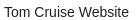
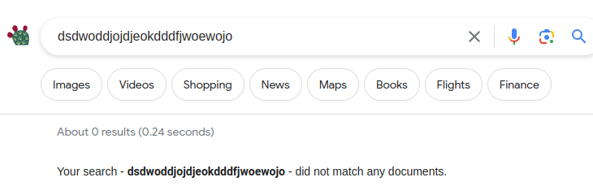

# Homework 7 — Design and Implementation of a Simple Google

In this assignment you will develop a simple search engine called New York Search. Your program will mimic some of the features provided by Google. Please read the entire handout before starting to code the assignment.

## Learning Objectives

- Practice writing recursive programs.
- Practice using std::map and std::set.

## Background

When talking about Google Search Engine, what words come to your mind? Page Ranking? Inverted Indexing? Web Crawler?

When developing a search engine, the first question we want to ask is, where to start? When you type "Selena Gomez" or "Tom Brady" in the search box in Google, where does Google start? Does Google start searching from one specific website? The answer is Google does not start from one specific website, rather they maintain a list of URLs which are called Seed URLs. These Seed URLs are manually chosen which represent a diverse range of high-quality, reputable websites. Search engines usually have a component called web crawler, which crawls these URLs and then follow links from these web pages to other web pages. As the web crawler crawls these other web pages, it collects links from these other web pages to more web pages, and then follow these links to crawl more web pages. This process continues, ultimately, the goal is to discover as many web pages as possible. Once all pages are visited, the search engine will build a map, which is known as the inverted index, which maps terms (i.e., individual words) to web pages (also known as documents). Below is an example:

| Key (Term) | Value (List of Document References)      |
|-----------|---------------------------------------|
| apple     | Document1, Document3, Document5       |
| banana    | Document2, Document4                   |
| orange    | Document1, Document2                   |

**Note**: in this README, the term web page, page, document, and HTML file, all have the same meaning.

<!--Term Frequency

Metadata and Links:

The index may also store metadata associated with each web page, such as the page's URL, title, and description. Additionally, the index can include information about links from one page to another, which is used for link analysis and page ranking.-->

When a user enters a search query, the search engine consults its inverted index map to identify the documents that match the query term. These matching documents will then be ranked based on various factors, and the ranked documents will then be presented to the user. And this ranking process is the so-called Page Ranking.

## Implementation

Based on the above description, you can see there are 3 steps when implementing a search engine: 

1. web crawling
2. query searching
3. page ranking

And thus, in this assignment, you are recommended to write your search engine following this same order of 3 steps (the reason this is just a recommendation, rather than a requirement, is because one mentor told us that she can produce all the results in the web crawling stage, and she doesn't need 3 steps). More details about each of these 3 steps are described below:

### Web Crawling

The Web Crawler's goal is to build the inverted index.

### Query Searching

The Query Searching component's goal is to identify the matching documents.

### Page Ranking

Once the matching documents are identified, you should rank these documents and present them to the user. Google uses a variety of factors in its page ranking, but in this assignment, your page ranking is required to consider the following factors:

- Keywords Density. <!--(keyword stuffing)-->
- Backlinks. <!--: The number and quality of links from other reputable websites are assessed.-->
<!--- Freshness.-->

For each page to be presented, we calculate a page score, and then present these pages in a descending order to the user, i.e., pages whose page score is higher should be presented first. As the page score consists of two factors, we will calculate the score for each of these two factors, and we name them the *keywords density score*, and the *backlinks score*, respectively. Once we have these two scores, we can get the page score using this formula:

page score = (0.5 * keywords density score + 0.5 * backlinks score); [**formula 1**] <a name="formula-1"></a>

In order to match the results used by the autograder, you should define all scores as *double*. Next we will describe how to calculate the keywords density score and the backlinks score.

#### Keywords Density Score

A search query may contain one keyword or multiple keywords. Given a set of keywords, we can calculate the keywords density score by following these two steps:

1. Calculate a density score for each keyword within the document. 
2. Accumulate these individual density scores into a combined score. <!--represent the overall keyword density of the document for the given set of keywords.-->

For each keyword, the keyword's density score is a measure of how the keyword's frequency in a document compares to its occurrence in all documents, and we can use the following formula to calculate the density score of one keyword.

```console
Keyword Density Score = (Number of Times Keyword Appears) / (Total Content Length of this One Document * Keyword Density Across All Documents)
```

Here, we consider the content of each document as a string. Also, here "Total Content Length" means the total length of the whole document, not just the length of the &lt;body&gt; section; and the "Number of Times Keyword Appears" means the number of times the keyword appears in the whole document, not just in the &lt;body&gt; section. Similarly, when calculating the "Keyword Density Across All Documents", you should also consider the whole document, not just the &lt;body&gt; section.

Let's explain this formula with an example: let's say we have 3 documents in total, and the user wants to search *Tom Cruise*. Assume the first document has 50 characters (i.e., the document length of the first document is 50), and the second document has 40 characters, and the third document has 100 characters. The keyword *Tom* appears in the first document 2 times, appears in the second document 3 times, appears in the third document 4 times. Then for this keyword *Tom*, the density across all documents would be:

```console
(2 + 3 + 4) / (50 + 40 + 100) = 0.047
```

and the keyword density score for this keyword *Tom* in the first document, would be:

```console
2 / (50 * 0.047) = 0.851

```

and the keyword density score for this keyword *Tom* in the second document, would be:

```console
3 / (40 * 0.047) = 1.596

```

and the keyword density score for this keyword *Tom* in the third document, would be:

```console
4 / (100 * 0.047) = 0.851

```

Once we get the density score for the keyword *Tom* in the first document (let's denote this score by denScore1), and we get the density score for the keyword *Cruise* in the first document (let's denote this score by denScore2), then the keywords density score for the search query *Tom Cruise* in the first document would be *(denScore1 + denScore2)*.

#### Backlinks Score

A backlinks score for a webpage is based on the importance of its incoming backlinks, considering that pages with fewer outgoing links are considered more valuable and contribute more to the score. Let's say there are N web pages which have links pointing to this current page. We name these pages doc_1, doc_2,... to doc_N, and we use doc_i->outgoingLinks to denote how many outgoing links document i has. Then we can calculate the backlinks score of this current page as following:


```console
backlinks score = ( 1.0 / (1 + doc_1->outgoingLinks) + 1.0 / (1 + doc_2->outgoingLinks) + ... + 1.0 / (1 + doc_N->outgoingLinks) );
```

Once you have both the keywords density score and the backlinks score, you can then use [formula 1](#formula-1) to get the overall score for a page.

## Assignment Scope

To reduce the scope of the assignment, and hence reduce the amount of work from you, we make the following rules for this search engine.

### Rule 1. Case-sensitive Search Engine

Search engines are usually case-insensitive, but making the search engine case-insensitive will require some extra work and likely need to call some functions we have not learned in this course. Therefore, to simplify your tasks and reduce the amount of your work, in this assignment, the search engine you are going to implement is case-sensitive.

<!--### Words Which are Concatenated

When searching *Tom Cruise*, your search engine should not include a page which contains *TomCruise*, but does not include "Tom Cruise". Therefore, a search result like the third one here should not be presented in your search results.-->

### Rule 2. Search HTML Files Only

Search Engines like Google will search all types of files on the Internet, but in this assignment, we assume all files we search are HTML files. And we consider an HTML file contains the search query only if the search query can be found within the &lt;body&gt; section of the HTML file. The &lt;body&gt; section, enclosed within the &lt;body&gt;&lt;/body&gt; tags in an HTML document, represents the primary content area of the web page.

Based on Rule 1 and Rule 2: when the search query is *Tom Cruise*, the second page showed in this image should not be included in your search results, unless the words *Tom Cruise* appears in the other part of the &lt;body&gt;&lt;/body&gt; section of this web page, which is not displayed here.


But wait, we see *Tom Cruise* here:


That's true, but this line is not in the &lt;body&gt; section of the HTML file, it is created via a meta description tag which is in the &lt;head&gt; section of the HTML file. We will have more details on this in [a later section](#the-description) in this README.

The same thing for this line:



this line is not in the &lt;body&gt; section of the HTML file, rather, it is created via a title tag which is in the &lt;head&gt; section of the HTML file. More details on this in [a later section](#the-title) in this README.

### Rule 3. Search Query: No More Than 3 Words

We also limit the user to search no more than 3 words in each query. Based on this rule, we allow users to search *Tom*, *Tom Cruise*, *Tom and Jerry*, but *Tom Hanks Academy Award* is not allowed, as it contains more than 3 words.

### Rule 4. Local Searching Only

The search engine you implement will not search anything on the Internet, as that requires extensive knowledge in computer networks and will need to include network libraries, which is way beyond the scope of this course. In this assignment, we limit our searches to a local folder, which is provided as [html_files](html_files).

You are also not allowed to use file system libraries such as &lt;filesystem&gt; to access the HTML files, rather, you should follow the instructions given in the [other useful code](#other-useful-code) section to open HTML files and follow links within each HTML file to get to other HTML files.

## Supported Commands

Your program will be run like this:

```console
nysearch.exe html_files/index.html output.txt Tom
nysearch.exe html_files/index.html output.txt Tom Cruise
nysearch.exe html_files/index.html output.txt Tom and Jerry
nysearch.exe html_files/index.html output.txt "Tom Cruise"
```

Here:

- *nysearch.exe* is the executable file name.
- html_files/index.html is the Seed URL. While Google maintains a list of Seed URL, in this assignment, we will just use one single HTML file as the Seed page and the path of this file is the Seed URL.
- output.txt is where to print your output to.
- *Tom* is an example of a search query which contains one word, *Tom Cruise* is an example of a search query which contains two words, *Tom and Jerry* is an example of a search query which contains three words. *"Tom Cruise"* is an example of a phrase search, in which the user wants to find an exact match to this whole phrase.

### Phrase Search vs Regular Search

Your search engine should support both phrase search and regular search.  
1. When searching multiple words with double quotes, it is called a phrase search. In phrase search, the whole phrase must exist somewhere in the searched document. In other words, the search engine will search for the exact phrase, word for word, and in the specified order.
2. When searching multiple words without double quotes, it is called a regular search. In this assignment, we define the term *regular search* as such: the search engine should look for documents which contain every word of the search query, but these words do not need to appear together, and they can appear in any order within the document. 

Based on the above definition, a document which only contains the following two lines (in the body section of the HTML file) is a valid document when the user searches *Tom Cruise*:

```console
Tom and Jerry show
Have Fun And Save Now With Great Deals When You Cruise With Carnival. Book Online Today.
```

Because we can find both the word *Tom* and the word *Cruise*. But it is not a valid document if the user does a phrase search - *"Tom Cruise"*, as no exact match can be found in this document.

## Input Files

All the input files are HTML files, and they are provided under the [html_files](html_files) directory. Among these HTML files, there is only one HTML file which will be provided via the command line, and this file will be considered as the Seed file, and the path of this file (i.e. html_files/index.html) therefore will be used as the Seed URL. Your web crawler should search this HTML file and find links contained in this HTML file, and then follow these links to crawl other HTML files, and repeat this process until you can not reach any more files. Keep in mind that links which take you to an HTML file which you have already crawled, should be skipped, otherwise you will get into an infinite loop situation.

## Output File Format

The output of your program should go to the output file. 

- If no matches can be found for a search query, your search engine should print the following message to the output file.

```console
Your search - dsdwoddjojdjeokdddfjwoewojo - did not match any documents.
```

Replace *dsdwoddjojdjeokdddfjwoewojo* with the search query.

This behavior matches with what Google does.



- If matches are found, you should print the ranked results in a format similar to what Google does, as shown in this following image:


More specifically, for each document, print
1. the title
2. the url
3. the description
4. a snippet

### The Title

In all HTML files we provide, in the &lt;head&gt; section of the HTML, we have a "title" element. It is used to define the title of the web page or document. In the following example, the text "ESPN" within the &lt;title&gt; tags represents the title of the web page, which is typically displayed in the browser's title bar or tab, and it is often used by search engines to display the title of the page in search results.

```html
<title>ESPN</title>
```

### The URL

This portion will be different from what Google shows, as our search is limited to the [html_files](html_files) folder, the URL we present will just be a path within this folder. Here are some example URLs we use in this assignment:

```plaintext
html_files/file1.html
html_files/subdir1/subdir2/file7.html
html_files/subdir1/subdir2/subdir3/subdir4/file13.html
```

### The Description

In all HTML files we provide, in the &lt;head&gt; section of the HTML, we have a meta description tag which provides a brief description of the page's content. This description is often displayed by search engines in search results to give users an idea of what the web page is about. The following is an example:

```html
<meta name="description" content="Boston Celtics Scores, Stats and Highlights">
```

Here, "Boston Celtics Scores, Stats and Highlights" is the description. Keep in mind that this description tag is always in the &lt;head&gt; section, rather than in the &lt;body&gt; section, and thus a match found in the description should not be counted as a valid match.

### The Snippet

This snippet contains an excerpt from the page's content that is directly related to the search query. In this assignment, the requirements for this snippet is:

1. It should contain exactly 120 characters.

2.1 For a phrase search, the snippet should start from the beginning of a sentence which contains the query; This means the query itself may not appear in the snippet: this is possible when a sentence contains the query, but that query does not appear in the first 120 characters of the sentence. If the query appears multiple times in a document, consider the first occurrence only. In other words, to construct the snippet, your program should search the first occurrence of the query in the document.

2.2 For a regular search, if an exact match can be found in the document, the snippet should start from the beginning of a sentence which contains the query, and if the query appears multiple times in the document, consider the first occurrence only; if an exact match can not be found, the snippet should start from the beginning of a sentence which contains the first keyword of the query, and if the first keyword appears multiple times in the document, consider the first occurrence only.

**Note**, to simplify the construction of the snippets, we have tailored the provided HTML files such that you can identify the beginning of a sentence via searching the period sign before the sentence. In this assignment, you can assume that there is always a period sign before the sentence which contains the snippet you are going to construct, however, it is possible that there are some whitespaces in between the period and the start of the sentence.

## Useful String Functions

You may find the following functions to be useful (most of them are string functions, except *std::isspace*):

- rfind: this function does reverse find in a string. When finding the start position of a sentence which contains a keyword or a query, the string function *rfind*() can be useful, as this function can be used to search a string for the last occurrence of the period sign. For example, if you find that the query starts at position *queryPos*, then you can use the *rfind*() function like this to locate the period sign before the sentence which contains this query:

```cpp
size_t periodPos = data.rfind(".", queryPos);
```

Here *data* is a string which contains the full content of the document. Once you locate the period sign, you can then skip any possible whitespaces to get to the start of the sentence. And in order to skip whitespaces, you may want to use this next function - *std::isspace*().

- std::isspace: we use this function to check if a given character is a whitespace character.
- find: we use this function to search a string for the first occurrence of some character or some substring.
- substr: we use this function to get a substring of an existing string.
- find_last_of: in this assignment, there might be several situations when you need to find the last slash of a URL. And for that purpose, you can use the *find_last_of*() function. An example usage case is, given the URL "html_files/subdir1/subdir2/file7.html" as a string, if you want to get the directory "html_files/subdir1/subdir2/", you can use *find_last_of*() and *substr*() like this.
```cpp
std::string directory;
// suppose URL is "html_files/subdir1/subdir2/file7.html"
size_t lastSlashPos = URL.find_last_of('/');
if (lastSlashPos != std::string::npos) {
	// directory will now be "html_files/subdir1/subdir2/"
	directory = URL.substr(0, lastSlashPos + 1);
}
```
- erase: when doing a phrase search, we enclose our query with double quotes. Unfortunately, the autograder is not smart enough to handle this, and it will pass the double quotes as a part of the query string. And therefore, in your program, you need to remove the double quotes, and you can do so using code like this:

```cpp
size_t quotePos;
// unfortunately, autograder will pass \" to the command line, and thus the double quote will be a part of the string.
if( (quotePos = tmpString.find('"')) != std::string::npos ){
	tmpString.erase(quotePos, 1); // remove the double quote character at the found position; here number 1 as the second argument means erasing 1 character.
}
```

Here *tmpString* is a string which might contain one double quote character, for example, *tmpString* might be **"Tom**, or it might be **Cruise"**.

## Provided Functions

Parsing an HTML file and extract all the links from this file may require some regular expression library functions, and using these regular expression library functions is beyond the scope of this course, and thus the following function (which calls regular expression library functions) is provided for you. This function takes a std::string argument, representing the content of an HTML file, and this function will extract all links in this HTML file, and return them as a linked list, represented by an std::list&lt;std::string&gt; object.

```cpp
// function to parse an HTML file and extract links to local files
std::list<std::string> extractLinksFromHTML(const std::string& fileContent) {
    std::list<std::string> links;
    // regular expression to match href attributes in anchor tags
    std::regex linkRegex("<a\\s+[^>]*href\\s*=\\s*['\"]([^'\"]+)['\"][^>]*>");
    std::smatch match;

    // search for links in the HTML content
    std::string::const_iterator start = fileContent.cbegin();
    while (std::regex_search(start, fileContent.cend(), match, linkRegex)) {
        if (match.size() > 1) {
            links.push_back(match[1].str());
        }
        start = match.suffix().first;
    }

    return links;
}
```

In order to use this function, you need to include the regex library like this:

```cpp
#include <regex>
```

## Other Useful Code

Unlike previous assignments where you read input files and parse it line by line, in this assignment, when you open an HTML file, you may want to store the full content of this file into a string. For example, you want to open the file file3.html, whose path is "html_files/subdir1/file3.html", and store the full content of this file into a string, then you can do this:

```cpp
std::ifstream fileStream(filePath);
if (fileStream.is_open()) {
	std::string fileContent((std::istreambuf_iterator<char>(fileStream)), std::istreambuf_iterator<char>());
	// suppose filePath is the string "html_files/subdir1/file3.html", then at this point, the string fileContent will be the full content of this file file3.html.
	// do something with fileContent
}
```

Make sure you still include the fstream library.

```cpp
#include <fstream>
```

## Program Requirements & Submission Details

In this assignment, you are required to use either std::map or std::set. You can use both if you want to. You are NOT allowed to use any data structures we have not learned so far, but feel free to use any data structures we have already learned, such as std::string, std::vector, std::list. In addition, **the web crawler component of your program must be recursive**.

Use good coding style when you design and implement your program. Organize your program into functions:
don’t put all the code in main! Be sure to read the [Homework Policies](https://www.cs.rpi.edu/academics/courses/fall23/csci1200/homework_policies.php) as you put the finishing touches on your solution. Be sure to make up new test cases to fully debug your program and don’t forget
to comment your code! Use the provided template [README.txt](./README.txt) file for notes you want the grader to read.
You must do this assignment on your own, as described in the [Collaboration Policy & Academic Integrity](https://www.cs.rpi.edu/academics/courses/fall23/csci1200/academic_integrity.php) page. If you did discuss the problem or error messages, etc. with anyone, please list their names in your README.txt file.

**Due Date**: 11/02/2023, Thursday, 23:59pm.

## Instructor's Code

You can test (but not view) the instructor's code here: [instructor code](http://cs.rpi.edu/~xiaoj8/ds/search/). Note that this page just uses a copy of Google's homepage to serve as the front end, and at the back end it runs the instructor's C++ code. This page does not support the "enter" key, you need to press the "New York Search" button to submit a query.

## Rubric

20 pts
 - README.txt Completed (2 pts)
   - One of name, collaborators, or hours not filled in. (-1)
   - Two or more of name, collaborators, or hours not filled in. (-2)
 - IMPLEMENTATION AND CODING STYLE (Good class design, split into a .h and .cpp file.  Functions > 1 line are in .cpp file.  Organized class implementation and reasonable comments throughout. Correct use of const/const& and of class method const. ) (8 pts)
   - No credit (significantly incomplete implementation) (-8)
   - Putting almost everything in the main function. It's better to create separate functions for different tasks. (-2)
   - Function bodies containing more than one statement are placed in the .h file. (okay for templated classes) (-2)
   - Missing include guards in the .h file. (Or does not declare them correctly) (-1)
   - Functions are not well documented or are poorly commented, in either the .h or the .cpp file. (-1)
   - Improper uses or omissions of const and reference. (-1)
   - Overly cramped, excessive whitespace, or poor indentation. (-1)
   - Poor file organization: Puts more than one class in a file (okay for very small helper classes) (-1)
   - Poor variable names. (-1)
   - Contains useless comments like commented-out code, terminal commands, or silly notes. (-1)
 - DATA REPRESENTATION (7 pts)
   - Uses data structures which have not been covered in this class. (-7)
   - Neither std::map nor std::set is used. (-7)
   - Member variables are public. (-2)
 - RECURSION (3 pts)
   - Does not use recursion in the web crawler component. (-3)
