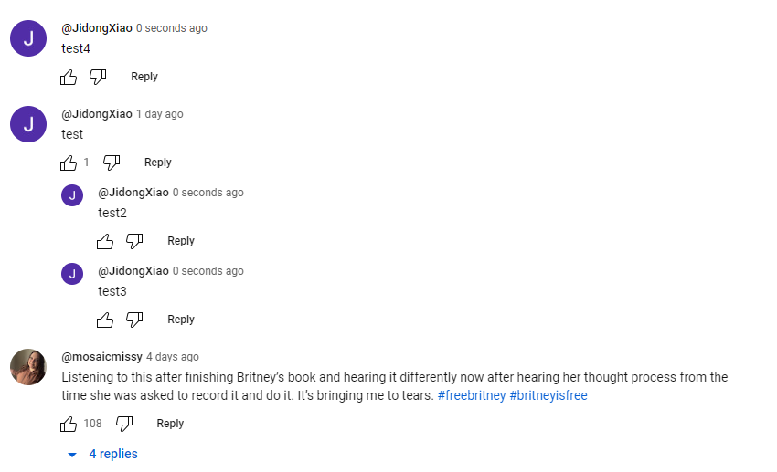
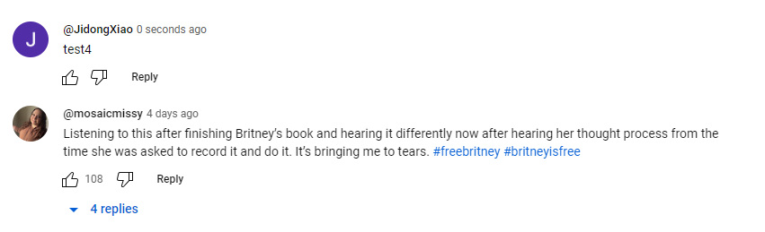

# Homework 8 — Managing Youtube Comments

In this assignment you will develop a program to manage youtube comments, let's call this program New York Comments. Please read the entire handout before starting to code the assignment.

## Learning Objectives

- Practice using tree data structures.
- Practice writing recursive programs.

## Background

A reddit user complained about this: [Why are YouTube comments not threaded like reddit comments? Why is there only one level of nestedness?](https://www.reddit.com/r/youtube/comments/8uei3n/why_are_youtube_comments_not_threaded_like_reddit/).

The complaint is saying that on reddit you will get a nested comment chain like this:

```
A: This video is fake
    B: No, it's not!
        C: How can you be so dumb?
```

and it's clear that C is replying to B.

But on YouTube you will only get something like this:

```
A: This video is fake
    B: No, it's not!
    C: How can you be so dumb?
```

Now, is C replying to B or to A? In fact, on YouTube, even if C relies to B, you will still get something like this. The problem is, YouTube does manage their comments in trees, but they only allow the trees to have two levels: parent and children, but there are no grandchildren, and that's what this user refers to as "only one level of nestedness". In order to support multiple level of nestedness, we need to create trees with more than two levels, and that is what you do in this assignment, your goal is to write a program to make youtube display comments the better way, so users can see which comment is a reply to which comment.

If you are still not clear about this problem, try to reply to a comment on youtube, and make sure you reply to a comment which is already a reply to another comment.

## Supported Commands

Your program will be run like this:

```console
nycomments.exe input1.json input2.txt output.txt
```

Here:

- *nycomments.exe* is the executable file name.
- input1.json contains existing comments to a youtube video. In this README we will refer to this file as **the json file**.
- input2.txt contains operations we want to perform. In this README we will refer to this file as **the second input file**, or just the **input2** file.
- output.txt is where to print your output to.

To summerize what your program does: your program reads all existing comments from **the json file**, store them in trees, and read the operations from **the second input file**, and then perform these operations, and every time there is a "display_comment" operation in **the second input file**, you program display the specified comment into output.txt. If there are multiple *display_comment* operations in **the second input file**, then your program will display all of them in *output.txt*, one by one.

## Format of input1.json

input1.json represents the json files, it stores all existing comments. Each line of the .json file represents one comment, and each line has this same format:

```console
{"video_id": "PMootRNTC-A", "author": "@tedybossu98", "comment_id": "UgwRfodAvGV1UOSQHhN4AaABAg", "like_count": 145, "reply_count": 51, "is_reply": false, "parent_comment_id": "", "published_date": "11 years ago", "crawled_date": "2023-10-31T22:35:37.499265", "is_video_owner": false, "comment": "Great Lord. Every time i hear this song i picture myself calling my ex and having the most romantic conversation on Earth. (her crying ..me crying) but when the song ends i never call her. I go play MW3 ..lame"}
```

The line is enclosed with a pair of curly braces. And every line has these same fields:

- *video_id*: youtube assign each video an id.
- author: username of the author.
- *comment_id*: youtube assign each comment an id.
- *like_count*: how many likes this comment gets.
- *reply_count*: how many comments are a reply to this comment.
- *is_reply*: is this a reply to an existing comment? If not, then it's a comment to the video; in other words, every comment, is either a reply to an existing comment (*is_reply* will be true), or is a comment to the original video (*is_reply* will be false).
- *parent_comment_id*: if comment A is a reply to comment B, then we define comment B as the parent of comment A.
- *published_date*: when this comment was made, for all the new comments we are going to make in this assignment, please set the published date to be "0 seconds ago".
- *crawled_date*: when the comment data was collected, you won't really use this field in this assignment.
- *is_video_owner*: indicates if this comment is made by the video owner.
- comment: the actual comment.

Each field is a key-value pair.

Please note that all comments which are direct responses to the original video, are considered as siblings. And they do not have a parent. The *parent_comment_id* field of these comments is empty. The following is such an example:

```console
{"video_id": "zz42pQ-2ytI", "author": "@user-ek5tl4nu7p", "comment_id": "UgwELiGkULP-8OvPOAZ4AaABAg", "like_count": 826, "reply_count": 33, "is_reply": false, "parent_comment_id": "", "published_date": "7 hours ago (edited)", "crawled_date": "2023-10-29T23:00:47.300265", "is_video_owner": false, "comment": "I am a Man City fan, but I have to ask the Man United players, how could they leave Haaland so wide open on the second goal."}
```

As can be seen from this above example, a comment which is a direct response to the original video, has this field *parent_comment_id* as an empty string, and also has this field *is_reply* as **false**; in contrast, a comment which is not a direct response to the original video, but rather is a response to an existing comment, will have the id of that existing comment as its *parent_comment_id*, and will also have the *is_reply* field as **true**. The following is an example of such comments:

```console
{"video_id": "zz42pQ-2ytI", "author": "@abelendecody1", "comment_id": "UgwELiGkULP-8OvPOAZ4AaABAg.9wTA3njI9fp9wTE98Q3wqB", "like_count": 83, "reply_count": 0, "is_reply": true, "parent_comment_id": "UgwELiGkULP-8OvPOAZ4AaABAg", "published_date": "6 hours ago", "crawled_date": "2023-10-29T23:00:47.300265", "is_video_owner": false, "comment": "Because they don’t know what they’re doing out there. It’s so sad to see."}
```

see the *is_reply* field is true here.

Our data set includes 6 json files, just to satisfy your curiosity, they include comments corresponding to the following 6 youtube videos:

- hold_me_closer.json is corresponding to this video titled [Elton John, Britney Spears - Hold Me Closer (Official Video)](https://www.youtube.com/watch?v=qExVlz3zb0k).

- manchester_derby.json is corresponding to this video titled [Manchester United v. Manchester City | PREMIER LEAGUE HIGHLIGHTS](https://www.youtube.com/watch?v=zz42pQ-2ytI).

- need_you_now.json is corresponding to this video titled [Lady Antebellum - Need You Now (Official Music Video)](https://www.youtube.com/watch?v=PMootRNTC-A).

- remembering_matthew_perry.json is corresponding to this video titled ["Remembering Matthew Perry, Part 1: The 'Friend' who made us laugh"](https://www.youtube.com/watch?v=riyOeTLGWHw).

- should_you_go_to_rpi.json is corresponding to this video titled [Should You Go To RPI? - Opinions from a Rensselaer Polytechnic Institute Graduate](https://www.youtube.com/watch?v=5RSsr-MagHw).

- rpi_admissions.json is corresponding to this video titled [Welcome to Rensselaer!](https://www.youtube.com/watch?v=9tsirvC4sSQ).

## Format of input2.txt 

input2.txt contains operations we want to perform, each line of this file describes one operation. These operations include:

1. reply to a video

When a line starts with the string *reply_to_video*, it means that this line describes the operation of *reply to a video*. Here is an example:

```console
reply_to_video Ugw2rL586Lv-OZNS6E94AaABAH @user2 "Friends marks my childhood."
```

Here:

- reply_to_video is the operation name. Lines describing the operation of *reply to a video* has 4 fields (separated by spaces): operation name, id of this comment, user name of the author who is making this replying comment (to the video), and the content of the replying comment.
- Ugw2rL586Lv-OZNS6E94AaABAH is the id of this current comment. 
- user2 is the user name of this author who is now making the comment, and there is always an @ symbol in front of the user name.
- "Friends marks my childhood." is the content of the comment.

2. reply to a comment

A line which starts with the string *reply_to_comment" means this line describes the operation of "reply to a comment". Here is an example:

```console
reply_to_comment Ugzsyj0jivPUQdfy_Y94AaABAg Ugzsyj0jivPUQdfy_Y94AaABAg.0 @user1 "Britney is back!"
```

Here:

- reply_to_comment is the operation name. Lines describing the operation of *reply to a comment* has 5 fields (separated by spaces): operation name, id of the parent comment, id of this comment, user name of the author who is making this replying comment (to another comment), and the content of the replying comment.
- Ugzsyj0jivPUQdfy_Y94AaABAg is the parent comment id.
- Ugzsyj0jivPUQdfy_Y94AaABAg.0 is the id of this current comment.
- user1 is the user name of this author who is now making the comment, and there is always an @ symbol in front of the user name.
- "Britney is back!" is the content of the comment.

This whole lines means that this user *user1* is making a comment with the content of "Britney is back!", and the id of this comment is Ugzsyj0jivPUQdfy_Y94AaABAg.0, and this comment is a reply to the comment whose id is Ugzsyj0jivPUQdfy_Y94AaABAg.

3. like a comment

A line which starts with the string *like_comment" means this line describes the operation of "like a comment". Here is an example:

```console
like_comment Ugzsyj0jivPUQdfy_Y94AaABAg.0.1.5.8.888
```

Here:

- like_comment is the operation name. Lines describing the operation of *like a comment* has just 2 fields (separated by spaces): the operation name, and the id the of comment which is being liked.
- Ugzsyj0jivPUQdfy_Y94AaABAg.0.1.5.8.888 is the id of the comment which is being liked.

4. delete comment

A line which starts with the string *delete_comment" means this line describes the operation of "delete a comment". Here is an example:

```console
delete_comment Ugw2rL586Lv-OZNS6E94AaABAF
```

Here:

- delete_comment is the operation name. Lines describing the operation of *delete a comment* has just 2 fields (separated by spaces): the operation name, and the id the of comment which is being deleted.
- Ugw2rL586Lv-OZNS6E94AaABAF is the id of the comment which is now being deleted.

**Definition of deleting a comment**:  in this assignment, the definition of "deleting a comment" means delete this current comment, as well as all its descendants. For example, if A is a comment, B is a reply to A, C is a reply to B, D is also a reply to B, E is a reply to D, F is a reply to E, then the operation of "deleting A" means deleting A, B, C, D, E, and F, i.e., deleting A, and all of its descendants.

The following three pictures from youtube demonstrate the visual effect of this delete process.

- Before delete, we have four comments: "test", "test2", "test3", "test4". "test" and "test4" are both comments to the video, thus they are siblings, and have no parents."test2" is a reply comment to "test", thus "test2" is the child of "test", and "test" is the parent of "test2". "test3" is a reply comment to "test2", thus "test3" is the child of "test2", and "test2" is the parent of "test3". (Question: if "test2" is the parent of "test3", then why do "test2" and "test3" have the same indentation? Well, this is exactly the problem youtube has and it is exactly what we want to you solve in this assignment.)


- Now we want to delete "test". Based on our definition of delete, this should cause the deletion of "test", "test2", and "test3".


- And this is what we get after deletion. As can be seen, "test", "test2", "test3" are all deleted.


5. display comment

A line which starts with the string "display_comment" means this line describes the operation of "display a comment". Here is an example:

```console
display_comment Ugw2rL586Lv-OZNS6E94AaABAH
```

Here:

- display_comment is the operation name. Lines describing the operation of *display a comment* has just 2 fields (separated by spaces): the operation name, and the id the of comment which is being displayed.
- Ugw2rL586Lv-OZNS6E94AaABAH is the id of the comment which is now being displayed.

**Definition of display a comment**:  in this assignment, the definition of "display a comment" means display this current comment, as well as all its descendants. For example, if A is a comment, B is a reply to A, C is a reply to B, D is also a reply to B, E is a reply to D, F is a reply to E, then the operation of "displaying A" means displaying A, B, C, D, E, and F, i.e., displaying A, and all of its descendants. And display means display the comments into the output file.

## Output File Format

All expected output files are provided. Among all the five operations mentioned above, only the *display a comment* operation would trigger a write to the output file.

When displaying the comments, we need to consider the displaying order of the comments. The rules are:

1. existing comments: comments which are included in **the json file** are existing comments. And when displaying existing comments, a parent comment should be displayed (i.e., printed to the output file) before its children comments are displayed (i.e., printed to the output file). Two children comments which have the same parent should stay in the order as they are in **the json file**. For example, both A and B are existing commens, if comment A appears in line 1 of **the json file**, and comment B appears in line 4 of **the json file**, then comment A should be displayed (i.e., printed to the output file) before comment B is displayed (i.e., printed to the output file). Also, two comments which are both responses to the original video, should stay in the same order as they appear in **the json file**.
2. newly added comments: for newly added comments, a parent comment should be displayed (i.e., printed to the output file) before its children comments are displayed (i.e., printed to the output file). Two children comments who have the same parent should stay in the same order as they are in **the second input file**.
3. if a newly added comment is a reply to an existing comment, then it should be displayed right below that existing comment.
4. if a newly added comment is a response to the original video, then this newly added comment should be displayed at the very bottom; in other words, it should be displayed after all existing comments are displayed.
5. if two newly added comments, let's say A and B, both are responses to the original video, then both A and B should be displayed at the very bottom; but the order between A and B themselves, should stay the same as they appear in **the second input file**.

To summarize the rules, in this homework, no sorting is needed, but you need to make sure that a newly added comment should always be below its all existing siblings.

### Indentation

Just like youtube, we use indentations to display the tree structure of the comments. The following image is an example from youtube:


In this assignment, we define that a child comment should be indented by four space characters relative to its parent comment. Sibling comments should have the same identation. Multiple replying comments to the same comment should all be considered as siblings. Also, as we have already mentioned earlier, multiple comments which are responses to the original video should all be considered as siblings.

## Useful Code

### getline

1. Unlike previous assignments where the input files only contain fields separated by spaces, in this assignment, fields are not separated by spaces, and therefore you may need a different way to read the input files. And the function *getline* will now come into play. To read the json file and store the whole json file into a std::string, you can use the following lines of code:

```cpp
	// assume inputFile is a std::string, containing the file name of the input file.
        std::ifstream jsonFile(inputFile);
        if (!jsonFile.is_open()) {
                std::cerr << "Failed to open the JSON file." << std::endl;
                exit(1);
        }

        std::string json_content;
        std::string line;
        while (std::getline(jsonFile, line)) {
                json_content += line;
        }
        // don't need this json file anymore, as the content is read into json_content.
        jsonFile.close();
```

After these lines, the whole content of the json file will be stored as a string in the std::string variable *json_content*. And you can then parse it to get each individual comment. In order to parse the *json_content*, which is a std::string, you will once again find that the std::string functions such as *std::string::find*(), and *std::string::substr*() to be very useful.

2. **The second input file** contains comments, which may have spaces, and that makes it hard for you to use the >> operator to read the content of the file. Once again, the *getline* function can come into play. Let's say you want to read a line like this:

```console
reply_to_comment UgxCAk2MEXaUMS8E5dx4AaABAg UgxCAk2MEXaUMS8E5dx4AaABAg.0 @user3 "I love this song!"
```

You can use the following lines of code:

```cpp
	// assuming opsFile is an std::ifstream object, which you use to open the second input file.
	// assuming command, parent_id, id, author, comment are all std::string objects.
	// read the command, the parent comment id, the child comment id, the user name.
	opsFile >> command;
	opsFile >> parent_id;
	opsFile >> id;
	opsFile >> user;
	// skip any whitespace to get to the next non-whitespace character
	opsFile >> std::ws;
	// now, read the comment
	if (opsFile.peek() == '"') {
		// if the field starts with a double quote, read it as a whole string
		opsFile.get();  // consume the opening double quote
		std::getline(opsFile, comment, '"');  // read until the closing double quote
		// opsFile >> comment;  // read the quoted field
		if (!comment.empty() && comment.back() == '"') {
			comment.pop_back();  // remove the closing double quote
		}
	}
```

After executing the above lines, your *command* will be "reply_to_comment", your *parent_id* will be "UgxCAk2MEXaUMS8E5dx4AaABAg", your *id* will be "UgxCAk2MEXaUMS8E5dx4AaABAg.0", your *user* will be "@user3", your *comment* will be "I love this song!".

### print thumbs up symbol

This line will print the thumbs up symbol, indicating likes.

```
std::cout << "\U0001F44D " << std::endl;
```

Of course you can change std::cout to a file stream so as to print the thumbs up symbol into the output file.

## Program Requirements & Submission Details

In this assignment, you are required to maintain the comments in tree nodes, each comment should be stored in one tree node. **You must use recursion in your program in at least one of your functions.** There is no other requirement on what data structures you can use and what data structures you can not use.

Use good coding style when you design and implement your program. Organize your program into functions: don’t put all the code in main! Be sure to read the [Homework Policies](https://www.cs.rpi.edu/academics/courses/spring24/csci1200/homework_policies.php) as you put the finishing touches on your solution. Be sure to make up new test cases to fully debug your program and don’t forget to comment your code! Use the provided template [README.txt](./README.txt) file for notes you want the grader to read.
You must do this assignment on your own, as described in the [Collaboration Policy & Academic Integrity](https://www.cs.rpi.edu/academics/courses/spring24/csci1200/academic_integrity.php) page. If you did discuss the problem or error messages, etc. with anyone, please list their names in your README.txt file.

**Due Date**: 03/28/2024, Thursday, 10pm.

## Instructor's Code

You can test (but not view) the instructor's code here: [instructor code](http://ds.cs.rpi.edu/hws/comments/). 

## Rubric

17 pts
 - README.txt Completed (3 pts)
   - One of name, collaborators, or hours not filled in. (-1)
   - Two or more of name, collaborators, or hours not filled in. (-2)
   - No reflection. (-1)
 - IMPLEMENTATION AND CODING STYLE (6 pts)
   - No credit (significantly incomplete implementation) (-6)
   - Putting almost everything in the main function. It's better to create separate functions for different tasks. (-2)
   - Function bodies containing more than one statement are placed in the .h file. (okay for templated classes) (-2)
   - Missing include guards in the .h file. (Or does not declare them correctly) (-1)
   - Functions are not well documented or are poorly commented, in either the .h or the .cpp file. (-1)
   - Improper uses or omissions of const and reference. (-1)
   - At least one function is excessively long (i.e., more than 200 lines). (-1)
   - Overly cramped, excessive whitespace, or poor indentation. (-1)
   - Poor file organization: Puts more than one class in a file (okay for very small helper classes) (-1)
   - Poor choice of variable names: non-descriptive names (e.g. 'vec', 'str', 'var'), single-letter variable names (except single loop counter), etc. (-2)
   - Contains useless comments like commented-out code, terminal commands, or silly notes. (-1)
 - DATA REPRESENTATION (6 pts)
   - Does not use tree data structures to store the comments. (-6)
 - RECURSION (2 pts)
   - Does not use recursion at all. (-2)
