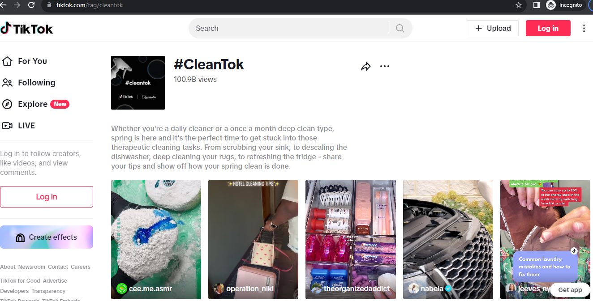

# Homework 10 — TikTok Trends

In this assignment you will develop a program to display the trends page like TikTok does, let's call this program New York Trends. Please read the entire handout before starting to code the assignment.

## Learning Objectives

- Practice using std::priority_queue.
- Practice using std::unordered_map, std::unordered_set.
<!--- Practice using C++ exceptions.-->

## Background

### TikTok Discover

According to [TikTok support](https://support.tiktok.com/en/using-tiktok/exploring-videos/discover-and-search): Discover is a page on TikTok that allows you to search and explore the wide variety of content in the TikTok community. In this feed you'll find trending videos, hashtags, creators, and sponsored content.

To access the Discover page via the mobile app, users just tap Discover, located at the bottom of phone screen.

To access the Discover page via your web browser, just go to [https://www.tiktok.com/discover](https://www.tiktok.com/discover).


As can be seen from the above screenshot (taken on November 19th, 2023), on the Discover page, two lists of videos are displayed: trending hashtags (on the left) and trending sounds (on the right). And displaying these two lists of videos is the main task of this assignment.

## Supported Commands

Your program will be run like this:

```console
nytrends.exe input.json output.txt hashtag
nytrends.exe input.json output.txt sound
```

Here:

- *nytrends.exe* is the executable file name.
- input.json contains data collected from TikTok. In this README we will refer to this file as **the json file**.
- output.txt is where to print your output to. In this README we will refer to this file as **the output file**.
- this field will be either hashtag or sound. When this field is *hashtag*, your program should display the top 10 trending hashtags to the output file. When this field is *sound*, your program should display the top 10 trending sounds to the output file.

To summarize what your program does: your program reads data from **the json file**, analyze the data and find out the top 10 trending hashtags, or the top 10 trending sounds, and display them in the output file.

## Format of input.json

input.json represents the json file. It stores posts we collected from TikTok. Each line of the json file represents one post, and each line has the same format. And below is an example, which describes a post by Taylor Swift. (You can view her post [here](https://www.tiktok.com/@taylorswift/video/7216853341702278446).)

```console
{"id": "7216853341702278446", "text": "That\u2019s my whole world \ud83d\udc95 #tstheerastour #swifttok ", "createTime": 1680304615, "createTimeISO": "2023-03-31T23:16:55.000Z", "authorMeta": {"id": "6881290705605477381", "name": "taylorswift", "nickName": "Taylor Swift", "verified": true, "signature": "This is pretty much just a cat account", "bioLink": "taylorswift.com", "avatar": "https://p16-sign-va.tiktokcdn.com/tos-maliva-avt-0068/13f2a0d585f3cd8578da0d18c36a18c4~c5_720x720.jpeg?x-expires=1700456400&x-signature=jkLwlnqFUpLwoYe6TvlGXZs%2FhP8%3D", "privateAccount": false, "region": "US", "following": 0, "fans": 22900000, "heart": 200400000, "video": 61, "digg": 2161}, "musicMeta": {"musicName": "So it goes x Miss Americana", "musicAuthor": "\ud83e\udea9", "musicOriginal": false, "playUrl": "https://v16-webapp-prime.us.tiktok.com/video/tos/useast5/tos-useast5-v-27dcd7-tx/3b1da6666aed49658c9f51e43d08ea46/?a=1988&ch=0&cr=0&dr=0&er=0&lr=default&cd=0%7C0%7C0%7C0&br=250&bt=125&bti=ODszNWYuMDE6&ft=tlc-I-Inz7TfiVYZiyq8Z&mime_type=audio_mpeg&qs=6&rc=ZmY0aTtlOjY0ZjxlaDNlOUBpM212eGU6ZnVsZjMzZzU8NEBfNTE1NjAuNjAxY18tNTYtYSNxcjZtcjQwNGhgLS1kMS9zcw%3D%3D&btag=e00008000&expire=1700307910&l=202311180544290984F2C815B65729734D&ply_type=3&policy=3&signature=00588d20de31148a1b020adebf99713b&tk=0", "coverMediumUrl": "https://p16-sign.tiktokcdn-us.com/tos-useast5-avt-0068-tx/0049bec51b5b8fcacf4339562209fd19~c5_720x720.jpeg?x-expires=1700456400&x-signature=6NwY7jHmDO1xGlE4ULhwCOEA%2F6o%3D", "musicId": "7145281770450078507"}, "webVideoUrl": "https://www.tiktok.com/@taylorswift/video/7216853341702278446", "videoMeta": {"height": 1088, "width": 576, "duration": 7, "coverUrl": "https://p16-sign.tiktokcdn-us.com/obj/tos-useast5-p-0068-tx/673c6a9a5a13481f9b1ad0c4fd1bac57?x-expires=1700456400&x-signature=knRr2wspgekIz60TWQ80WwON3%2Bw%3D", "definition": "540p", "format": "mp4", "downloadAddr": "https://v16-webapp-prime.us.tiktok.com/video/tos/useast5/tos-useast5-pve-0068-tx/71aa3cd7b7b043f484a10b6f836747cc/?a=1988&ch=0&cr=3&dr=0&lr=tiktok_m&cd=0%7C0%7C1%7C3&cv=1&br=3358&bt=1679&bti=ODszNWYuMDE6&cs=0&ds=3&ft=_rKBMBnZq8Zmoc_CKQ_vjFy.VAhLrus&mime_type=video_mp4&qs=0&rc=Zjw6ODY5aTdmOTg0NjM0ZkBpM2o2bjc6ZjlwajMzZzczNEAvMTRiNl9gNTUxLWA0XmFfYSMwYDJncjRfZmdgLS1kMS9zcw%3D%3D&btag=e00008000&expire=1700307877&l=202311180544290984F2C815B65729734D&ply_type=2&policy=2&signature=b2a0bf53c132df575cfec2b39c2dcfc7&tk=tt_chain_token"}, "diggCount": 3700000, "shareCount": 33600, "playCount": 29300000, "commentCount": 47000, "mentions": []}
```

The line is enclosed with a pair of curly braces. And every line has these same fields:

- *id*: TikTok assigns each post an id.
- text: each post has its text content and its video/audio content. The text content is stored here. Keep in mind that on TikTok, a post can't just include text information, it must contain a video. Therefore, in the remainder of this section, when we say **the video** or **this video**, we mean the video which comes with this post. When users uses hash tags, these hash tags will appear in the text content, like in this above example, Taylor Swift used hash tags twice: *#tstheerastour* and *#swifttok*.
- *createTime*: a timestamp indicating when this post was created. This is the timestamp in Unix epoch format. It represents the number of seconds that have passed since January 1, 1970 (the Unix epoch) until the specified date and time.
- *createTimeISO*: still a timestamp indicating when this post was created. This is the same timestamp but presented in the ISO 8601 date and time format, which is more human friendly. Here, *"T"* is a separator indicating the beginning of the time portion; and *"Z"* indicates that the time is in Coordinated Universal Time (UTC).
<!-- *locationCreated*: where this post was created.-->
- *authorMeta*: the author's information, which includes multiple items.
- *musicMeta*:  information of the music used in the video. This also includes multiple items.
- *webVideoUrl*: the URL of this post. To satsify your curiosity, open this specific [webVideoUrl](https://www.tiktok.com/@taylorswift/video/7216853341702278446) in your browser, and you will see which video we are talking about right now.
- *videoMeta*: information of the video. This also includes multiple items.
- *diggCount*: how many likes this video has received.
- *shareCount*: how many times this video has been shared.
- *playCount*: how many times this video has been viewed.
- *commentCount*: how many comments users have made as a reaction to this video.
- *mentions*: whom the author of this post has mentioned in the post. This could include multiple items - if multiple users are mentioned.
<!--- *hashtags*: the hashtags used in the text content of the post are also stored here separately. This could include multiple items - if multiple hashtags are used.-->

Each field is a key-value pair. As mentioned above, there are four fields which could include multiple items, and these four fields are: *authorMeta*, *musicMeta*, *videoMeta*, *mentions*. We will describe each of these four fields next.

### Author Meta

The word *meta* means meta data. Let's extract the *authorMeta* field from this same Taylor Swift post and take a closer look.

```console
"authorMeta": {"id": "6881290705605477381", "name": "taylorswift", "nickName": "Taylor Swift", "verified": true, "signature": "This is pretty much just a cat account", "bioLink": "taylorswift.com", "avatar": "https://p16-sign-va.tiktokcdn.com/tos-maliva-avt-0068/13f2a0d585f3cd8578da0d18c36a18c4~c5_720x720.jpeg?x-expires=1700456400&x-signature=jkLwlnqFUpLwoYe6TvlGXZs%2FhP8%3D", "privateAccount": false, "region": "US", "following": 0, "fans": 22900000, "heart": 200400000, "video": 61, "digg": 2161}
```

TikTok uses the following sub-fields to describe each author (i.e., user):

- *id*: TikTok assigns each author an id.
- *name*: the user name. Not necessarily the real name; but of course celebrities would use their real name for their official account.
- *nickName*: each user can also have nick name.
- *verified*: official accounts are usually verified.
- *signature*: users can put a few words introducin this account.
- *bioLink*: users can put a link in their bio section.
- *avatar*: link to the account's profile picture.
- *privateAccount*: is this a private account? Private accounts are only visible to users who have the permission from the account owner.
- *region*: where this user is located.
- *following*: how many accounts this user is following. Taylor Swift does not follow anyone. Hence her *following* is 0.
- *fans*: how many followers this account has.
- *heart*: how many likes (in total) this account received.
- *video*: how many videos this account has posted.
- *digg*: how many likes this user has pressed.

Some of these sub-fields (such as name, nickName, verified, signature, bioLink, avatar, following, fans, heart) are directly visible on Taylor Swift's TikTok profile page, as shown in this following screenshot, taken on November 19th, 2023.


### Music Meta

Let's extract the *musicMeta* field from this same Taylor Swift post and take a closer look.

```console
"musicMeta": {"musicName": "So it goes x Miss Americana", "musicAuthor": "\ud83e\udea9", "musicOriginal": false, "playUrl": "https://v16-webapp-prime.us.tiktok.com/video/tos/useast5/tos-useast5-v-27dcd7-tx/3b1da6666aed49658c9f51e43d08ea46/?a=1988&ch=0&cr=0&dr=0&er=0&lr=default&cd=0%7C0%7C0%7C0&br=250&bt=125&bti=ODszNWYuMDE6&ft=tlc-I-Inz7TfiVYZiyq8Z&mime_type=audio_mpeg&qs=6&rc=ZmY0aTtlOjY0ZjxlaDNlOUBpM212eGU6ZnVsZjMzZzU8NEBfNTE1NjAuNjAxY18tNTYtYSNxcjZtcjQwNGhgLS1kMS9zcw%3D%3D&btag=e00008000&expire=1700307910&l=202311180544290984F2C815B65729734D&ply_type=3&policy=3&signature=00588d20de31148a1b020adebf99713b&tk=0", "coverMediumUrl": "https://p16-sign.tiktokcdn-us.com/tos-useast5-avt-0068-tx/0049bec51b5b8fcacf4339562209fd19~c5_720x720.jpeg?x-expires=1700456400&x-signature=6NwY7jHmDO1xGlE4ULhwCOEA%2F6o%3D", "musicId": "7145281770450078507"}
```

TikTok uses the following sub-fields to describe each music:

- *musicName*: the name of this music.
- *musicAuthor*: the author of this music.
- *musicOriginal*: is this original music?
- *playUrl*: this url takes you to audio content of this music.
- *coverMediumUrl*: this url takes you to the cover page of this music.
- *musicId": TikTok assigns each music an id. Keep in mind that two songs can have the same name, but the musicId is unique.

### Video Meta

```console
"videoMeta": {"height": 1088, "width": 576, "duration": 7, "coverUrl": "https://p16-sign.tiktokcdn-us.com/obj/tos-useast5-p-0068-tx/673c6a9a5a13481f9b1ad0c4fd1bac57?x-expires=1700456400&x-signature=knRr2wspgekIz60TWQ80WwON3%2Bw%3D", "definition": "540p", "format": "mp4", "downloadAddr": "https://v16-webapp-prime.us.tiktok.com/video/tos/useast5/tos-useast5-pve-0068-tx/71aa3cd7b7b043f484a10b6f836747cc/?a=1988&ch=0&cr=3&dr=0&lr=tiktok_m&cd=0%7C0%7C1%7C3&cv=1&br=3358&bt=1679&bti=ODszNWYuMDE6&cs=0&ds=3&ft=_rKBMBnZq8Zmoc_CKQ_vjFy.VAhLrus&mime_type=video_mp4&qs=0&rc=Zjw6ODY5aTdmOTg0NjM0ZkBpM2o2bjc6ZjlwajMzZzczNEAvMTRiNl9gNTUxLWA0XmFfYSMwYDJncjRfZmdgLS1kMS9zcw%3D%3D&btag=e00008000&expire=1700307877&l=202311180544290984F2C815B65729734D&ply_type=2&policy=2&signature=b2a0bf53c132df575cfec2b39c2dcfc7&tk=tt_chain_token"}
```

TikTok uses the following sub-fields to describe each music:

- *height*: how this video will be displayed - the height.
- *width*: how this video will be displayed - the width.
- *duration*: the duration of this video - how many seconds.
- *coverUrl*: this url takes you to the thumbnail view image of this video.
- *definition*: the definition of this video.
- *format*: the format of this video.
- *downloadAddr*: the url where you can download this video.

### Mentions

Unliked the *authorMeta*, *musicMeta*, *videoMeta* which includes multiple sub-fields. *mentions* is more like an array which store objects of the same type. If multiple users are mentioned, then these users will appear in this *mentions* array; if no account is mentioned, like the case in this Taylor Swift post, then the *mentions* field will be stored like an empty array like this:

```console
"mentions": []
```

<!--### Hashtags

If no hashtags are used in the text content of the post, this field will be stored like this - which is just an empty array.

```console
"hashtags": []
```

If hashtags are used in the text content of the post, they will be stored in this hashtags array in this format:

```console
"hashtags": [{"id": "1640230938585093", "name": "cleantok", "title": "Whether you're a daily cleaner or a once a month deep clean type, spring is here and it's the perfect time to get stuck into those therapeutic cleaning tasks. From scrubbing your sink, to descaling the dishwasher, deep cleaning your rugs, to refreshing the fridge - share your tips and show off how your spring clean is done.", "cover": "https://p16-amd-va.tiktokcdn.com/obj/musically-maliva-obj/9342f13cf27fe417b49e65a6f4cadcbe.png"}, {"id": "1655304719036422", "name": "cleaningtiktok", "title": "Start cleaning with #CleaningTikTok.", "cover": ""}, {"id": "170127", "name": "springcleaning", "title": "Whether it's minimizing or taking out the trash, get ready for some #SpringCleaning.", "cover": "https://p16-amd-va.tiktokcdn.com/obj/musically-maliva-obj/1629633553410053.PNG"}, {"id": "75424303", "name": "cleaninghacks", "title": "Show us how you keep things neat and tidy!", "cover": "https://p16-amd-va.tiktokcdn.com/obj/musically-maliva-obj/3320a6a94d0ad4bae1a025c0b3239481"}, {"id": "1614083057293334", "name": "cleaningasmr", "title": "", "cover": ""}, {"id": "15898164", "name": "cleaningproducts", "title": "", "cover": ""}]
```

This hashtags array stores multiple hashtags, and they are:

- cleantok
- cleaningtiktok
- springcleaning
- cleaninghacks
- cleaningasmr
- cleaningproducts

For each hash tag, TikTok maintains four sub-fields:

- *id*: TikTok assigns each hashtag an id.
- *name*: the name of the hashtag.
- *title*: some hashtags have a title. The initial creation of popular or trending hashtags is initiated by TikTok itself. TikTok's content moderation and curation teams may introduce new hashtags, along with associated titles, to highlight specific themes, challenges, or trends.
- *cover*: the url which takes you to the cover image of this hashtag page.

TikTok also maintains a web page for each hashtag, for example, the hashtag cleantok is maintained on this page:



and you can visit this page via [https://www.tiktok.com/tag/cleantok](https://www.tiktok.com/tag/cleantok).
-->

## Output File Format

All expected output files are provided.

1. when users run this command:

```console
nytrends.exe input.json output.txt hashtag
```

your program should produce an output similar to what TikTok does (of course we will not print the pictures):


this basically is the trending hashtags, each is associated with some videos. In your output, these videos should be sorted in a descending order, based on how many views the video has received.

More specifically, you should print the top 10 trending hashtags, and then for each hashtag, print 3 videos which use this hashtag in its post text. If a hashtag is used in 100 videos, select the 3 (out of these 100) most viewed videos. Print the most viewed video first, and then print the next most viewed video, and then the third most viewed video.

Definition of the top 10 trending hashtags: this should be the based on the usage of the hashtag - how many times in total each hashtag is used. When two hashtags are both used for the same amount of times, break the tie by the total view count of the videos associated with each hashtag. And if still a tie, break the tie by comparing the hashtag names, i.e., apply the less than operator (<) to the two names - both are std::strings, the hashtag whose name is less than the name of the other hashtag should be the winner and should be displayed first.

Example 1:

hashtag A is used 100 times, hashtag B is used 20 times. Then hashtag A is the clear winner.

Example 2:

hashtag A is used 1000 times, hashtag B is used 1000 times, but all the posts which use hashtag A are (in total) viewed 50000 times, but all the posts which use hashtag B are (in total) viewed 2000 times, then A is the clear winner.

Example 3:

hashtag A and hashtag B are both used 100 times, and their associated videos are both view 1000 times. hashtag A is "#tstheerastour", and hashtag B is "#swifttok", both are std::string objects. Then, "#swifttok" will be the winner, because "#swifttok" is less than "#tstheerastour" when we apply the less than operators (<) to compare these two std::string objects.

Some differences between the expected output file and what TikTok actually shows:

- For the videos, we do not show the video, but we just print the coverUrl and the webVideoUrl of the video.
- For trending hashtags, we also print the usage count - as this is used to rank the hashtags, showing this will help you to diagnose potential problems.
- For view counts, which can be a very very large number, we use the raw numbers, whereas TikTok uses the more readable format. i.e., we may print *1200000000 views*, whereas TikTok would just print *1.2B views*.

2. when users run this command:

```console
nytrends.exe input.json output.txt sound
```

your program should produce an output similar to what TikTok does (of course we will not print the pictures):


this basically is the trending sounds, each is associated with some videos. In your output, these videos should be sorted in a descending order, based on how many views the video has received.

More specifically, you should print the top 10 trending sounds, and then for each sound, print 3 videos which use this sound. If a sound is used in 100 videos, select the 3 (out of these 100) most viewed videos. Print the most viewed video first, and then print the next most viewed video, and then the third most viewed video.

Definition of the top 10 trending sounds: this should be the based on the total view count of the videos which use this sound. If there is a tie, break the tie by comparing the music id, i.e., apply the less than operator (<) to the two music ids - both are std::strings, the sound whose music id is less than the music id of the other sound should be the winner, and should be displayed first.

Example 1:

sound A is used in 100 videos, and these 100 videos have been viewed (in total) 10000 times, sound B is used in 1 video, but this video has been viewed 1000000 times. Then sound B is the clear winner.

Example 2:

sound A is used in 1000 videos, and these 1000 videos have been viewed (in total) 10000 times; sound B is used in 5000 videos, and all of these 5000 videos in total have been viewed 10000 times. Then we get a tie based on the view count. Let's say sound A's music id is "123", sound B's music id is "456", and then because ("123" < "456") is true, sound A with the music id "123" wins. Thus we break the tie and A is the winner.

Some differences between the expected output file and what TikTok actually shows:

- For the videos, we do not show the video, but we just print the coverUrl and the webVideoUrl of the video.
- For trending sounds, we also print the music id - as this is used to break the tie, showing this will help you to diagnose potential problems.
- For view counts, which can be a very very large number, we use the raw numbers, whereas TikTok uses the more readable format. i.e., we may print *1200000000 views*, whereas TikTok would just print *1.2B views*.

## Useful Code

### Extract Hashtags from the Post Text

Assume you store the post text content in a std::string variable called *text*, the following code block will extract all hashtags from this text string.

```cpp
// the text of the post is given as a std::string, extract hashtags from the text.

    // define a regular expression to match hashtags
    std::regex hashtagRegex("#([\\w\\u0080-\\uFFFF]+)");

    // create an iterator for matching
    std::sregex_iterator hashtagIterator(text.begin(), text.end(), hashtagRegex);
    std::sregex_iterator endIterator;

    // iterate over the matches and extract the hashtags
    while (hashtagIterator != endIterator) {
        std::smatch match = *hashtagIterator;
        std::string hashtag = match.str(1);  // extract the first capturing group
	// this line will print each hash tag
	// if you want to do more with each hash tag, do it here. for example, store all hash tags in your container.
        std::cout << "Hashtag: " << hashtag << std::endl;

        ++hashtagIterator;
    }
}
```

In order to use this above code block, you need to include the regular expression library like this:

```cpp
#include <regex>
```

**Note**: it is okay if you decide not to use the above code to extract the hashtags, especially if you have a better way to do so.

## Program Requirements & Submission Details

In this assignment, you are required to use std::priority_queue. There is no other requirement on what data structures you can use and what data structures you can not use.

<!--**You must use try/throw/catch to handle exceptions in your code**. You do not need to do so everywhere in your code. You will only lose points if you do not use it at all.-->

Use good coding style when you design and implement your program. Organize your program into functions: don’t put all the code in main! Be sure to read the [Homework Policies](https://www.cs.rpi.edu/academics/courses/spring24/csci1200/homework_policies.php) as you put the finishing touches on your solution. Be sure to make up new test cases to fully debug your program and don’t forget to comment your code! Use the provided template [README.txt](./README.txt) file for notes you want the grader to read.
You must do this assignment on your own, as described in the [Collaboration Policy & Academic Integrity](https://www.cs.rpi.edu/academics/courses/spring24/csci1200/academic_integrity.php) page. If you did discuss the problem or error messages, etc. with anyone, please list their names in your README.txt file.

**Due Date**: 04/18/2024, Thursday, 10pm.

## Instructor's Code

You can test (but not view) the instructor's code here: [instructor code](http://ds.cs.rpi.edu/hws/trends/).

## FAQs

q1: For cases where a hashtag appears twice on a line does that count as two separate URLs?

a1: Yes, a hashtag appears 2 times in one post will be counted as 2 times. This is the reason why some URLs appear twice in the output as the top 3 videos of some hashtag - as in that #foryou case in tiny1. (This is just to simplify your implementation).

## Rubric

13 pts
 - README.txt Completed (3 pts)
   - One of name, collaborators, or hours not filled in. (-1)
   - Two or more of name, collaborators, or hours not filled in. (-2)
   - No reflection. (-1)
 - IMPLEMENTATION AND CODING STYLE (5 pts)
   - No credit (significantly incomplete implementation) (-5)
   - Putting almost everything in the main function. It's better to create separate functions for different tasks. (-2)
   - Function bodies containing more than one statement are placed in the .h file. (okay for templated classes) (-2)
   - Functions are not well documented or are poorly commented, in either the .h or the .cpp file. (-1)
   - Improper uses or omissions of const and reference. (-1)
   - At least one function is excessively long (i.e., more than 200 lines). (-1)
   - Overly cramped, excessive whitespace, or poor indentation. (-1)
   - Poor file organization: Puts more than one class in a file (okay for very small helper classes) (-1)
   - Poor choice of variable names: non-descriptive names (e.g. 'vec', 'str', 'var'), single-letter variable names (except single loop counter), etc.
   - Contains useless comments like commented-out code, terminal commands, or silly notes. (-1)
 - DATA REPRESENTATION (5 pts)
   - No credit (significantly incomplete implementation). (-5)
   - Does not use std::priority_queue at all. (-5)
<!--
   - Member variables are public. (-2)
 - Exceptions (2 pts)
   - Does not use try/throw/catch anywhere in the code. (-2) -->
