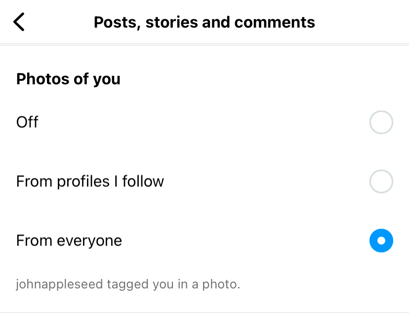
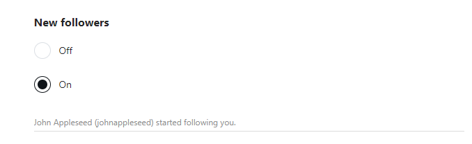
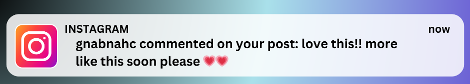

# Homework 10 — Instagram Notifications

In this assignment you will develop a program to deliver notifications to users like Instagram does, let's call this program New York Notifications. Please read the entire handout before starting to code the assignment. As the main learning objective of this assignment is to practice using the C++ inheritance and polymorphism, in this assignment, we explicitly require you to define a class called Notification, and use this class as the base class to derive classes for various types of notifications.

## Learning Objectives

- Practice using C++ inheritance and polymorphism.

## Background

### Instagram Notifications

Instagram sends notifications to users in different situations, such as:
1. when someone follows you.
2. when someone likes or comments on one of your posts.
3. when someone mentions you in a comment.
4. when someone sends you a message.

And there are many more. In this assignment, your program will support five types of notifications: like, tag, comment, follow, and message request. This means, your program must define a base class called Notification, and then define five derived classes, each of them represents one of these five types of notifications.

On Instagram, on the "Settings and privacy" page, users can choose to turn on or turn off each of these notifications, as shown in the following five screenshots:

To turn on or off like notifications:\


To turn on or off tag notifications:\


To turn on or off comment notifications:\


To turn on or off follow notifications:\


To turn on or off message request notifications:\


Users can also decide to pause all notifications:\


## Supported Commands

Your program will be run like this:

```console
nynotifications.exe posts.json users.json events.txt output.txt username
```

Here:

- *nynotifications.exe* is the executable file name.
- posts.json contains data collected from Instagram. Each line in this json file represents one post on Instagram.
- users.json contains data collected from Instagram as well as simulated data for users' notification preferences. Each line in this json file represents one user on Instagram.
- events.txt defines all events which might trigger a notification. In this README we will refer to this file as the **events file**. Note that we have multiple events files, representing different test cases. These events files include events_tiny.txt, events_small.txt, events_medium.txt, events_large.txt, and events_huge.txt.
- output.txt is where to print your output to, and each line in this output file should represent one notification. In this README we will refer to this file as **the output file**.
- this argument would be a username. For each run of your program, **the output file** should contain notifications which are only supposed to be delivered to this user as specified by this **username**.

To summarize what your program does: your program reads data from the two json files, and parse events from the events file. Based on the events and users' notification preferences, your program display notifications for this user (as specified in the **username** command line argument) in the output file.

## Format of posts.json

posts.json stores posts we collected from Instagram. Each line of this json file represents one post, and each line has the same format. And below is an example, which describes a post by Taylor Swift.

```console
{"id":"3166098261500503829","type":"Image","caption":"Surprise!! 1989 (Taylor\u2019s Version) is on its way to you \ud83d\udd1c! The 1989 album changed my life in countless ways, and it fills me with such excitement to announce that my version of it will be out October 27th. To be perfectly honest, this is my most FAVORITE re-record I\u2019ve ever done because the 5 From The Vault tracks are so insane. I can\u2019t believe they were ever left behind. But not for long! Pre order 1989 (Taylor\u2019s Version) on my site \ud83e\ude75\ud83d\ude0e\ud83e\ude75\n\n\ud83d\udcf7: @bethgarrabrant","hashtags":[],"mentions":["bethgarrabrant"],"url":"https://www.instagram.com/p/CvwPZgYuCcV/","commentsCount":0,"displayUrl":"https://scontent-ord5-2.cdninstagram.com/v/t51.2885-15/366422100_147674528370406_9143482148277133418_n.jpg?stp=dst-jpg_e35_s1080x1080&_nc_ht=scontent-ord5-2.cdninstagram.com&_nc_cat=1&_nc_ohc=rBcVFTxJPEYAX9clyr2&edm=AOQ1c0wBAAAA&ccb=7-5&ig_cache_key=MzE2NjA5ODI2MTUwMDUwMzgyOQ%3D%3D.2-ccb7-5&oh=00_AfBuyZsouLs0N90G6dXlfhiUTKIFL3sJP3YUWQnqtBFXnQ&oe=656720E4&_nc_sid=8b3546","images":[],"likesCount":12532920,"timestamp":"2023-08-10T06:19:06.000Z","ownerUsername":"taylorswift","ownerId":"11830955","taggedUsers":[{"full_name":"Beth Garrabrant","id":"34234869","is_verified":false,"profile_pic_url":"https://scontent-ord5-2.cdninstagram.com/v/t51.2885-19/365905608_305188601913736_4756066331028114622_n.jpg?stp=dst-jpg_s150x150&_nc_ht=scontent-ord5-2.cdninstagram.com&_nc_cat=104&_nc_ohc=osCkZA1f-NYAX9uyTTV&edm=AOQ1c0wBAAAA&ccb=7-5&oh=00_AfAmj-OGhpkJTUNN-jo_k-GOUu1PphuKjvAQJjtGPpAbcw&oe=65673C00&_nc_sid=8b3546","username":"bethgarrabrant"}]}
```

The line is enclosed with a pair of curly braces. And every line has these same fields:

- *id*: Instagram assigns each post an id.
- type: Instagram supports different types of posts. The two most common ones are "Image" type and "Video" type. This above post is an Image post. 
- caption: each post has its text content and its image/video content. The text content is known as *caption* and is stored here.
- *hashtags*: if hashtags are used in the caption, Instagram would store them here.
- *mentions*: if the post text content mentions some other users, the username of these users will be stored here. In this above example, Taylor Swift mentioned @bethgarrabrant, to thank her for shooting the photo.
- *url*: the URL of this post. You can open this url [https://www.instagram.com/p/CvwPZgYuCcV/](https://www.instagram.com/p/CvwPZgYuCcV/) in your browser so you will see which post we are talking about right now.
- *commentsCount*: how many comments users have made as a reaction to this video. Taylor Swift doesn't allow users to comment on this post, thus its commentCount for this specific post is 0.
- *displayUrl*: this URL takes you to the cover image of this post.
- *images*: some posts have multiple images, information about these images will be stored here.
- *likesCount*: how many times this post has been liked.
- *timestamp*: when this post was created.
- *ownerUsername*: the username of the owner who owns/created this post.
- *ownerId*: Instagram assigns each user an id.
- *taggedUsers*: whom the author of this post has tagged in the images of this post. This could include multiple items - if multiple users are tagged. This field will not exist if no users are tagged.

Each field is a key-value pair. The screenshot of this Taylor Swift's post will help you better understand some of these fields.


## Format of users.json

users.json stores users we collected from Instagram, we also added some random data here to represent each user's notification preferences. Each line of this json file represents one user, and each line has the same format. And below is an example, which describes the user Taylor Swift.

```console
{"id": "11830955", "username": "taylorswift", "url": "https://www.instagram.com/taylorswift", "fullName": "Taylor Swift", "biography": "I’m the problem, it’s me", "notifications": [{"pauseAll": "false", "likes": "true", "tags": "true", "comments": "true", "newFollowers": "true", "messageRequests": "true"}]}
```

The line is enclosed with a pair of curly braces. And every line has these same fields:

- *id*: Instagram assign each user an id.
- *username*: when registering on Instagram, users can choose a username - if it's still available.
- *url*: this URL takes you to the user's profile page.
- *fullName*: the full name of this user.
- *biography*: users can briefly describe themselves here.
- *notifications*: this is the data we added. Since notification preferences are private data, we are not able to collect them from Instagram, thus we just randomly assign a *true* or *false* value to each of the five notification types we use in this assignment. When it is *true*, it means the user has turned this notification type on, meaning the user expects to receive such notifications. We also randomly set this *pauseAll* attributes to either *true* or *false*. When this *pauseAll* attribute is set to *true*, no notifications should be delivered to this user.

## Format of events.txt

events.txt contains events which may occur on Instagram, each line of this file describes one event, and each line has 3 columns, separated by a space. The first column is always a username, and the third column is always either a username, or a post id. The second column of each line defines what event it is. The events we use in our data set include:

1. likes

When the second column of a line is the string *likes*, it means that this line describes the event of *someone likes a post*. Here is an example:

```console
jasonevans likes 3241797774743415032
```

Here: jasonevans is a username. This user like the post which has an id of 3241797774743415032.

2. tags

When the second column of a line is the string *tags*, it means that this line describes the event of *someone tags another user in a photo*. Here is an example:

```console
lilynguyen tags nicolekidman
```

Here: lilynguyen is a username. This user tags Nicole Kidman, whose username is nicolekidman, in a photo. (In which photo? That is not relevant to this assignment.)

3. comments_on

When the second column of a line is the string *comments_on*, it means that this line describes the event of *someone makes a comment on a post*. Here is an example:

```console
alexjones comments_on 3241978951060130582
```

Here: alexjones is a username. This user makes a comment on the post which has an id of 3241978951060130582.

4. follows

When the second column of a line is the string *follows*, it means that this line describes the event of *someone follows another user*. Here is an example:

```console
carter_singh follows jaytatum0
```

Here: carter_singh is a username. This user starts following jaytatum0, which is the username of Boston Celtics' player Jayson Tatum.

5. messageRequests

When the second column of a line is the string *messageRequests*, it means that this line describes the event of *someone attempts to message someone else*. On Instagram, you can not message another user if the other user does not follow you. And if you do want to message another user who is not following you, you need to make this message request, and if the other user approves the request, then you will be able to send messages to the other user. Here is an example:

```console
brandon_wilson messageRequests jenniferaniston
```

Here: brandon_wilson is a username. This user attempts to send a message to Jennifer Aniston, whose username is jenniferaniston.

**Note**: In this assignment, we assume events in this events file are sorted in chronological order. Meaning the first line of the events file represents an event which occurs earlier than any other events, and the last line (at the very bottom) of the events file represents an event which occurs later than any other events, which also means it is the most recent event.

## Output File Format

All expected output files are provided.

Example 1: When users run this command:

```console
nynotifications.exe posts.json users.json events_medium.txt output.txt taylorswift
```

your program should produce an output which contains notifications which should be delivered to taylorswift.

Example 2: When users run this command:

```console
nynotifications.exe posts.json users.json events_large.txt output.txt andrewyang
```

your program should produce an output which contains notifications which should be delivered to andrewyang.

The notifications should be displayed in the **opposite** order as the corresponding events appear in the events file. In other words, they should be displayed in a descending chronological order, where the notification corresponding to the most recent event should be displayed at the very top of your output file, and the notification corresponding to the oldest event should be displayed at the very bottom. For example, let's say event A triggers notification A, and event B triggers notification B, and event A occurs before event B, then notification B should be printed in the output file before notification A, because compared to event A, event B is more recent. This behavior can also be seen from the following five screenshots.

For like notifications:


For tag notifications:


For comment notifications:



**Note**: our comment notification messages do not include the actual comments.

For follow notifications:


**Note**: our follow notification messages will show the user's username, but do not show the full name as Instagram does.

For messageRequest notifications:


In this assignment, your notification messages will be similar to (but not identical to) what Instagram shows.

### Max Number of Notifications

In this assignment, we set a cap of 100 on how many notifications can be displayed in your output file. This means your output file should be no more than 100 lines, and each line represents one notification message. These notification messages should be the notifications corresponding to the most recent events.

### Notification Aggregation

Besides setting a max number of notifications, in this assignment, we also group notifications of the same type together to avoid overwhelming the user with individual notifications for each event. This provides a more streamlined and user-friendly notification experience by presenting a summary of similar activities. We call this feature "Notification Aggregation". This behavior can be seen in the following Instagram screenshot, and we will use this as an example to explain how this *Notification Aggregation* works.


Here, 19 users liked this user's photo. Instead of delivering 19 notifications, you should just deliver one notification, and only display two usernames, with *itsgraeme* being the user who most recently liked this user's photo, and *nicstagram80* being the user whose like is the next most recent like. Usernames of the other 17 users should not be displayed here.

In this assignment, we define that this *Notification Aggregation* will be used when there are more than 3 consecutive notifications of the same type.

For example, if we have the following 3 comment notifications and 2 follow notificatons like this:

```console
carterkim started following you.
sebastianflores commented on your post.
zoeygraham commented on your post.
natalie_young commented on your post.
noah_brown started following you.
```

then:
1. We do not aggregate the follow notifications, because the number of follow notifications is just 2 and they are not consecutive.
2. We do not aggregate the comment notifications, because the number of comment notifications is just 3, even though they are consecutive.

But in this next example, we have 4 comment notifications and 2 follow notifications:

```console
carterkim started following you.
sebastianflores commented on your post.
zoeygraham commented on your post.
natalie_young commented on your post.
david_johnson commented on your post.
noah_brown started following you.
```

Then the above notifications should be printed as:

```console
carterkim started following you.
sebastianflores, zoeygraham and 2 others commented on your post.
noah_brown started following you.
```

This aggregation occurs because we find 4 (which is more than 3) consecutive notifications of the same type - comment notification.

Keep in mind that *Notification Aggregation* should not break the order of the output - your output should still be in a descending chronological order. In this above example, it means all 4 commenting events must occur in between the two following events. In other words, out of the 6 events, *carterkim started following you* represents the most recent event, *noah_brown started following you* represents the oldest event, and all of these four commenting events occur in between these two following events.

## Useful Code

### getline

**Note**: this next paragraph is the same as that paragraph in homework 8 and homework 9, and for the two json files we use in this assignment, you once again can read the whole file into a large string; but if you want to beat Jidong on the leaderboard, whether or not this is the most efficient way to read the file is a question for you to think about.

Unlike previous assignments where the input files only contain fields separated by spaces, in this assignment, fields are not separated by spaces, and therefore you may need a different way to read the input files. And the function *getline* will now come into play. To read the json file and store the whole json file into a std::string, you can use the following lines of code:

```cpp
	// assume inputFile is a std::string, containing the file name of the input file.
        std::ifstream jsonFile(inputFile);
        if (!jsonFile.is_open()) {
                std::cerr << "Failed to open the JSON file." << std::endl;
                exit(1);
        }

        std::string json_content;
        std::string line;
        while (std::getline(jsonFile, line)) {
                json_content += line;
        }
        // don't need this json file anymore, as the content is read into json_content.
        jsonFile.close();
```

After these lines, the whole content of the json file will be stored as a string in the std::string variable *json_content*. And you can then parse it to get each individual post. In order to parse the *json_content*, which is a std::string, you will once again find that the std::string functions such as *std::string::find*(), and *std::string::substr*() to be very useful.

## Program Requirements & Submission Details

In this assignment, you can use any data structures we have learned in this course. **There is no restrictions on what you can or cannot use.**

**The only requirement is: you must define a class called Notification, and use this class as the base class to derive classes for various types of notifications.**

<!--**You must use try/throw/catch to handle exceptions in your code**. You do not need to do so everywhere in your code. You will only lose points if you do not use it at all.-->

Use good coding style when you design and implement your program. Organize your program into functions: don’t put all the code in main! Be sure to read the [Homework Policies](https://www.cs.rpi.edu/academics/courses/spring25/csci1200/homework_policies.php) as you put the finishing touches on your solution. Be sure to make up new test cases to fully debug your program and don’t forget to comment your code! Use the provided template [README.txt](./README.txt) file for notes you want the grader to read.
You must do this assignment on your own, as described in the [Collaboration Policy & Academic Integrity](https://www.cs.rpi.edu/academics/courses/spring25/csci1200/academic_integrity.php) page. If you did discuss the problem or error messages, etc. with anyone, please list their names in your README.txt file.

**Due Date**: 04/17/2025, Thursday, 22:00pm.

## FAQs

q1: What bonus do I get if my program outperforms the instructor's program on the leaderboard?

a1: If by Thursday night 10pm (which is the submission deadline), your program outperforms the instructor's program, you have many options. You can choose one of these:
- Drop the lowest test score - replace it with your highest test score.
- Drop 2 of the lowest homeworks - replace them with your highest homework score.

   You will receive an email asking you about which option you want to choose, or if you want to propose a different option. You will be asked to describe your optimization techniques, and you must have at least one technique which is unique - not mentioned by 5 (or more than 5) other students.

**Definition of Outperform:** The term outperform is defined as: Your program must either runs less amount of time than the instructor's code; or runs the same amount of time but consumes less memory than the instructor's code. Same run time, same memory usage, but submitty shows you at a higher position will not be counted as outperforming.

q2: What if my program outperforms the instructor's program on two leaderboards (2 out of the 3: hw6, hw9, hw10)?

a2: You can skip the final exam; we will apply the highest test score among your test 1, 2, and 3, as your final exam score. The "skip final" option is exclusive and can't be used with other options.

q3: What if my program ranks higher than the instructor's program on all 3 leaderboards (3 out of the 3: hw6, hw9, hw10)?

a3: You will receive an A for this course immediately if determined that you worked independently on these 3 homeworks and it is you - not someone else, who wrote the code and all 3 are your original work. The instructor reserves the right to not give you an A if the following red flags are noticed: 1. your test scores are consistently low and all the tests show that you are very unfamiliar with C++ and the lab TA/mentors conclude that your coding skills are clearly below class average. 2. when asked what optimization techniques you used, you could not name anything unique - everything you say is mentioned by at least 5 other students.

**Definition of work independently:** Doing your own research, asking chatgpt or other AI tools, are okay; collaborating with other students in this class, sharing your techniques with other students in this class, are not okay and are not considered as an independent, original work.

q4: How many submissions can I make?

a4: 60. Submitty will deduct points once you submit more than 60 times. **To make it a fair game, students who make more than 60 submissions are disqualified from the competition automatically and thus won't receive any rewards.**

q5: Can I still compete on the leaderboard after the Thursday night 10pm deadline? 

a5: No. The leaderboard will be closed shortly after the submission deadline, meaning that you won't even be able to see a rank after the deadline. Students who want to take a screenshot of their position on the leaderboard are encouraged to do so before the 10pm deadline.

## Rubric

17 pts
 - README.txt Completed (3 pts)
   - One of name, collaborators, or hours not filled in. (-1)
   - Two or more of name, collaborators, or hours not filled in. (-2)
   - No reflection. (-1)
 - IMPLEMENTATION AND CODING STYLE (Good class design, split into a .h and .cpp file.  Functions > 1 line are in .cpp file.  Organized class implementation and reasonable comments throughout. Correct use of const/const& and of class method const. ) (6 pts)
   - No credit (significantly incomplete implementation) (-6)
   - Putting almost everything in the main function. It's better to create separate functions for different tasks. (-2)
   - Function bodies containing more than one statement are placed in the .h file. (okay for templated classes) (-2)
   - Functions are not well documented or are poorly commented, in either the .h or the .cpp file. (-1)
   - Improper uses or omissions of const and reference. (-1)
   - At least one function is excessively long (i.e., more than 200 lines).
   - Overly cramped, excessive whitespace, or poor indentation. (-1)
   - Poor file organization: Puts more than one class in a file (okay for very small helper classes). (-1)
   - Poor choice of variable names: non-descriptive names (e.g. 'vec', 'str', 'var'), single-letter variable names (except single loop counter), etc. (-1)
 - DATA REPRESENTATION (8 pts)
   - Does not define the Notification base class. (-8)
   - Does not define any of the five derived Notification classes. (-8)
   - One of the five derived Notification classes is missing. (-2)
   - Two of the five derived Notification classes are missing. (-4)
   - Three or more of the five derived Notification classes are missing. (-6)
<!--   - Member variables are public. (-2)
-- - Exceptions (2 pts)
   - Does not use try/throw/catch anywhere in the code. (-2)-->
