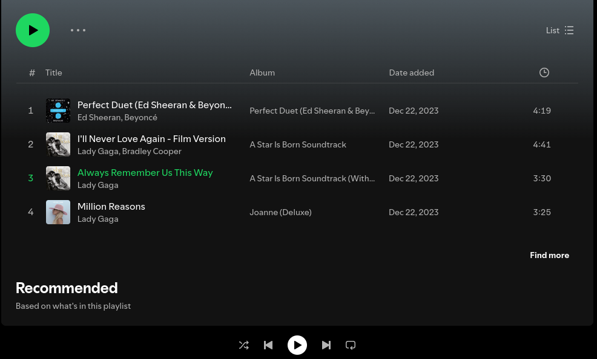
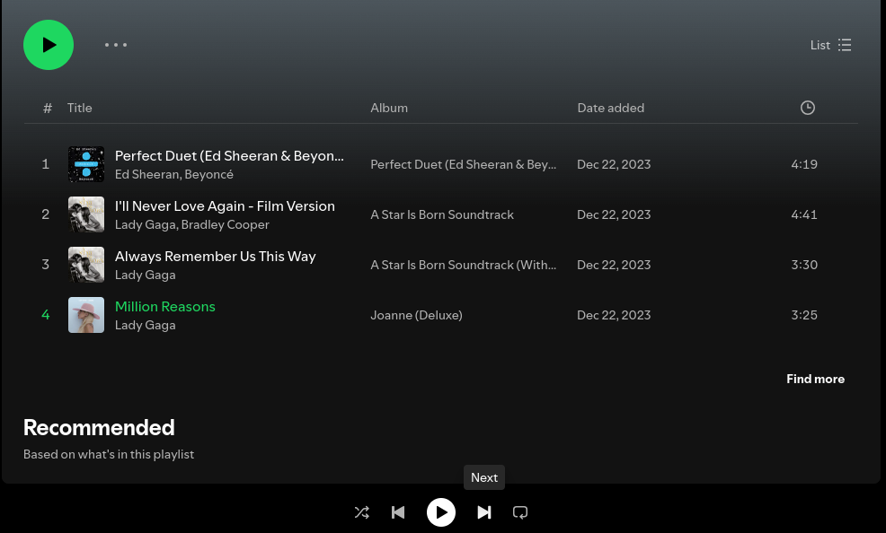
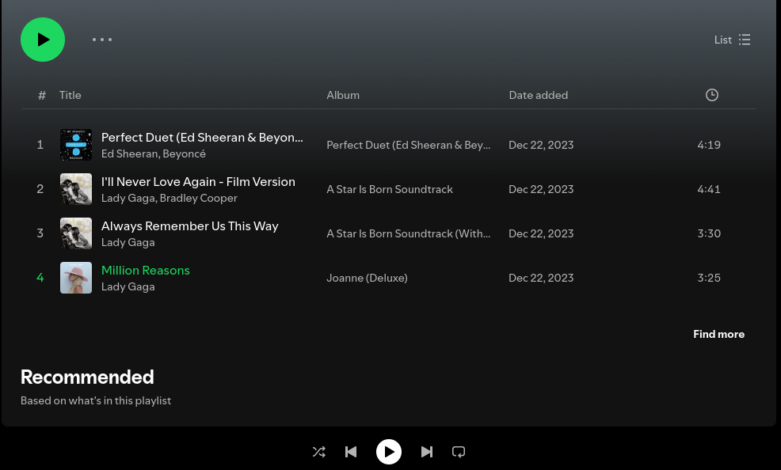
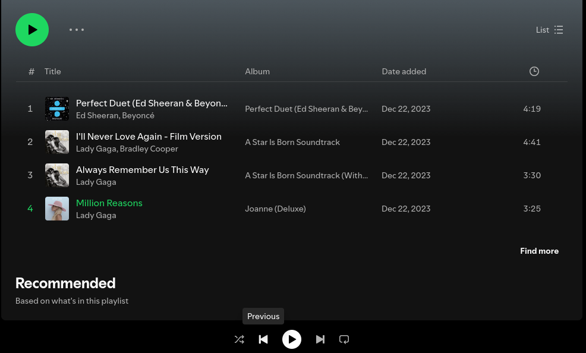

# Homework 1 — Spotify Playlists

Before starting this homework, make sure you have read and understood the Academic Integrity Policy.

In this assignment you will develop a program to manage music playlists like Spotify does, let's call this program New York Playlists. Please read the entire handout before starting to code the assignment. 

## Learning Objectives

- Practice handling command line arguments.
- Practice handling file input and output.
- Practice the C++ Standard Template Library string and vector classes. 

## Background

On Spotify, users can create and manage playlists. On the Spotify app or website, users can navigate to the "Your Library" section and click on the "+" sign to create a playlist. When creating a playlist, users can add music tracks to the playlist.

After a playlist is created, users can add new tracks to this playlist, or remove tracks from this playlist. Users can also move tracks to new positions within a playlist. The following two images show the moving process:

At first, track 1 is "Perfect Duet", track 2 is "Always Remember Us This Way", track 3 is "Million Reasons", and track 4 is "I'll Never Love Again".


Next, we drag track 4 up to right above track 2.

After this dragging action, now, track 1 is still "Perfect Duet", track 2 is "I'll Never Love Again", track 3 is "Always Remember Us This Way", and track 4 is "Million Reasons".


### Next and Previous Button

When using Spotify, if users press the "Next" button, Spotify will skip the currently playing song and starts playing the song that is listed directly after it; if users press the "Previous" button, Spotify will go to the song listed directly before the currently playing song.

The following images show the behavior of pressing "Next".

Before pressing "Next", the currently playing song is "Always Remember Us This Way":


Press "Next":


After pressing "Next", the currently playing song is now "Million Reasons":


The following images show the behavior of pressing "Previous".

Before pressing "Previous", the currently playing song is "Million Reasons":


Press "Previous":


After pressing "Previous", the currently playing song is "Always Remember Us This Way":


## Command Line Arguments

Your program will be run like this:

```console
./nyplaylists.exe playlist.txt actions.txt output.txt
```

Here:

- nyplaylists.exe is the executable file name.
- playlist.txt is the name of an input file which contains a playlist - in this README, we will refer to this file as the **playlist file**.
- actions.txt is an input file which defines a sequence of actions - in this README, we will refer to this file as the **actions file**.
- output.txt where to print your output to.

## Playlist File Format and Output File Format

The playlist file and the output file have the same format. Take the playlist_tiny1.txt as an example, this file has the following 4 lines:

```console
"Perfect Duet" Ed Sheeran, Beyonce
"Always Remember Us This Way" Lady Gaga current
"Million Reasons" Lady Gaga
"I Will Never Love Again - Film Version" Lady Gaga, Bradley Cooper
```

Except the second line, each line has two fields, the music title, and the artist(s). There is one single space separating these two fields. 

The second line is special, it ends with the word **current**, meaning that the song "Always Remember Us This Way" is the currently playing song. This word **current** appears in the **playlist file** once and should also appear in the output file once.

## Actions File Format

The actions file defines actions. Take actions1.txt as an example, this file has the following lines:

```console
add "Umbrella" Rihanna
add "We Are Young" Fun
add "You Are Still the One" Shania Twain
remove "Million Reasons" Lady Gaga
add "Viva La Vida" Coldplay
move "I Will Never Love Again - Film Version" Lady Gaga, Bradley Cooper 1
next
next
next
previous
move "You Are Still the One" Shania Twain 4
```

The **actions file** may include 5 different types of actions:

- add, which adds a song to the end of the playlist.
- remove, which removes a song from the playlist.
- move, which moves a song to a new position - the new position is always included at the end of the line. The line *move "I Will Never Love Again - Film Version" Lady Gaga, Bradley Cooper 1*, moves the song "I Will Never Love Again - Film Version" to position 1, and the line *move "You Are Still the One" Shania Twain 4*, moves the song "You Are Still the One" to position 4. Note that, unliked array indexing in C/C++, positioning in Spotify starts at 1, as opposed to 0. This can be seen in the above Spotify screenshot: the first position is position 1.
- next, which skips the currently playing song and starts playing the song that is listed directly after it. Note that if the currently playing song is already at the bottom of the playlist, the action *next* will make the first song (i.e., the song at the very top of the playlist) as the currently playing song.
- previous, which skips the currently playing song and goes to the song listed directly before the currently playing song. Note that if the currently playing song is already at the top of the playlist, the action *previous* will make the last song (i.e., the song at the bottom of the playlist) as the currently playing song.

According to this sample **actions file**, 4 songs will be added to the playlist, 1 song will be removed, 2 songs will be moved. And the currently playing song will be a different song, instead of the song "Always Remember Us This Way".

When playlist_tiny1.txt and actions1.txt are supplied to your program as the two input files, your program should produce the following output file:

```console
"I Will Never Love Again - Film Version" Lady Gaga, Bradley Cooper
"Perfect Duet" Ed Sheeran, Beyonce
"Always Remember Us This Way" Lady Gaga
"You Are Still the One" Shania Twain
"Umbrella" Rihanna
"We Are Young" Fun current
"Viva La Vida" Coldplay
```

## Non-existent Songs

If a move action or a remove action as defined in the **actions file** attempts to move or remove a song which does not exist in the playlist, your program should ignore such an action.

## Duplicated Songs

In cases where the same song appears more than once on the playlist, choose the first song (to move or remove) - i.e., search the playlist, starting from the top to the bottom, identify the first occurrence of this song, and use it (to move or remove).

<!-- ### Command 1: add a music track to a playlist
The first argument is the name of an input file which contains a playlist - in this README, we will refer to this file as the **playlist file**. The second argument is the name of another input file which contains all available music tracks - in this README, we will refer to this file as the **library file**. The third argument is the output file. The fourth argument is the action, which in this case is "add". The fifth argument is the title of the music track.

```console
./nyplaylists.exe playlist.txt library.txt output.txt add title
```

This command will add a music track (specified by the title) to the end of a playlist.

For example, the following command will add the song Umbrella to the end of the playlist.
```console
./nyplaylists.exe playlist_tiny1.txt library.txt output.txt add Umbrella
```

### Command 2: remove a music track from a playlist
The first argument is the name of the **playlist file**. The second argument is the name of **library file**. The third argument is the output file. The fourth argument is the action, which in this case is "remove". The fifth argument is the title of the music track.

```console
./nyplaylists.exe playlist.txt library.txt output.txt remove title
```

For example, the following command will remove the song "Always Remember Us This Way" from the playlist.
```console
./nyplaylists.exe playlist_tiny1.txt library.txt output.txt remove Always Remember Us This Way
```

### Command 3: move a music track to a new position on the playlist
The first argument is the name of **playlist file**. The second argument is the output file. The third argument is the action, which in this case is "move". The fourth argument is the title of the music track. The fifth argument is the new position - where this user wants the music track to be located on the playlist. Note that, unliked array indexing in C/C++, positioning in Spotify starts at 1, as opposed to 0. This can be seen in the above Spotify screenshot: the first position is position 1.

```console
./nyplaylists.exe playlist.txt output.txt move title [new_position]
```

For example, the following command will move the song "I Will Never Love Again - Film Version" to position 1.
```console
./nyplaylists.exe playlist_tiny1.txt output.txt move I Will Never Love Again - Film Version 1
```

### Command 4: skip to the next song in the current playlist
The first argument is the name of **playlist file**. The second argument is the output file. The third argument is the action, which in this case is "next".

```console
./nyplaylists.exe playlist.txt output.txt next
```

This command will skip to the next song in the current playlist.

### Command 5: skip to the previous song in the current playlist
The first argument is the name of **playlist file**. The second argument is the output file. The third argument is the action, which in this case is "previous".

```console
./nyplaylists.exe playlist.txt output.txt previous
```

For all 5 commands, the output.txt contains the updated playlist. We have provided sample input & output files. Examples of using command line arguments can be found on the course webpage: [Programming Information](https://www.cs.rpi.edu/academics/courses/spring25/csci1200/programming_information.php).

## Handling Music Tracks with the Same Title

In cases where multiple tracks may have the same title, choose the first track from the input file. This is NOT the natural behavior of Spotify, but this decision is just to simplify your implementation.
-->

<!-- ## Known Issue on Submitty

The Autograder on Submitty doesn't handle command line arguments correctly when the arguments are enclosed in double quotes. In fact, the autograder would add a backslash as an escape character in front of each double quote.

e.g., For this command:
```console
./nyplaylists.exe playlist_tiny1.txt library.txt output.txt add "Umbrella"
```

The autograder would actually run:
```console
./nyplaylists.exe playlist_tiny1.txt library.txt output.txt add \"Umbrella\"
```

And as a result, the autograder would pass the last argument as "Umbrella" (with the double quotes) to your program. Thus you need to remove the open double quote and the closing double quote in your program.

Another example, for this command,
```console
./nyplaylists.exe playlist_tiny1.txt library.txt output.txt move "I Will Never Love Again - Film Version" 1
```

The autograder would actually run:
```console
./nyplaylists.exe playlist_tiny1.txt library.txt output.txt move \"I Will Never Love Again - Film Version\" 1
```

This means the autograder would pass 14 arguments to your program. And these 14 arguments are:

0. ./nyplaylists.exe
1. playlist_tiny1.txt
2. library.txt
3. output.txt
4. move
5. "I
6. Will
7. Never
8. Love
9. Again
10. \-
11. Film
12. Version"
13. 1

To deal with this problem, you need to remove double quotes from the arguments. And the std::string erase function can help you remove a double quote. And you can use the following code to do so, here we assume you have a std::string variable called tmpString, and if this tmpString contains a double quote, the following lines will remove that double quote.

```cpp
        size_t quotePos;
        if( (quotePos = tmpString.find('"')) != std::string::npos ){
                tmpString.erase(quotePos, 1); // remove the double quote character at the found position; here number 1 as the second argument means erasing 1 character.
        }
```

You may need to include this double-quote-removal logic twice in your program so as to remove the openning double quote and then the closing double quote.

Note that the above double-quote-removal logic wouldn't do anything if the argument doesn't contain a double quote. This means including the double-quote-removal logic in your code should not affect how you run your program locally on your own computer.
-->

## Instructor's Code

You can test (but not view) the instructor's code here: [instructor code](http://ds.cs.rpi.edu/hws/playlists/). Note that this site is hosted on RPI's network and you can visit this site only if you are on RPI's network: either on campus or using a VPN service. Also note that, it is not your job in this assignment to play musics, the instructor's C++ code here is just used as the backend to manage the playlist.

## Program Requirements & Submission Details

In this assignment, you are required to use both std::string and std::vector. You are NOT allowed to use any data structures we have not learned so far.

Use good coding style when you design and implement your program. Organize your program into functions: don’t put all the code in main! Be sure to read the [Homework Policies](https://www.cs.rpi.edu/academics/courses/spring25/csci1200/homework_policies.php) as you put the finishing touches on your solution. Be sure to make up new test cases to fully debug your program and don’t forget to comment your code! Complete the provided template [README.txt](./README.txt). You must do this assignment on your own, as described in the [Collaboration Policy & Academic Integrity](https://www.cs.rpi.edu/academics/courses/spring25/csci1200/academic_integrity.php) page. If you did discuss the problem or error messages, etc. with anyone, please list their names in your README.txt file. Prepare and submit your assignment as instructed on the course webpage. Please ask a TA if you need help preparing your assignment for submission.

**Due Date**: 01/16/2025, 10pm.

## Rubric

13 pts
 - README.txt Completed (3 pts)
   - One of name, collaborators, or hours not filled in. (-1)
   - Two or more of name, collaborators, or hours not filled in. (-2)
   - No reflection. (-1)
 - STL Vector & String (3 pts)
   - Uses data structures which have not been covered in this class. (-3)
   - Did not use STL vector (-2)
   - Did not use STL string (-2)
 - Program Structure (7 pts)
   - No credit (significantly incomplete implementation) (-7)
   - Putting almost everything in the main function. It's better to create separate functions for different tasks. (-2)
   - Improper uses or omissions of const and reference. (-1)
   - Almost total lack of helpful comments. (-4)
   - Too few comments. (-2)
   - Contains useless comments like commented-out code, terminal commands, or silly notes. (-1)
   - Overly cramped, excessive whitespace, or poor indentation. (-1)
   - Lacks error checking (num of args, invalid file names, invalid command, etc.) (-1)
   - Poor choice of variable names: non-descriptive names (e.g. 'vec', 'str', 'var'), single-letter variable names (except single loop counter), etc. (-2)
   - Uses global variables. (-1)
   - Overly long lines, in excess of 100 or so characters. It's recommended to keep all lines short and put comments on their own lines. (-1)
