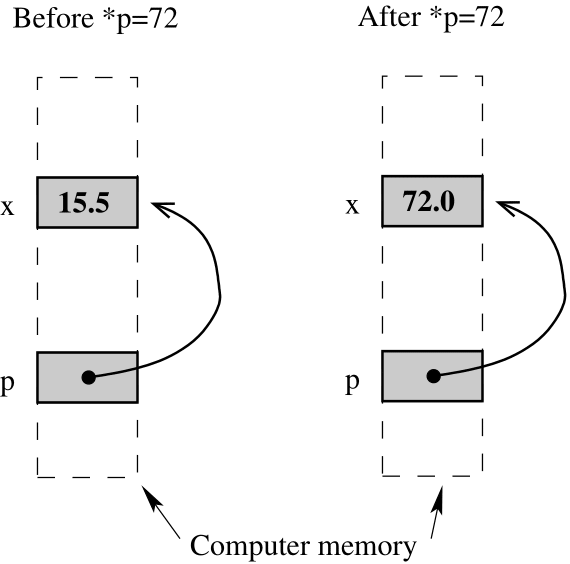

# Lecture 4 --- Pointers, Arrays, & Pointer Arithmetic

- Pointers store memory addresses.
- They can be used to access the values stored at their stored memory address.
- They can be incremented, decremented, added, and subtracted.
- Dynamic memory is accessed through pointers.
- Pointers are also the primitive mechanism underlying vector iterators, which we have used with std::sort and
will use more extensively throughout the semester.

## 4.1 Pointer Example

- Consider the following code segment:

```cpp
float x = 15.5;
float *p; /* equiv: float* p; or float * p; */
p = &x;
*p = 72;
if ( x > 20 )
cout << "Bigger\n";
else
cout << "Smaller\n";
```

The output is Bigger
because x == 72.0. What’s going on?



## 4.2 Pointer Variables and Memory Access

- x is an ordinary float, but p is a pointer that can hold the memory address of a float variable. The difference
is explained in the picture above.
- Every variable is attached to a location in memory. This is where the value of that variable is stored. Hence,
we draw a picture with the variable name next to a box that represents the memory location.
- Each memory location also has an address, which is itself just an index into the giant array that is the computer
memory.
- The value stored in a pointer variable is an address in memory. The statement p = &x; takes the address
of x’s memory location and stores it (the address) in the memory location associated with p.
- Since the value of this address is much less important than the fact that the address is x’s memory location,
we depict the address with an arrow.
- The statement: *p = 72; causes the computer to get the memory location stored at p, then go to that
memory location, and store 72 there. This writes the 72 in x’s location.

Note: *p is an l-value in the above expression.

- play this [animation](https://jidongxiao.github.io/CSCI1200-DataStructures/animations/pointers/example1/index.html).

## 4.3 Defining Pointer Variables

- In the example below, p, s and t are all pointer variables (pointers, for short), but q is NOT. You need the *
before each variable name.
```cpp
int * p, q;
float *s, *t;
```
- There is no initialization of pointer variables in this two-line sequence, so the statement below is dangerous,
and may cause your program to crash! (It won’t crash if the uninitialized value happens to be a legal address.)
```cpp
*p = 15;
```

- play this [animation](https://jidongxiao.github.io/CSCI1200-DataStructures/animations/pointers/example2/index.html).

## 4.4 Operations on Pointers

- The unary (single argument/operand) operator * in the expression *p is the “dereferencing operator”. It means
“follow the pointer”. *p can be either an l-value or an r-value, depending on which side of the = it appears on.
- The unary operator & in the expression &x means “take the memory address of.”
- Pointers can be assigned. This just copies memory addresses as though they were values (which they are).
Let’s work through the example below (and draw a picture!). What are the values of x and y at the end?
```cpp
float x=5, y=9;
float *p = &x, *q = &y;
*p = 17.0;
*q = *p;
q = p;
*q = 13.0;
```
- play this [animation](https://jidongxiao.github.io/CSCI1200-DataStructures/animations/pointers/example3/index.html).

- Assignments of integers or floats to pointers and assignments mixing pointers of different types are illegal.
Continuing with the above example:
```cpp
int *r;
r = q; // Illegal: different pointer types;
p = 35.1; // Illegal: float assigned to a pointer
```
- Comparisons between pointers of the form if ( p == q ) or if ( p != q ) are legal and very
useful! Less than and greater than comparisons are also allowed. These are useful only when the pointers are
to locations within an array.

## 4.5 Exercise

- Draw a picture for the following code sequence. What is the output to the screen?

```cpp
int x = 10, y = 15;
int *a = &x;
cout << x << " " << y << endl;
int *b = &y;
*a = x * *b;
cout << x << " " << y << endl;
int *c = b;
*c = 25;
cout << x << " " << y << endl;
```

- play this [animation](https://jidongxiao.github.io/CSCI1200-DataStructures/animations/pointers/example4/index.html).

## 4.6 Null Pointers

- Like the int type, pointers are not default initialized. We should assume it’s a garbage value, leftover from
the previous user of that memory.
- Pointers that don’t (yet) point anywhere useful are often explicitly assigned to NULL.  
  - NULL is equal to the integer 0, which is a legal pointer value (you can store NULL in a pointer variable).  
  - But NULL is not a valid memory location you are allowed to read or write. If you try to dereference or
follow a NULL pointer, your program will immediately crash. You may see a segmentation fault, a bus
error, or something about a null pointer dereference.  
  - NOTE: In C++11, we are encouraged to switch to use **nullptr** instead of NULL or 0, to avoid some
subtle situations where NULL is incorrectly seen as an int type instead of a pointer. For this course we
will assume NULL and nullptr are equivalent.  
  - We indicate a NULL or nullptr value in diagrams with a slash through the memory location box.  
  - Comparing a pointer to NULL is very useful. It can be used to indicate whether or not a pointer variable is
pointing at a useable memory location. For example,
```cpp
if ( p != NULL )
cout << *p << endl.
```
tests to see if p is pointing somewhere that appears to be useful before accessing and printing the value stored
at that location.
- But don’t make the mistake of assuming pointers are automatically initialized to NULL.

## 4.7 Arrays

- Here’s a quick example to remind you about how to use an array:
```cpp
const int n = 10;
double a[n];
int i;
for ( i=0; i<n; ++i )
a[i] = sqrt( double(i) );
```
<!--both double(i) and (double)i would work, they are the same.-->
- Remember: the size of array a is fixed at compile time. STL vectors act like arrays, but they can grow and
shrink dynamically in response to the demands of the application.

- play this [animation](https://jidongxiao.github.io/CSCI1200-DataStructures/animations/pointers/example_arrays_1/index.html).

## 4.8 Stepping through Arrays with Pointers (Array Iterators)

- The array code above that uses [] subscripting, can be equivalently rewritten to use pointers. We can re-write it in two ways:

### 4.8.1 First Approach

```cpp
const int n = 10;
double a[n];
double *p;
for ( p=a; p<a+n; ++p )
    *p = sqrt( p-a );
```
- The assignment: *p = a*; takes the address of the start of the array and assigns it to *p*.
- This illustrates the important fact that the name of an array is in fact a pointer to the start of a block of memory. We will come back to this several times! We could also write this line as: *p = &a[0]*; which means “find the location of a[0] and take its address”.
- By incrementing, *++p*, we make *p* point to the next location in the array.
  – When we increment a pointer we don’t just add one byte to the address, we add the number of bytes (sizeof) used to store one object of the specific type of that pointer. Similarly, basic addition/subtraction of pointer variables is done in multiples of the sizeof the type of the pointer.
  – Since the type of *p* is double, and the size of double is 8 bytes, we are actually adding 8 bytes to the address when we execute *++p*.

- The test *p&lt;a+n* checks to see if the value of the pointer (the address) is less than n array locations beyond
the start of the array. In this example, *a+n* is the memory location 80 bytes after the start of the array (n = 10 slots * 8 bytes per
slot). We could equivalently have used the test *p != a+n*.
- In the assignment:
```cpp
*p = sqrt( p-a );
```
*p-a* is the number of array locations (not number of byte, although each slot is 8 bytes) between *p* and the start. **This is an integer**. The
square root of this value is assigned to \*p.

- Note that there may or may not be unused memory between your array and the other local variables. Similarly, the order that your local variables appear on the stack is not guaranteed (the compiler may rearrange things a bit in an attempt to optimize performance or memory usage). A buffer overflow (attempting to access an illegal array index) may or may not cause an immediate failure – depending on the layout of other critical program memory.

- play this [animation](https://jidongxiao.github.io/CSCI1200-DataStructures/animations/pointers/example_arrays_2/index.html).

### 4.8.2 Second Approach

The first approach uses pointer arithmetic in several places - just to demonstrate the usage of pointer arithmetic; but many students find it confusing and hard to understand. In contrast, the following approach is easier to understand, and **is the recommended way for you to use in tomorrow's lab**; use the first approach only if you truly understand all the pointer arithmetics involved in that approach.

```cpp
const int n = 10;
double a[n];
double *p;
p = a;
int i;
for ( i=0; i<n; ++i ){
    *(p+i) = sqrt( double(i) );
};
```

This second approach also "nicely mimics the subscript notation used in the (original) for loop above, which highlights that fundamentally array subscripts are just pointer arithmetic." - comments by our mentor Eleanor Olson, :smile:.

## 4.9 Sorting an Array

- Arrays may be sorted using std::sort, just like vectors. Pointers are used in place of iterators. For example, if a is an array of doubles and there are n values in the array, then here’s how to sort the values in the array into increasing order:

```cpp
std::sort( a, a+n );
```

## 4.10 Exercises

- [Leetcode problem 26: Remove Duplicates from Sorted Array](https://leetcode.com/problems/remove-duplicates-from-sorted-array/). Solution: [p26_removeduplicates.cpp](../../leetcode/p26_removeduplicates.cpp)
