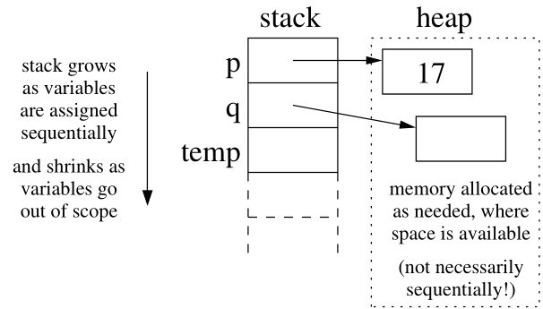
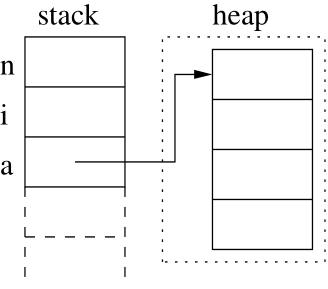

# Lecture 6 --- Pointer and Dynamic Memory

- Different types of memory
- Dynamic allocation of arrays

## 6.1 Three Types of Memory

- Automatic memory: memory allocation inside a function when you create a variable. This allocates space for
local variables in functions (on the stack) and deallocates it when variables go out of scope. For example:
```cpp
int x;
double y;
```
- Static memory: variables allocated statically (with the keyword static). They are are not eliminated when
they go out of scope. They retain their values, but are only accessible within the scope where they are defined. For example:
```cpp
static int counter;
```
- Dynamic memory: explicitly allocated (on the heap) as needed. This is our focus for today.

## 6.2 Dynamic Memory

Dynamic memory is:
- created using the **new** operator,
- accessed through pointers, and
- removed through the **delete** operator.
 Here’s a simple example involving dynamic allocation of integers:

<table>
 <tr>
  <td>

 <pre>
int * p = new int;
*p = 17;
cout << *p << endl;
int * q;
q = new int;
*q = *p;
*p = 27;
cout << *p << " " << *q << endl;
int * temp = q;
q = p;
p = temp;
cout << *p << " " << *q << endl;
delete p;
delete q;
 </pre>

</td>
<td>
</tr>
</table>

<!--[alt text](heap.png "heap")-->

- The expression *new int* asks the system for a new chunk of memory that is large enough to hold an integer
and returns the address of that memory. Therefore, the statement

```cpp
int * p = new int; 
```

allocates memory from the heap and stores its address in the pointer variable *p*.

- The statement

```cpp
delete p;
```

takes the integer memory pointed by *p* and returns it to the system for re-use.
- This memory is allocated from and returned to a special area of memory called the **heap**. By contrast, local
variables and function parameters are placed on the stack.
- In between the *new* and *delete* statements, the memory is treated just like memory for an ordinary variable,
except the only way to access it is through pointers. Hence, the manipulation of pointer variables and values is
similar to the examples covered in the pointers lecture except that there is no explicitly named variable for that memory
other than the pointer variable.
- Dynamic allocation of primitives like ints and doubles is not very interesting or significant. What’s more important is dynamic allocation of arrays and class objects.

- play this [animation](https://jidongxiao.github.io/CSCI1200-DataStructures/animations/dynamic_memory/example1/index.html) to see what exactly the above code snippet does.

## 6.3 Dynamic Allocation of Arrays
- How do we allocate an array on the stack? What is the code? What memory diagram is produced by the code?
- Declaring the size of an array at compile time doesn’t offer much flexibility. Instead we can dynamically allocate an array based on data. This gets us part-way toward the behavior of the standard library vector class. Here’s an example:

<table>
 <tr>
  <td>

 <pre>
int main() {
    std::cout << "Enter the size of the array: ";
    int n,i;
    std::cin >> n;
    double *a = new double[n];
    for (i=0; i<n; ++i) { a[i] = sqrt(i); }
    for (i=0; i<n; ++i) {
        if ( double(int(a[i])) == a[i] )
            std::cout << i << " is a perfect square " << std::endl;
    }
    delete [] a;
    return 0;
}
 </pre>

</td>
<td>
</tr>
</table>

- The expression new double[n] asks the system to dynamically allocate enough consecutive memory to hold n
double’s (usually 8n bytes).
  - What’s crucially important is that n is a variable. Therefore, its value and, as a result, the size of the
array are not known until the program is executed and the the memory must be allocated dynamically.
  - The address of the start of the allocated memory is assigned to the pointer variable a.
- After this, a is treated as though it is an array. For example: a[i] = sqrt( i );
In fact, the expression a[i] is exactly equivalent to the pointer arithmetic and dereferencing expression *(a+i)
which we have seen several times before.
- After we are done using the array, the line: delete [] a; releases the memory allocated for the entire
array and calls the destructor (we’ll learn about these soon!) for each slot of the array. Deleting a dynamically
allocated array without the [] is an error (but it may not cause a crash or other noticeable problem, depending
on the type stored in the array and the specific compiler implementation).
- Since the program is ending, releasing the memory is not a major concern. However, to demonstrate
that you understand memory allocation & deallocation, you should always delete dynamically allocated
memory in this course, even if the program is terminating.
- In more substantial programs it is ABSOLUTELY CRUCIAL. If we forget to release memory repeatedly
the program can be said to have a memory leak. Long-running programs with memory leaks will eventually
run out of memory and crash.

- play this [animation](https://jidongxiao.github.io/CSCI1200-DataStructures/animations/dynamic_memory/example2/index.html) to see what exactly the above code snippet does.

## 6.3 Exercises

- [Leetcode problem 56: Merge Intervals](https://leetcode.com/problems/merge-intervals/). Solution: [p56_mergeintervals.cpp](../../leetcode/p56_mergeintervals.cpp)
- [Leetcode problem 905: Sort Array By Parity](https://leetcode.com/problems/sort-array-by-parity/). Solution: [p905_sortarraybyparity.cpp](../../leetcode/p905_sortarraybyparity.cpp)
- [Leetcode problem 1929: Concatenation of Array
](https://leetcode.com/problems/concatenation-of-array/). Solution: [p1929_concatenationofarray.cpp](../../leetcode/p1929_concatenationofarray.cpp)
