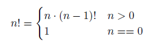

# Lecture 7 --- Order Notation & Basic Recursion

- Algorithm Analysis, Formal Definition of Order Notation
- Simple recursion, Visualization of recursion, Iteration vs. Recursion
- “Rules” for writing recursive functions, Lots of examples

## 7.1 Algorithm Analysis

Why should we bother?
 - We want to do better than just implementing and testing every idea we have.
 - We want to know why one algorithm is better than another.
 - We want to know the best we can do. (This is often quite hard.)
How do we do it? There are several options, including:
 - Don’t do any analysis; just use the first algorithm you can think of that works.
 - Implement and time algorithms to choose the best.
 - Analyze algorithms by counting operations while assigning different weights to different types of operations
based on how long each takes.
 - Analyze algorithms by assuming each operation requires the same amount of time. Count the total number of
operations, and then multiply this count by the average cost of an operation.

## 7.2 Exercise: Counting Example

- Suppose arr is an array of n doubles. Here is a simple fragment of code to sum of the values in the array:
```cpp
double sum = 0;
for (int i=0; i<n; ++i)
sum += arr[i];
```
- What is the total number of operations performed in executing this fragment? Come up with a function describing the number of operations in terms of n.

## 7.3 Exercise: Which Algorithm is Best?

A venture capitalist is trying to decide which of 3 startup companies to invest in and has asked for your help. Here’s
the timing data for their prototype software on some different size test cases:

```console
n foo-a foo-b foo-c
10 10 u-sec 5 u-sec 1 u-sec
20 13 u-sec 10 u-sec 8 u-sec
30 15 u-sec 15 u-sec 27 u-sec
100 20 u-sec 50 u-sec 1000 u-sec
1000 ? ? ?
```

Which company has the “best” algorithm?

## 7.4 Order Notation Definition

In this course we will focus on the intuition of order notation. This topic will be covered again, in more depth, in
later computer science courses.
- Definition: Algorithm A is order f(n) — denoted O(f(n)) — if constants k and n0 exist such that A requires
no more than k ∗ f(n) time units (operations) to solve a problem of size n ≥ n0.
- For example, algorithms requiring 3n + 2, 5n − 3, and 14 + 17n operations are all O(n).
This is because we can select values for k and n0 such that the definition above holds. (What values?)
Likewise, algorithms requiring n 2/10 + 15n − 3 and 10000 + 35n
2 are all O(n
2
).
- Intuitively, we determine the order by finding the asymptotically dominant term (function of n) and throwing
out the leading constant. This term could involve logarithmic or exponential functions of n. Implications for
analysis:
  – We don’t need to quibble about small differences in the numbers of operations.  
  – We also do not need to worry about the different costs of different types of operations.  
  – We don’t produce an actual time. We just obtain a rough count of the number of operations. This count is used for comparison purposes.  
- In practice, this makes analysis relatively simple, quick and (sometimes unfortunately) rough.

## 7.5 Common Orders of Magnitude

- O(1), a.k.a. CONSTANT: The number of operations is independent of the size of the problem. e.g., compute
quadratic root.
- O(log n), a.k.a. LOGARITHMIC. e.g., dictionary lookup, binary search.
- O(n), a.k.a. LINEAR. e.g., sum up a list.
- O(n log n), e.g., sorting.
- O(n2), O(n3), O(nk), a.k.a. POLYNOMIAL. e.g., find closest pair of points.
- O(2n), O(kn), a.k.a. EXPONENTIAL. e.g., Fibonacci, playing chess.

## 7.6 Exercise: A Slightly Harder Example

 Here’s an algorithm to determine if the value stored in variable x is also in an array called foo. Can you analyze
it? What did you do about the if statement? What did you assume about where the value stored in x occurs
in the array (if at all)?

```cpp
int loc=0;
bool found = false;
while (!found && loc < n) {
    if (x == foo[loc]) found = true;
    else loc++;
}
if (found) cout << "It is there!\n";
```

## 7.7 Best-Case, Average-Case and Worst-Case Analysis

- For a given fixed size array, we might want to know:
  – The fewest number of operations (best case) that might occur.
  – The average number of operations (average case) that will occur.
  – The maximum number of operations (worst case) that can occur.
- The last is the most common. The first is rarely used.
- On the previous algorithm, the best case is O(1), but the average case and worst case are both O(n).

## 7.8 Approaching An Analysis Problem

- Decide the important variable (or variables) that determine the “size” of the problem. For arrays and other
“container classes” this will generally be the number of values stored.
- Decide what to count. The order notation helps us here.
  - If each loop iteration does a fixed (or bounded) amount of work, then we only need to count the number
of loop iterations.
  - We might also count specific operations. For example, in the previous exercise, we could count the number
of comparisons.
- Do the count and use order notation to describe the result.

## 7.9 Exercise: Order Notation

For each version below, give an order notation estimate of the number of operations as a function of n:

1
```cpp
int count=0;
for (int i=0; i<n; ++i)
for (int j=0; j<n; ++j)
++count;
```

2.
```cpp 
int count=0;
for (int i=0; i<n; ++i)
++count;
for (int j=0; j<n; ++j)
++count;
```

3.
```cpp
int count=0;
for (int i=0; i<n; ++i)
for (int j=i; j<n; ++j)
++count;
```

## 7.10 Recursive Definitions of Factorials and Integer Exponentiation

- Factorial is defined for non-negative integers as:


- Computing integer powers is defined as:
n
p =
(
n · n
p−1 p > 0
1 p == 0

These are both examples of recursive definitions

## 7.11 Recursive C++ Functions

C++, like other modern programming languages, allows functions to call themselves. This gives a direct method of
implementing recursive functions. Here are the recursive implementations of factorial and integer power:

```cpp
int fact(int n) {
    if (n == 0) {
        return 1;
    } else {
        int result = fact(n-1);
        return n * result;
    }
}
```

```cpp
int intpow(int n, int p) {
    if (p == 0) {
        return 1;
    } else {
        return n * intpow( n, p-1 );
    }
}
```

## 7.12 The Mechanism of Recursive Function Calls

- For each recursive call (or any function call), a program creates an activation record to keep track of:
  – Completely separate instances of the parameters and local variables for the newly-called function.  
  – The location in the calling function code to return to when the newly-called function is complete. (Who
asked for this function to be called? Who wants the answer?)  
  – Which activation record to return to when the function is done. For recursive functions this can be
confusing since there are multiple activation records waiting for an answer from the same function.  
- This is illustrated in the following diagram of the call fact(4). Each box is an activation record, the solid lines
indicate the function calls, and the dashed lines indicate the returns. Inside of each box we list the parameters
and local variables and make notes about the computation.
- This chain of activation records is stored in a special part of program memory called the stack

## 7.13 Iteration vs. Recursion

- Each of the above functions could also have been written using a for or while loop, i.e.  iteratively. For example, here is an iterative
version of factorial:

```cpp
int ifact(int n) {
int result = 1;
for (int i=1; i<=n; ++i)
result = result * i;
return result;
}
```

- Often writing recursive functions is more natural than writing iterative functions, especially for a first draft of
a problem implementation.
- You should learn how to recognize whether an implementation is recursive or iterative, and practice rewriting
one version as the other. Note: We’ll see that not all recursive functions can be easily rewritten in iterative
form!
- Note: The order notation for the number of operations for the recursive and iterative versions of an algorithm
is usually the same. However in C, C++, Java, and some other languages, iterative functions are generally
faster than their corresponding recursive functions. This is due to the overhead of the function call mechanism.
Compiler optimizations will sometimes (but not always!) reduce the performance hit by automatically eliminating
the recursive function calls. This is called tail call optimization.

## 7.14 Exercises

1. Draw a picture to illustrate the activation records for the function call
cout << intpow(4, 4) << endl;
2. Write an iterative version of intpow.
3. What is the order notation for the two versions of intpow?

## 7.15 Rules for Writing Recursive Functions

Here is an outline of five steps that are useful in writing and debugging recursive functions. Note: You don’t have
to do them in exactly this order...
1. Handle the base case(s).
2. Define the problem solution in terms of smaller instances of the problem. Use wishful thinking, i.e., if someone
else solves the problem of fact(4) I can extend that solution to solve fact(5). This defines the necessary
recursive calls. It is also the hardest part!
3. Figure out what work needs to be done before making the recursive call(s).
4. Figure out what work needs to be done after the recursive call(s) complete(s) to finish the computation. (What
are you going to do with the result of the recursive call?)
5. Assume the recursive calls work correctly, but make sure they are progressing toward the base case(s)!

## 7.16 Location of the Recursive Call — Example: Printing the Contents of a Vector

 Here is a function to print the contents of a vector. Actually, it’s two functions: a driver function, and a true
recursive function. It is common to have a driver function that just initializes the first recursive function call.

```cpp
void print_vec(std::vector<int>& v, unsigned int i) {
if (i < v.size()) {
cout << i << ": " << v[i] << endl;
print_vec(v, i+1);
}
}
```

```cpp
void print_vec(std::vector<int>& v) {
print_vec(v, 0);
}
```

 What will this print when called in the following code?
```cpp
int main() {
std::vector<int> a;
a.push_back(3); a.push_back(5); a.push_back(11); a.push_back(17);
print_vec(a);
}
```
 How can you change the second print vec function as little as possible so that this code prints the contents
of the vector in reverse order?
