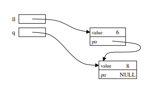
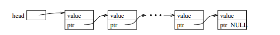

# Lecture 10 --- Vector Iterators & Linked Lists

- Keep an eye for an update on Student Excuse Absence Policy which would go in effect from HW4
     * Please remember even if one student submits HW late then
           + grading process gets delayed
           + you will receive grades late
           + will affect your grade inquiry time
           + may affect when you receive the solutions or see the actual rubric
           + if that HW was due before exam then be ready to receive feedback on that after exams
     * More detailed info soon
- Review of iterators
- Building our own basic linked lists:  
  – Stepping through a list  
  – Push back

## 10.1 Review: Iterators and Iterator Operations

- An iterator type is defined by each STL container class. For example:

```cpp
std::vector<double>::iterator v_itr;
std::list<std::string>::iterator l_itr;
std::string::iterator s_itr;
```

- An iterator is assigned to a specific location in a container. For example:

```cpp
v_itr = vec.begin() + i; // i-th location in a vector
l_itr = lst.begin(); // first entry in a list
s_itr = str.begin(); // first char of a string
```

*Note*: We can add an integer to vector and string iterators, but not to list iterators.

- The contents of the specific entry referred to by an iterator are accessed using the * dereference operator:
In the first and third lines, *v itr and *l itr are l-values. In the second, *s_itr is an r-value.

```cpp
*v_itr = 3.14;
cout << *s_itr << endl;
*l_itr = "Hello";
```

- Stepping through a container, either forward and backward, is done using increment (++) and decrement (--)
operators:

```cpp
++itr; itr++; --itr; itr--;
```

These operations move the iterator to the next and previous locations in the vector, list, or string. The
operations do not change the contents of container!

- Finally, we can change the container that a specific iterator is attached to as long as the types match.
Thus, if v and w are both std::vector<double>, then the code:

```cpp
v_itr = v.begin();
*v_itr = 3.14; // changes 1st entry in v
v_itr = w.begin() + 2;
*v_itr = 2.78; // changes 3rd entry in w
```

works fine because v_itr is a std::vector&lt;double&gt;::iterator, but if *a* is a std::vector&lt;std::string&gt; then

```cpp
v_itr = a.begin();
```

is a syntax error because of a type clash!

## 10.2 Additional Iterator Operations for Vector (& String) Iterators

- Initialization at a random spot in the vector:

```cpp
v_itr = v.begin() + i;
```
Jumping around inside the vector through addition and subtraction of location counts:

```cpp
v_itr = v_itr + 5;
```
moves p 5 locations further in the vector. These operations are constant time, O(1) for vectors.
- These operations are not allowed for list iterators (and most other iterators, for that matter) because of the
way the corresponding containers are built. These operations would be linear time, O(n), for lists, where n is
the number of slots jumped forward/backward. Thus, they are not provided by STL for lists.
- Students are often confused by the difference between iterators and indices for vectors. Consider the following
declarations:

```cpp
std::vector<double> a(10, 2.5);
std::vector<double>::iterator p = a.begin() + 5;
unsigned int i=5;
```

- Iterator p refers to location 5 in vector a. The value stored there is directly accessed through the * operator:

```cpp
*p = 6.0;
cout << *p << endl;
```

- The above code has changed the contents of vector a. Here’s the equivalent code using subscripting:

```cpp
a[i] = 6.0;
cout << a[i] << endl;
```

- Here’s another common confusion:

```cpp
std::list<int> lst; lst.push_back(100); lst.push_back(200);
lst.push_back(300); lst.push_back(400); lst.push_back(500);
```

```cpp
std::list<int>::iterator itr,itr2,itr3;
itr = lst.begin();// itr is pointing at the 100
++itr; // itr is now pointing at 200
*itr += 1; // 200 becomes 201
// itr += 1; // does not compile! can't advance list iterator like this
```
```cpp
itr = lst.end(); // itr is pointing "one past the last legal value" of lst
itr--; // itr is now pointing at 500;
itr2 = itr--; // itr is now pointing at 400, itr2 is still pointing at 500
itr3 = --itr; // itr is now pointing at 300, itr3 is also pointing at 300
```

```cpp
// dangerous: decrementing the begin iterator is "undefined behavior"
// (similarly, incrementing the end iterator is also undefined)
// it may seem to work, but break later on this machine or on another machine!
itr = lst.begin();
itr--; // dangerous!
itr++;
assert (*itr == 100); // might seem ok... but rewrite the code to avoid this!
```

## 10.3 Working towards our own version of the STL list

- Our discussion of how the STL list&lt;T&gt; is implemented has been intuitive: it is a “chain” of objects.
- Now we will study the underlying mechanism — linked lists.
- This will allow us to build custom classes that mimic the STL list class, and add extensions and new features.

## 10.4 Objects with Pointers, Linking Objects Together

- The two fundamental mechanisms of linked lists are:  
  – creating objects with pointers as one of the member variables, and  
  – making these pointers point to other objects of the same type.  
- These mechanisms are illustrated in the following program:

```cpp
template <class T>
class Node {
public:
	T value;
	Node* ptr;
};
int main() {
	Node<int>* ll; // ll is a pointer to a (non-existent) Node
	ll = new Node<int>; // Create a Node and assign its memory address to ll
	ll->value = 6; // This is the same as (*ll).value = 6;
	ll->ptr = NULL; // NULL == 0, which indicates a "null" pointer
	Node<int>* q = new Node<int>;
	q->value = 8;
	q->ptr = NULL;
	// set ll's ptr member variable to
	// point to the same thing as variable q
	ll->ptr = q;
	cout << "1st value: " << ll->value << "\n"
	<< "2nd value: " << ll->ptr->value << endl;
}
```



- Play this [animation](https://jidongxiao.github.io/CSCI1200-DataStructures/animations/lists/creation/index.html) to see how this program works.

## 10.5 Definition: A Linked List

- The definition is recursive: A linked list is either:
  - Empty, or
  - Contains a node storing a value and a pointer to a linked list.
- The first node in the linked list is called the head node and the pointer to this node is called the head pointer.
The pointer’s value will be stored in a variable called head.

## 10.6 Visualizing Linked Lists



- The head pointer variable is drawn with its own box. It is an individual variable. It is important to have a
separate pointer to the first node, since the “first” node may change.
- The objects (nodes) that have been dynamically allocated and stored in the linked lists are shown as boxes,
with arrows drawn to represent pointers.
  - Note that this is a conceptual view only. The memory locations could be anywhere, and the actual values
of the memory addresses aren’t usually meaningful.
- The last node MUST have NULL for its pointer value — you will have all sorts of trouble if you don’t ensure this!
- You should make a habit of drawing pictures of linked lists to figure out how to do the operations.

## 10.7 Basic Mechanisms: Stepping Through the List

- We’d like to write a function to determine if a particular value, stored in x, is also in the list.
- We can access the entire contents of the list, one step at a time, by starting just from the head pointer.
  – We will need a separate, local pointer variable to point to nodes in the list as we access them.
  – We will need a loop to step through the linked list (using the pointer variable) and a check on each value

## 10.8 Exercise: Write is_there

```cpp
template <class T> bool is_there(Node<T>* head, const T& x) {


}
```

- If the input linked list chain contains n elements, what is the order notation of is_there?

## 10.9 Overview: Adding an Element at the Front of the List

- Goal: place a new node at the beginning of the list.
- We must create a new node.
- We must permanently update the head pointer variable's value.
  Therefore, we must pass the pointer variable **by reference.**

## 10.10 Exercise: Write push_front

```cpp
template <class T> void push_front( Node<T>* & head, T const& value ) {


}
```

- Play this [animation](https://jidongxiao.github.io/CSCI1200-DataStructures/animations/lists/push_front/index.html) to see how push_front works.

- If the input linked list chain contains n elements, what is the order notation of the implementation of push_front?

## 10.11 Basic Mechanisms: Pushing on the Back

- Goal: place a new node at the end of the list.
- We must step to the end of the linked list, remembering the pointer to the last node.
  - This is an O(n) operation and is a major drawback to the ordinary linked-list data structure we are
discussing now. We will correct this drawback by creating a slightly more complicated linking structure
in our next lecture.
- We must create a new node and attach it to the end.
- We must remember to update the head pointer variable’s value if the linked list is initially empty.
  – Hence, in writing the function, we must pass the pointer variable** by reference.**
  
## 10.12 Exercise: Write push_back

```cpp
template <class T> void push_back( Node<T>* & head, T const& value ) {


}
```

- Play this [animation](https://jidongxiao.github.io/CSCI1200-DataStructures/animations/lists/push_back/index.html) to see how push_back works.

- If the input linked list chain contains n elements, what is the order notation of this implementation of push_back?

## 10.13 Inserting a Node into a Singly-Linked List

- With a singly-linked list, we’ll need a pointer to the node before the spot where we wish to insert the new
item.
- If p is a pointer to this node, and x holds the value to be inserted, then the following code will do the insertion.
Draw a picture to illustrate what is happening.

```cpp
Node<T> * q = new Node<T>; // create a new node
q -> value = x; // store x in this node
q -> next = p -> next; // make its successor be the current successor of p
p -> next = q; // make p's successor be this new node
```

- Play this [animation](https://jidongxiao.github.io/CSCI1200-DataStructures/animations/lists/insert/index.html) to see how this code snippet works.

- Note: This code will not work if you want to insert x in a new node at the front of the linked list. Why not?

## 10.14 Removing a Node from a Singly-Linked List

- The remove operation itself requires a pointer to the node before the node to be removed.
- Suppose p points to a node that should be removed from a linked list, q points to the node before p, and head
points to the first node in the linked list. Note: Removing the first node is an important special case.
- Write code to remove p, making sure that if p points to the first node that head points to what was the second
node and now is the first after p is removed. Draw a picture of each scenario.

## 10.15 Exercise: Singly-Linked List Remove All

Write a recursive function to delete all nodes in a linked list. Here’s the function prototype:

```cpp
template <class T> void RemoveAll(Node<T>*& head) {


}
```

## 10.16 Exercise: Singly-Linked List Copy

Write a recursive function to copy all nodes in a linked list to form an new linked list of nodes with identical structure
and values. Here’s the function prototype:

```cpp
template <class T> void CopyAll(Node<T>* old_head, Node<T>*& new_head) {


}
```


<!-- ## 10.16 Leetcode Exercises

- [Leetcode problem 27: Remove Element](https://leetcode.com/problems/remove-element/). Solution: [p27_removeelement.cpp](../../leetcode/p27_removeelement.cpp)
- [Leetcode problem 58: Length of Last Word](https://leetcode.com/problems/length-of-last-word/). Solution: [p58_lengthoflastword.cpp](../../leetcode/p58_lengthoflastword.cpp)
- [Leetcode problem 283: Move Zeroes](https://leetcode.com/problems/move-zeroes/). Solution: [p283_movezeroes.cpp](../../leetcode/p283_movezeroes.cpp)
-->
