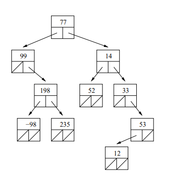

# Lecture 18 --- Trees, Part I

## Review from Lecture 17

- STL set container class (like STL map, but without the pairs!)
- set iterators, insert, erase, find

## Today’s Lecture

- Binary trees, binary search trees
- Implementation of ds_set class using binary search trees
- In-order, pre-order, and post-order traversal

## Overview: Lists vs Trees vs Graphs
- Trees create a hierarchical organization of data, rather than the linear organization in linked lists (and arrays and vectors).
- Binary search trees are the mechanism underlying maps & sets (and multimaps & multisets).
- Mathematically speaking: A _graph_ is a set of vertices connected by edges. And a tree is a special graph that has no _cycles_. The edges that connect nodes in trees and graphs may be _directed_ or _undirected_.

## 18.1 Definition: Binary Trees

- A binary tree (strictly speaking, a “rooted binary
tree”) is either empty or is a node that has
pointers to two binary trees.
- Here’s a picture of a binary tree storing integer
values. In this figure, each large box indicates a
tree node, with the top rectangle representing the
value stored and the two lower boxes representing
pointers. Pointers that are null are shown with a
slash through the box.



- The topmost node in the tree is called the root.
- The pointers from each node are called left and
right. The nodes they point to are referred to as
that node’s (left and right) children.
- The (sub)trees pointed to by the left and right
pointers at any node are called the left subtree
and right subtree of that node.
- A node where both children pointers are null is
called a leaf node.
- A node’s parent is the unique node that points to
it. Only the root has no parent.

## 18.2 Definition: Binary Search Trees

- A binary search tree (often abbreviated to
BST) is a binary tree where at each node
of the tree, the value stored at the node is
  – greater than or equal to all values
stored in the left subtree, and

  – less than or equal to all values stored in
the right subtree.

- Here is a picture of a binary search tree
storing string values.


## 18.3 Definition: Balanced Trees

- The number of nodes on each subtree of each node in a
“balanced” tree is approximately the same. In order to
be an exactly balanced binary tree, what must be true
about the number of nodes in the tree?
- In order to claim the performance advantages of trees, we must assume and ensure that our data structure
remains approximately balanced. (You’ll see much more of this in Intro to Algorithms!)

## 18.4 Exercise

Consider the following values:
4.5, 9.8, 3.5, 13.6, 19.2, 7.4, 11.7

1. Draw a binary tree with these values that is NOT a binary search tree.

2. Draw two different binary search trees with these values. Important note: This shows that the binary search
tree structure for a given set of values is not unique!

3. How many exactly balanced binary search trees exist with these numbers? How many exactly balanced
binary trees exist with these numbers?

## 18.5 Beginning our implementation of ds_set: The Tree Node Class

- Here is the class definition for nodes in the tree. We will use this for the tree manipulation code we write.

```cpp
template <class T> class TreeNode {
public:
	TreeNode() : left(NULL), right(NULL) {}
	TreeNode(const T& init) : value(init), left(NULL), right(NULL) {}
	T value;
	TreeNode* left;
	TreeNode* right;
};
```

- Note: Sometimes a 3rd pointer — to the parent TreeNode — is added.

  

## 18.6 Exercises

1. Write a templated function to find the smallest value stored in a binary search tree whose root node is pointed
to by p.

2. Write a function to count the number of odd numbers stored in a binary tree (not necessarily a binary search
tree) of integers. The function should accept a TreeNode<int> pointer as its sole argument and return an
integer. Hint: think recursively!

## 18.7 ds_set and Binary Search Tree Implementation

- A partial implementation of a set using a binary search tree is provided in this [ds_set_starter.h](ds_set_starter.h). We will continue to study this implementation in Lab 10 & the next lecture.
- The increment and decrement operations for iterators have been omitted from this implementation. Next week
in lecture we will discuss a couple strategies for adding these operations.
- We will use this as the basis both for understanding an initial selection of tree algorithms and for thinking
about how standard library sets really work.

## 18.8 ds_set: Class Overview

- There is two auxiliary classes, TreeNode and tree_iterator. All three classes are templated.
- The only member variables of the ds_set class are the root and the size (number of tree nodes).
- The iterator class is declared internally, and is effectively a wrapper on the TreeNode pointers.
  – Note that operator* returns a const reference because the keys can’t change.

  – The increment and decrement operators are missing (we’ll fill this in next week in lecture!).

- The main public member functions just call a private (and often recursive) member function (passing the root
node) that does all of the work.
- Because the class stores and manages dynamically allocated memory, a copy constructor, operator=, and
destructor must be provided.

## 18.9 Exercises

1. Provide the implementation of the member function ds_set<T>::begin. This is essentially the problem of
finding the node in the tree that stores the smallest value.


2. Write a recursive version of the function find.


