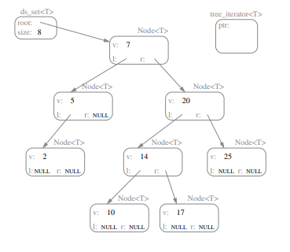

# Lecture 18 --- Trees, Part II
## Announcements

## Review from Lecture 17

- Binary Trees, Binary Search Trees, & Balanced Trees
- STL set container class (like STL map, but without the pairs!)
- Finding the smallest element in a BST.
- Overview of the ds set implementation: begin and find. (leetcode 700)

## Today’s Lecture

- Warmup / Review: destroy_tree
- A very important ds set operation insert
- In-order, pre-order, and post-order traversal
- Finding the in-order successor of a binary tree node, tree iterator increment

## 18.1 Warmup Exercise

Write the ds set::destroy tree private helper function.

## 18.2 Insert



- Move left and right down the tree based on
comparing keys. The goal is to find the location to
do an insert that preserves the binary search tree
ordering property.
- We will always be inserting at an empty (NULL)
pointer location.
- Exercise: Why does this work? Is there always
a place to put the new item? Is there ever more
than one place to put the new item?
- IMPORTANT NOTE: Passing pointers by reference ensures that the new node is truly inserted into the tree.
This is subtle but important.
- Note how the return value pair is constructed
- Exercise: How does the order that the nodes are inserted affect the final tree structure? Give an ordering
that produces a balanced tree and an insertion ordering that produces a highly unbalanced tree.

## 18.3 In-order, Pre-order, Post-order Traversal

- Reminder: For an exactly balanced binary search tree with the elements 1-7:
  - In-order: 1 2 3 (4) 5 6 7
  - Pre-order: (4) 2 1 3 6 5 7
  - Post-order: 1 3 2 5 7 6 (4)
- Now let’s write code to print out the elements in a binary tree in each of these three orders. These functions
are easy to write recursively, and the code for the three functions looks amazingly similar. Here’s the code for
an in-order traversal to print the contents of a tree:

```cpp
void print_in_order(ostream& ostr, const TreeNode<T>* p) {
	if (p) {
		print_in_order(ostr, p->left);
		ostr << p->value << "\n";
		print_in_order(ostr, p->right);
	}
}
```
- How would you modify this code to perform pre-order and post-order traversals?
- What is the traversal order of the destroy_tree function we wrote earlier?

## 18.4 Tree Iterator Increment/Decrement - Implementation Choices

- The increment operator should change the iterator’s pointer to point to the next TreeNode in an in-order
traversal — the “in-order successor” — while the decrement operator should change the iterator’s pointer to
point to the “in-order predecessor”.
- Unlike the situation with lists and vectors, these predecessors and successors are not necessarily “nearby”
(either in physical memory or by following a link) in the tree, as examples we draw in class will illustrate.
- There are two common solution approaches:

  – Each node stores a parent pointer. Only the root node has a null parent pointer. [method 1]


  – Each iterator maintains a stack of pointers representing the path down the tree to the current node. [method 2]


- If we choose the parent pointer method, we’ll need to rewrite the insert and erase member functions to
correctly adjust parent pointers.
- Although iterator increment looks expensive in the worst case for a single application of operator++, it is fairly
easy to show that iterating through a tree storing n nodes requires O(n) operations overall.

Exercise: [method 1] Write a fragment of code that given a node, finds the in-order successor using parent pointers.
Be sure to draw a picture to help you understand!


Exercise: [method 2] Write a fragment of code that given a tree iterator containing a pointer to the node and a
stack of pointers representing path from root to node, finds the in-order successor (without using parent pointers).
Either version can be extended to complete the implementation of increment/decrement for the ds_set tree iterators.


Exercise: What are the advantages & disadvantages of each method?

## 18.5 Limitations of Our BST Implementation

- The efficiency of the main insert, find and erase algorithms depends on the height of the tree.
- The best-case and average-case heights of a binary search tree storing n nodes are both O(log n). The worstcase, which often can happen in practice, is O(n).
- Developing more sophisticated algorithms to avoid the worst-case behavior will be covered in Introduction to
Algorithms. One elegant extension to the binary search tree is described below...

## 18.6 B+ Trees

Unlike binary search trees, nodes in B+ trees (and their predecessor, the B tree) have up to b children. Thus
B+ trees are very flat and very wide. This is good when it is very expensive to move from one node to another.
- B+ trees are supposed to be associative (i.e. they have key-value pairs), but we will just focus on the keys.
- Just like STL map and STL set, these keys and values can be any type, but keys must have an operator<
defined.
- In a B tree key-value pairs can show up anywhere in the tree, in a B+ tree all the key-value pairs are in the
leaves and the non-leaf nodes contain duplicates of some keys.
- In either type of tree, all leaves are the same distance from the root.
- The keys are always sorted in a B/B+ tree node, and there are up to b − 1 of them. They act like b − 1 binary
search tree nodes mashed together.
- In fact, with the exception of the root, nodes will always have between roughly b/2 and b − 1 keys (in our
implementation).
- If a B+ tree node has k keys key0, key1, key2, . . . , keyk−1, it will have k + 1 children. The keys in the leftmost
child must be < key0, the next child must have keys such that they are ≥key0 and < key1, and so on up to
the rightmost child which has only keys ≥keyk−1.
