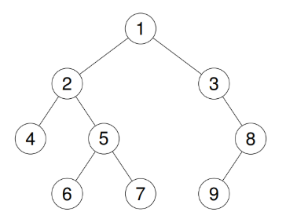

# Lecture 21 --- Trees, Part IV

## Test 3 Information

- Test 3 will be held Thursday, April 3rd, 2025 from 6-7:50pm.
- Student’s assigned test room, row, and seat assignments will be re-randomized. If on Tuesday evening you still don’t have a seating assignment when you log onto Submitty, let us know via the ds_instructors list.
- Coverage: Maps, Sets, Trees, as well as concepts learned prior to test 2. Please remember Recursion and Big O notation goes hand in hand with all the topics taught after Test 2.
- OPTIONAL: you are allowed to bring one physical piece of 8.5x11” paper, that’s two “sides”. We will check at the start of the exam that you do not have more than one piece of paper for your notes!
- All students must bring their Rensselaer photo ID card.
- Bring pencil(s) & eraser (pens are ok, but not recommended).
- Practice problems from previous tests are available on the [course materials](https://submitty.cs.rpi.edu/courses/s25/csci1200/course_materials) page on Submitty.

## Today’s Lecture

- Binary Tree In-order, Pre-order, Post-order Iterative Traversal
- Binary Tree Morris Traversal

## 21.1 Binary Tree In-order, Pre-order, Post-order Iterative Traversal

A common way to traverse a binary tree without recursion, is using an extra container, such as a stack or a queue. Here we will use a stack to perform an in-order traversal of a binary tree; and use a stack to perform a pre-order traversal of a binary tree; but we will need to use two stacks to perform a post-order traversal of a binary tree.

We will use this binary tree as a test case:



## 21.1.1 In-order Iteratively

An in-order traversal program is provided here: [inorder_iterative.cpp](inorder_iterative.cpp).

Play this [animation](https://jidongxiao.github.io/CSCI1200-DataStructures/animations/trees/iterative/inorder/inorder.html) to understand how this works.

## 21.1.2 Pre-order Iteratively

A pre-order traversal program is provided here: [preorder_iterative.cpp](preorder_iterative.cpp).

Play this [animation](https://jidongxiao.github.io/CSCI1200-DataStructures/animations/trees/iterative/preorder/preorder.html) to understand how this works.

## 21.1.3 Post-order Iteratively

A post-order traversal program is provided here: [postorder_iterative.cpp](postorder_iterative.cpp).

Play this [animation](https://jidongxiao.github.io/CSCI1200-DataStructures/animations/trees/iterative/postorder/postorder.html) to understand how this works.

## 21.2 Existing Binary Tree Traversals

In-order, Pre-order, Post-Order recursively: Time Complexity: O(n), Space Complexity: best case: O(log n), balanced tree;  worst case: O(n), completely skewed tree. The space consumption is mostly because of the recursive call stack usage.

In-order, Pre-order, Post-Order iteratively: Time Complexity: O(n); Space Complexity: best case: O(log n), worst case: O(n). The space consumption is mostly because of the stack usage.

Level-order, iteratively: Time Complexity: O(n), Space Complexity: best case: O(1), for a skewed tree; worst case: O(n), if every node either has zero children, or exactly two children.

Can we traverse a binary tree with an O(n) time complexity and O(1) space complexity?

**Note**: when considering space complexity of the traverse, we do not count the memory space used by the tree itself; meaning that the space refers to the extra space, which is introduced by the traverse function.

## 21.3 Morris Traversal

Morris Traversal is a tree traversal algorithm that allows in-order, pre-order, and post-order traversal of a binary tree without using recursion or a stack/queue, achieving O(1) space complexity. It modifies the tree temporarily but restores it afterward.

Instead of using extra memory (like recursion stack or an explicit stack), Morris Traversal utilizes threaded binary trees by:

- Finding the inorder predecessor of the current node.

- Temporarily modifying the tree structure by creating threads (links) to the current node.

- Using these links to traverse back instead of a recursive call.

- In Morris Traversal: 
  - for each node which has no left subtree, we visit this node once; 
  - for each node which has a left subtree, we visit this node twice; and in between the first visit and the second visit of this node, the traverse of the entire left subtree occurs.

## 21.4 Morris Traversal - In Order

- Start from the root.

- If the left subtree is NULL, print the node and move to the right.

- If the left subtree exists, find the inorder predecessor (rightmost node in the left subtree):

- If the predecessor’s right child is NULL, set it to the current node (threading) and move left.

- If the predecessor’s right child points to the current node (thread already exists), remove the thread, print the current node, and move right.

- Repeat until you traverse the entire tree.

```cpp
void inorderTraversal(TreeNode* root) {
    TreeNode *current=root;
    TreeNode *rightmost;
    while(current!=NULL){
        if(current->left!=NULL){
            rightmost=current->left;
            while(rightmost->right!=NULL && rightmost->right!=current){
                rightmost=rightmost->right;
            }
            if(rightmost->right==NULL){ /* first time */
                rightmost->right=current;
                current=current->left;
            }else{  /* second time */
                std::cout << current->val << " ";
                rightmost->right=NULL;
                current=current->right;
            }
        }else{  /* nodes which do not have left child */
            std::cout << current->val << " ";
            current=current->right;
        }
    }
    return;
}
```

You can test the above function using this program: [inorder_main.cpp](inorder_main.cpp).

For this test case,


The testing program prints:

```console
$ g++ inorder_main.cpp
$ ./a.out
Inorder Traversal using Morris Traversal:
4 2 6 5 7 1 3 9 8
```

Play this [animation](https://jidongxiao.github.io/CSCI1200-DataStructures/animations/trees/morris/morris_in_order.html) to understand how this works.

## 21.5 Morris Traversal - Pre Order

To perform preorder traversal:

Print the node before going left instead of after restoring links.

```cpp
void preorderTraversal(TreeNode* root) {
    TreeNode *current=root;
    TreeNode *rightmost;
    while(current != nullptr){
        if(current->left != nullptr){
            rightmost=current->left;
            while(rightmost->right!=nullptr && rightmost->right!=current){
                rightmost=rightmost->right;
            }
            if(rightmost->right==nullptr){ /* visiting the right most node for the first time */
                std::cout << current->val << " ";
                rightmost->right=current;
                current=current->left;
            }else{  /* visiting the right most node for the second time */
                rightmost->right=nullptr;
                current=current->right;
            }
        }else{  /* nodes which do not have left child */
            std::cout << current->val << " ";
            current=current->right;
        }
    }
    return;
}
```

You can test the above function using this program: [preorder_main.cpp](preorder_main.cpp).

For above test case, the testing program prints:

```console
$ g++ preorder_main.cpp
$ ./a.out
Preorder Traversal using Morris Traversal:
1 2 4 5 6 7 3 8 9
```

Play this [animation](https://jidongxiao.github.io/CSCI1200-DataStructures/animations/trees/morris/morris_pre_order.html) to understand how this works.

## 21.6 Morris Traversal - Post Order

Post order is different, and we need to write some helper functions here.

```cpp
// function to reverse the right-edge path of a subtree
TreeNode* reverse(TreeNode* head) {
    TreeNode* prev = nullptr;
    TreeNode* next = nullptr;

    while (head != nullptr) {
        next = head->right;
        head->right = prev;
        prev = head;
        head = next;
    }
    return prev;
}

// function to traverse and collect nodes along a reversed right edge
void reverseTraverseRightEdge(TreeNode* head) {
    TreeNode* tail = reverse(head);
    TreeNode* current = tail;

    while (current != nullptr) {
        std::cout << current->val << " ";
        current = current->right;
    }
    reverse(tail); // restore the original tree structure
}

// Morris Postorder Traversal
void postorderTraversal(TreeNode* root) {
    TreeNode* current = root;
    TreeNode* rightmost;

    while (current != nullptr) {
        if (current->left != nullptr) {
            rightmost = current->left;
            while (rightmost->right != nullptr && rightmost->right != current) {
                rightmost = rightmost->right;
            }

            if (rightmost->right == nullptr) {
                rightmost->right = current;
                current = current->left;
            } else {
                rightmost->right = nullptr;
                reverseTraverseRightEdge(current->left);
                current = current->right;
            }
        } else {
            current = current->right;
        }
    }

    reverseTraverseRightEdge(root); // traverse the final right edge
    return;
}
```

You can test the above function using this program: [postorder_main.cpp](postorder_main.cpp).

For above test case, the testing program prints:

```console
$ g++ postorder_main.cpp
$ ./a.out
Postorder Traversal using Morris Traversal:
4 6 7 5 2 9 8 3 1
```

Play this [animation](https://jidongxiao.github.io/CSCI1200-DataStructures/animations/trees/morris/morrisPostOrder.html) to understand how this works.

## Time and Space Complexity in Morris Traversal (in-order, pre-order, post-order)

- Time Complexity: O(N) (each node is visited at most twice)

- Space Complexity: O(1) (no extra space used except for modifying pointers)
