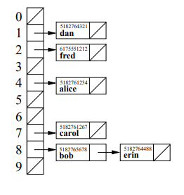

# Lecture 22 --- Hash Tables

## Today’s Lecture

- Hash Tables, Hash Functions, and Collision Resolution <!--(leetcode 1, 705, 706)-->
- Performance of: Hash Tables vs. Binary Search Trees
- Collision resolution: separate chaining vs open addressing
- STL’s unordered_set and unordered_map
- Using a hash table to implement a set/map
<!--  – Hash functions as functors/function objects (leetcode 1451: Rearrange Words in a Sentence)

  – Iterators, find, insert, and erase-->

## 22.1 Definition: What’s a Hash Table?

- A table implementation with constant time access.
  - Like a set, we can store elements in a collection. Or like a map, we can store key-value pair associations in the hash table. But it’s even faster to do find, insert, and erase with a hash table! However, hash tables do not store the data in sorted order.
- A hash table is implemented with an array at the top level.
- Each element or key is mapped to a slot in the array by a hash function.

## 22.2 Definition: What’s a Hash Function?

- A simple function of one argument (the key) which returns an integer index (a bucket or slot in the array).
- Ideally the function will “uniformly” distribute the keys throughout the range of legal index values (0 → k-1).
- What’s a collision?
  - When the hash function maps multiple (different) keys to the same index.
- How do we deal with collisions?
  - One way to resolve this is by storing a linked list of values at each slot in the array.

## 22.3 Example: Caller ID

- We are given a phonebook with 50,000 name/number pairings. Each number is a 10 digit number. We need to
create a data structure to lookup the name matching a particular phone number. Ideally, name lookup should
be O(1) time expected, and the caller ID system should use O(n) memory (n = 50,000).
- Note: In the toy implementations that follow we use small datasets, but we should evaluate the system scaled
up to handle the large dataset.
- The basic interface:

```cpp
// add several names to the phonebook
add(phonebook, 1111, "fred");
add(phonebook, 2222, "sally");
add(phonebook, 3333, "george");
// test the phonebook
std::cout << identify(phonebook, 2222) << " is calling!" << std::endl;
std::cout << identify(phonebook, 4444) << " is calling!" << std::endl;
```

<!--- We’ll review how we solved this problem in Lab 9 with an STL vector then an STL map. Finally, we’ll implement the system with a hash table.-->

## 22.4 Caller ID with an STL Vector

```cpp
// create an empty phonebook
std::vector<std::string> phonebook(10000, "UNKNOWN CALLER");

void add(std::vector<std::string> &phonebook, int number, std::string name) {
	phonebook[number] = name;
}

std::string identify(const std::vector<std::string> &phonebook, int number) {
	return phonebook[number];
}
```

Exercise: What’s the memory usage for the vector-based Caller ID system?
What’s the expected running time for identify, insert, and erase?

## 22.5 Caller ID with an STL Map

```cpp
// create an empty phonebook
std::map<int,std::string> phonebook;
void add(std::map<int,std::string> &phonebook, int number, std::string name) {
	phonebook[number] = name;
}

std::string identify(const std::map<int,std::string> &phonebook, int number) {
	map<int,std::string>::const_iterator tmp = phonebook.find(number);
	if (tmp == phonebook.end()){
		return "UNKNOWN CALLER";
	}else{
		 return tmp->second;
	}
}
```

Exercise: What’s the memory usage for the map-based Caller ID system?
What’s the expected running time for identify, add, and erase?

## 22.6 Now let’s implement Caller ID with a Hash Table



```cpp
#define PHONEBOOK_SIZE 10

class Node {
public:
	int number;
	string name;
	Node* next;
};

// create the phonebook, initially all numbers are unassigned
Node* phonebook[PHONEBOOK_SIZE];
for (int i = 0; i < PHONEBOOK_SIZE; i++) {
	phonebook[i] = NULL;
}

// corresponds a phone number to a slot in the array
int hash_function(int number) {


}

// add a number, name pair to the phonebook
void add(Node* phonebook[PHONEBOOK_SIZE], int number, string name) {


}

// given a phone number, determine who is calling
std::string identify(Node* phonebook[PHONEBOOK_SIZE], int number) {


}
```

## 22.7 Exercise: Choosing a Hash Function

- What’s a good hash function for this application?

- What’s a bad hash function for this application?

## 22.8 Exercise: Hash Table Performance

- What’s the memory usage for the hash-table-based Caller ID system?

- What’s the expected running time for identify, insert, and erase?

## 22.9 What makes a Good Hash Function?

- Goals: fast O(1) computation and a random, uniform distribution of keys throughout the table,
despite the actual distribution of keys that are to be stored.
- For example, using: f(k) = abs(k)%N as our hash function satisfies the first requirement, but may not
satisfy the second.
- Another example of a dangerous hash function on string keys is to add or multiply the ascii values of each char:
```cpp
unsigned int hash(const std::string& k, unsigned int N) {
	unsigned int value = 0;
	for (unsigned int i=0; i<k.size(); ++i) {
		value += k[i]; // conversion to int is automatic
	}
	return value % N;
}
```
The problem is its high collision rate:

1. Anagrams (e.g., "listen" and "silent") get the same hash.

2. Many different strings can sum to the same value, leading to collisions. 

- This can be improved through multiplications that involve the position and value of the key:

```cpp
unsigned int hash(const std::string& k, unsigned int N) {
	unsigned int value = 0;
	for (unsigned int i=0; i<k.size(); ++i) {
		value = value*8 + k[i]; // conversion to int is automatic
	}
	return value % N;
}
```
- The 2nd method is better, but can be improved further. The theory of good hash functions is quite involved and beyond the scope of this course.

## 22.10 How do we Resolve Collisions? METHOD 1: Separate Chaining

- Each table location stores a linked list of keys (and values) hashed to that location (as shown above in the phonebook hashtable). Thus, the hashing function really just selects which list to search or modify.
- This works well when the number of items stored in each list is small, e.g., an average of 1. Other data structures, such as binary search trees, may be used in place of the list, but these have even greater overhead considering the (hopefully, very small) number of items stored per bin.

## 22.11 How do we Resolve Collisions? METHOD 2: Open Addressing

- In open addressing, when the chosen table location already stores a key (or key-value pair), a different table location is sought in order to store the new value (or pair).
- Here are three different open addressing variations to handle a collision during an insert operation:

  – Linear probing: If i is the chosen hash location then the following sequence of table locations is tested (“probed”) until an empty location is found:
```console
(i+1)%N, (i+2)%N, (i+3)%N, ...
```

  – Quadratic probing: If i is the hash location then the following sequence of table locations is tested:
```console
(i+1)%N, (i+2*2)%N, (i+3*3)%N, (i+4*4)%N, ...
```
More generally, the jth “probe” of the table is (i + c<sub>1</sub>j + c<sub>2</sub>j<sup>2</sup>) mod N where c<sub>1</sub> and c<sub>2</sub> are constants.

  – Secondary hashing: when a collision occurs a second hash function is applied to compute a new table location. This is repeated until an empty location is found.

- For each of these approaches, the find operation follows the same sequence of locations as the insert operation. The key value is determined to be absent from the table only when an empty location is found.
- When using open addressing to resolve collisions, the erase function must mark a location as “formerly occupied”. If a location is instead marked empty, find may fail to return elements in the table. Formerly occupied locations may (and should) be reused, but only after the find operation has been run to completion.
- Problems with open addressing:

  – Slows dramatically when the table is nearly full (e.g. about 80% or higher). This is particularly problematic for linear probing.

  – Fails completely when the table is full.

  – Cost of computing new hash values.

## 22.12 Hash Table in STL?

- The Standard Template Library standard and implementation of hash table have been slowly evolving over
many years. Unfortunately, the names “hashset” and “hashmap” were spoiled by developers anticipating the
STL standard, so to avoid breaking or having name clashes with code using these early implementations...
- STL’s agreed-upon standard for hash tables: unordered_set and unordered_map. 
- You can use std::unordered_set the same way as you use std::set, even though the internal of these two are different, the external interface are the same.
- You can use std::unordered_map the same way as you use std::map, even though the internal of these two are different, the external interface are the same.
<!--- Depending on your OS/compiler, you may need to add the -std=c++11 flag to the compile line (or other
configuration tweaks) to access these more recent pieces of STL. (And this will certainly continue to evolve
in future years!) Also, for many types STL has a good default hash function, so you may not always need to
specify both template parameters!-->

<!--## 20.13 Our Copycat Version: A Set As a Hash Table

- The class is templated over both the key type and the hash function type.

```cpp
template < class KeyType, class HashFunc >
class ds_hashset { ... };
```

- We use separate chaining for collision resolution. Hence the main data structure inside the class is:

```cpp
std::vector< std::list<KeyType> > m_table;
```

- We will use automatic resizing when our table is too full. Resize is expensive of course, so similar to
the automatic reallocation that occurs inside the vector push_back function, we at least double the size of
underlying structure to ensure it is rarely needed.

## 20.14 Our Hash Function (as a Functor or Function Object)

- Next lecture we’ll talk about “function objects” or “functors”.... A functor is just a class wrapper around a
function, and the function is implemented as the overloaded function call operator for the class.
- Often the programmer/designer for the program using a hash function has the best understanding of the
distribution of data to be stored in the hash function. Thus, they are in the best position to define a custom
hash function (if needed) for the data & application.
- Here’s an example of a (generically) good hash function for STL strings, wrapped up inside of a class:

```cpp
class hash_string_obj {
public:
	unsigned int operator() (std::string const& key) const {
		// This implementation comes from
		// http://www.partow.net/programming/hashfunctions/
		unsigned int hash = 1315423911;
		for(unsigned int i = 0; i < key.length(); i++){
			hash ^= ((hash << 5) + key[i] + (hash >> 2));
		}
		return hash;
	}
};
```

- Once our new type containing the hash function is defined, we can create instances of our hash set object
containing std::string by specifying the type hash_string_obj as the second template parameter to the
declaration of a ds_hashset. E.g.,

```cpp
ds_hashset<std::string, hash_string_obj> my_hashset;
```

- Alternatively, we could use function pointers as a non-type template argument.
(We don’t show that syntax here!).

## 20.15 Hash Set Iterators

- Iterators move through the hash table in the order of the storage locations rather than the ordering imposed by (say) an operator<. Thus, the visiting/printing order depends on the hash function and the table size.
  - Hence the increment operators must move to the next entry in the current linked list or, if the end of the current list is reached, to the first entry in the next non-empty list.
- The declaration is nested inside the ds_hashset declaration in order to avoid explicitly templating the iterator
over the hash function type.
- The iterator must store:
  - A pointer to the hash table it is associated with. This reflects a subtle point about types: even though
the iterator class is declared inside the ds_hashset, this does not mean an iterator automatically knows
about any particular ds_hashset.
  - The index of the current list in the hash table.
  - An iterator referencing the current location in the current list.
- Because of the way the classes are nested, the iterator class object must declare the ds_hashset class as a friend, but the reverse is unnecessary.

## 20.16 Implementing begin() and end()

- begin(): Skips over empty lists to find the first key in the table. It must tie the iterator being created to
the particular ds_hashset object it is applied to. This is done by passing the this pointer to the iterator
constructor.
- end(): Also associates the iterator with the specific table, assigns an index of -1 (indicating it is not a normal
valid index), and thus does not assign the particular list iterator.
- Exercise: Implement the begin() function.

## 20.17 Iterator Increment, Decrement, & Comparison Operators

- The increment operators must find the next key, either in the current list, or in the next non-empty list.
- The decrement operator must check if the iterator in the list is at the beginning and if so it must proceed to
find the previous non-empty list and then find the last entry in that list. This might sound expensive, but
remember that the lists should be very short.
- The comparison operators must accommodate the fact that when (at least) one of the iterators is the end, the
internal list iterator will not have a useful value.

## 20.18 Insert & Find

- Computes the hash function value and then the index location.
- If the key is already in the list that is at the index location, then no changes are made to the set, but an iterator
is created referencing the location of the key, a pair is returned with this iterator and false.
- If the key is not in the list at the index location, then the key should be inserted in the list (at the front is
fine), and an iterator is created referencing the location of the newly-inserted key a pair is returned with this
iterator and true.
- Exercise: Implement the insert() function, ignoring for now the resize operation.
- Find is similar to insert, computing the hash function and index, followed by a std::find operation.

## 20.19 Erase

- Two versions are implemented, one based on a key value and one based on an iterator. These are based on
finding the appropriate iterator location in the appropriate list, and applying the list erase function.

## 20.20 Resize

- Must copy the contents of the current vector into a scratch vector, resize the current vector, and then re-insert
each key into the resized vector. Exercise: Write resize().

## 20.21 Hash Table Iterator Invalidation

- Any insert operation invalidates all ds_hashset iterators because the insert operation could cause a resize of
the table. The erase function only invalidates an iterator that references the current object.-->

## 22.13 Leetcode Exercises

- [Leetcode problem 1: Two Sum](https://leetcode.com/problems/two-sum/). Solution: [p1_twosum_hash_table.cpp](../../leetcode/p1_twosum_hash_table.cpp).

**Note**: make sure you understand this longest consecutive sequence problem and its solution, because you will re-write this function in the lab.
- [Leetcode problem 128: Longest Consecutive Sequence](https://leetcode.com/problems/longest-consecutive-sequence/). Solution: [p128_longest_consecutive_sequence.cpp](../../leetcode/p128_longest_consecutive_sequence.cpp).

