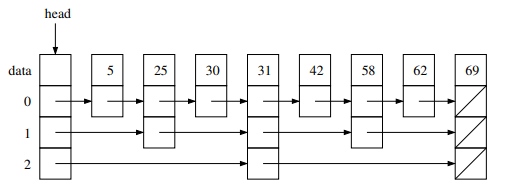
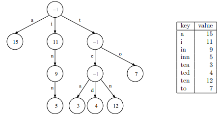

# Lecture 27 --- Hybrid / Variant Data Structures

## Today’s Lecture

- Some variants on the classic data structures

## 27.1 The Basic Data Structures

This term we’ve studying the details of a spectrum of core data structures. These structures have fundamentally different memory layouts. These data structures are classic, and are not unique to C++.

- array / vector
- linked list
- binary search tree
- hash table
- binary heap / priority queue

## 27.2 A Few Variants of the Basic Data Structures

Many variants and advanced extensions and hybrid versions of these data structures are possible. Different applications
with different requirements and patterns of data and data sizes and computer hardware will benefit from or leverage
different aspects of these variants.

This term we’ve already discussed / implemented a number of data structure variants:
- single vs. doubly linked lists  
  - using more memory can improve convenience and running time for key operations
- 2D arrays/vectors
- hash table: separate chaining vs open addressing – reduce memory and avoid pointer dereferencing
- stack and queue – restricted/reduced(!) set of operations on array/vector and list
- priority queue

We’ll discuss just a few additional variants today.

- unrolled linked list
- skip list
- trie (a.k.a. prefix tree) (Leetcode 208: Implement Trie (Prefix Tree), Leetcode 212: Word Search II, Leetcode 14: Longest Common Prefix, Leetcode 648: Replace Words)

The list above is just a sampling of the possible variety of hybrid / variant data structures!

## 27.3 Unrolled Linked List - Overview

- An unrolled linked list data structure is a hybrid of an array / vector and a linked list. It is very similar to a standard doubly linked list, except that more than one element may be stored at each node.
- This data structure can have performance advantages (both in memory and running time) over a standard linked list when storing small items and can be used to better align data in the cache.
- Here’s a diagram of an unrolled linked list:

- Each Node object contains a fixed size array (size = 6 in the above example) that will store 1 or more elements from the list. The elements are ordered from left to right.
- From the outside, this unrolled linked list should perform exactly like an STL list containing the numbers 10 through 23 in sorted order, except we’ve just erased ’19’. Note that to match the behavior, the list_iterator object must also change. The iterator must keep track of not only which Node it refers to, but also which element within the Node it’s on. This can be done with a simple offset index. In the above example, the iterator refers to the element “20”.
- Just like regular linked lists, the unrolled linked list supports speedy insert and erase operations in the middle of the list. The diagram above illustrates that after erasing an item it is often more efficient to store one fewer item in the affected Node than to shift all elements (like we have to with an array/vector).
- And when we insert an item in the middle, we might need to splice a new Node into the chain if the current
Node is “full” (there’s not an empty slot).

## 27.4 Skip List - Overview

- Consider a classic singly-linked list storing a collection of n integers in sorted order.

- If we want to check to see if ’42’ is in the list, we will have to linearly scan through the structure, with O(n)
running time.
- Even though we know the data is sorted... The problem is that unlike an array / vector, we can’t quickly jump
to the middle of a linked list to perform a binary search.
- What if instead we stored a additional pointers to be able to jump to the middle of the chain? A skip list stores
sorted data with multiple levels of linked lists. Each level contains roughly half the nodes of the previous level,
approximately every other node from the previous level.

- Now, to find / search for a specific element, we start at the highest level (level 2 in this example), and ask if
the element is before or after each element in that chain. Since it’s after ’31’, we start at node ’31’ in the next
lowest level (level 1). ’42’ is after ’31’, but before ’58’, so we start at node ’31’ in the next lowest level (level
0). And then scanning forward we find ’42’ and return ’true’ = yes, the query element is in the structure.

## 27.5 Skip List - Discussion

How are elements inserted & erased? (Once the location is found) Just edit the chain at each level.
- But how do we determine what nodes go at each level? Upon insertion, generate a top level for that element
at random (from [0,log n] where n is the # of elements currently in the list ... details omitted!)
- The overall hierarchy of a skip list is similar to a binary search tree. Both a skip list and a binary search tree
work best when the data is balanced.
Draw an (approximately) balanced binary search tree with the data above. How much total memory does the
skip list use vs. the BST? Be sure to count all pointers – and don’t forget the parent pointers!
- What is the height of a skip list storing n elements? What is the running time for find, insert, and erase in
a skip list?
- Compared to BSTs, in practice, balanced skip lists are simpler to implement, faster (same order notation, but
smaller coefficient), require less total memory, and work better in parallel. Or maybe they are similar...

## 27.6 Trie / Prefix Tree - Overview

- Next up, let’s look at alternate to a map or hash map for storing key strings and an associated value type.
- In a trie or prefix tree, the key is defined not by storing the data at the node or leaf, but instead by the path to
get to that node. Each edge from the root node stores one character of the string. The node stores the value
for the key (or NULL or a special value, e.g., ’-1’, if the path to that point is not a valid key in the structure).

- Lookup in the structure is fast, O(m) where m is the length (# of characters) in the string. A hash table has similar lookup (since we have to hash the string which generally involves looking at every letter). If m << n, we can say this is O(1).

## 27.7 Trie / Prefix Tree - Discussion

- What is the worst case # of children for a single node? What are the member variables for the Node class?
- Unlike a hash table, we can iterate over the keys in a trie / prefix tree in sorted order.
Exercise: Implement the trie sorted-order iterator (in code or pseudocode) and print the table on the right.
